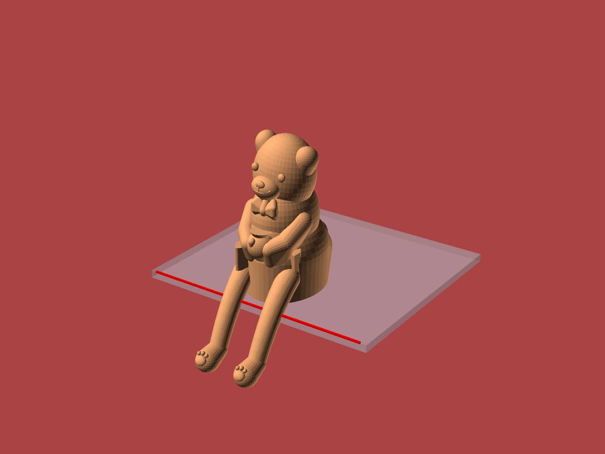

# 3D Model Repository (3D 列印模型庫)

個人 3D 列印模型集合庫，包含 OpenSCAD 參數化原始碼、已編譯可直接列印的 STL 檔案、以及高解析度渲染預覽圖。

---

## 📦 模型清單 (Model Catalog)

| 預覽圖 | 模型名稱 / 目錄 | 說明與用途 | 關鍵規格 / 特點 | 快速連結 |
| :---: | :--- | :--- | :--- | :---: |
|  | **[magnetic-exhaust-base](magnetic-exhaust-base/)**<br>牆面排風網罩磁吸轉接底座 | 安裝於六角蜂巢孔排風罩的磁吸法蘭底座。用於快速拆裝、磁吸各類排風管或過濾配件。 | • 56 根六角定位柱 (方向/間距校正)<br>• 8 顆 5x3 磁鐵 (6 齒彈性避讓槽)<br>• 7~8mm 氣密帶、外角 R5 防翹板 | [📖 說明](magnetic-exhaust-base/README.md)<br>[📦 STL](magnetic-exhaust-base/magnetic_exhaust_base.stl)<br>[📐 SCAD](magnetic-exhaust-base/magnetic_exhaust_base.scad) |
|  | **[magnetic-exhaust-duct-80mm](magnetic-exhaust-duct-80mm/)**<br>80mm 磁吸排風管轉接頭 | 搭配牆面底座的磁吸排風配件，快速轉接 80mm 軟管（鋁箔管/PVC管），抗拉脫、高氣密。 | • 8 顆 5x3 磁鐵 (6 齒避讓槽，約 4kgf 吸力)<br>• 1.5mm 內嵌對位止口 (防橫向滑動)<br>• 外徑 78.8mm + 80.6mm 防脫倒鉤環<br>• 100% 免支撐列印設計 (管口朝下) | [📖 說明](magnetic-exhaust-duct-80mm/README.md)<br>[📦 STL](magnetic-exhaust-duct-80mm/magnetic_exhaust_duct_80mm.stl)<br>[📐 SCAD](magnetic-exhaust-duct-80mm/magnetic_exhaust_duct_80mm.scad) |
|  | **[chibi-ledge-cat](chibi-ledge-cat/)**<br>桌緣趴姿萌貓公仔 | 依循仿生學幾何與黃金比例設計的趴姿貓咪桌緣擺飾。雙腿懸垂桌外，低重心幾何配重，自平衡穩坐桌緣無須黏膠。 | • 黃金比例 ($\phi \approx 1.618$) 造型<br>• 超橢球有機體 + 貝茲四肢 + 對數螺線尾巴<br>• 隱藏式低重心後臀配重，自平衡抗傾覆<br>• 總高 < 50mm，小巧精緻 | [📖 說明](chibi-ledge-cat/README.md)<br>[📦 STL](chibi-ledge-cat/chibi_ledge_cat.stl)<br>[📐 SCAD](chibi-ledge-cat/chibi_ledge_cat.scad) |
|  | **[chibi-ledge-bear](chibi-ledge-bear/)**<br>桌緣趴姿幾何萌熊公仔 (菱角幾何風) | 承襲原版 SCAD 經典低多邊形菱角幾何美學（Faceted Low-Poly Mesh）的小熊公仔。領結蜜罐配備，自平衡穩坐桌緣。 | • 俐落折紙/鑽石菱角切面美學風格<br>• 折紙領結、幾何蜜罐、厚實膝關節<br>• 100% 封閉水密實體，自平衡抗傾覆<br>• 總高 < 50mm，雕塑感極強 | [📖 說明](chibi-ledge-bear/README.md)<br>[📦 STL](chibi-ledge-bear/chibi_ledge_bear.stl)<br>[📐 SCAD](chibi-ledge-bear/chibi_ledge_bear.scad) |
|  | **[cute-ledge-bear](cute-ledge-bear/)**<br>桌緣趴姿經典萌熊公仔 (平滑超萌版) | 回歸極致溫潤、圓滾憨厚的正常泰迪小熊風格。圓耳、凸圓紐扣眼、微笑嘴、小領結與懷中蜜罐，自平衡穩坐桌緣無須黏膠。 | • 經典平滑有機曲面 ($fn=48~64)<br>• 圓耳立體耳廓、微凸紐扣眼、親切微笑嘴<br>• 懷抱迷你蜂蜜罐、蝴蝶結領結、腳底肉球<br>• 100% 水密 2-Manifold，自平衡抗傾覆 | [📖 說明](cute-ledge-bear/README.md)<br>[📦 STL](cute-ledge-bear/cute_ledge_bear.stl)<br>[📐 SCAD](cute-ledge-bear/cute_ledge_bear.scad) |
|  | **[cute-ledge-bear-supportfree](cute-ledge-bear-supportfree/)**<br>桌緣趴姿萌熊公仔 (零支撐最佳化版) | 針對 FDM 3D 列印專門工程最佳化。保留極致可愛經典圓潤風格，透過自支撐 45° 幾何、尖拱榫卯與平鋪分件，達成 100% 免支撐（0 Supports）列印！ | • 100% 免支撐切片列印 (0.00g 支撐廢料)<br>• 模組化 D 型尖拱榫卯插接 (0.22mm 緊配)<br>• 層線縱向受力，雙腿膝蓋抗斷裂強度提升 5x<br>• 提供「一盤搞定版 (Plate)」一鍵直接印 | [📖 說明](cute-ledge-bear-supportfree/README.md)<br>[📦 STL](cute-ledge-bear-supportfree/cute_ledge_bear_plate.stl)<br>[📐 SCAD](cute-ledge-bear-supportfree/cute_ledge_bear_supportfree.scad) |

*(後續新增模型時，可直接在上方表格繼續擴充)*

---

## 🛠️ 目錄組織規範 (Directory Structure)

本倉庫每個模型皆擁有獨立的子目錄，架構如下：

```
3dmodel/
├── README.md                          # 根目錄：全部模型的快速總覽清單與導覽
└── [model-name]/                      # 模型專屬子目錄 (小寫連字符命名)
    ├── README.md                      # 模型詳細說明、規格、BOM、列印建議
    ├── [model_name].scad              # OpenSCAD 參數化原始代碼 (若有)
    ├── [model_name].stl               # 可直接切片之 STL 模型檔案
    └── renders/                       # 模型各角度視覺渲染圖
        ├── isometric_view.png
        ├── bottom_magnets.png
        └── ...
```

---

## 🚀 後續新增模型步驟

1. **建立專屬目錄**：`mkdir -p [model-name]/renders`
2. **放置檔案**：將 `.scad` 程式碼、輸出的 `.stl` 及渲染圖放進該子目錄。
3. **編寫目錄文件**：在子目錄內撰寫 `README.md` 詳細說明其列印設定與安裝方法。
4. **更新根目錄清單**：在根目錄 `README.md` 表格新增一行，包含預覽圖縮圖與說明連結。
