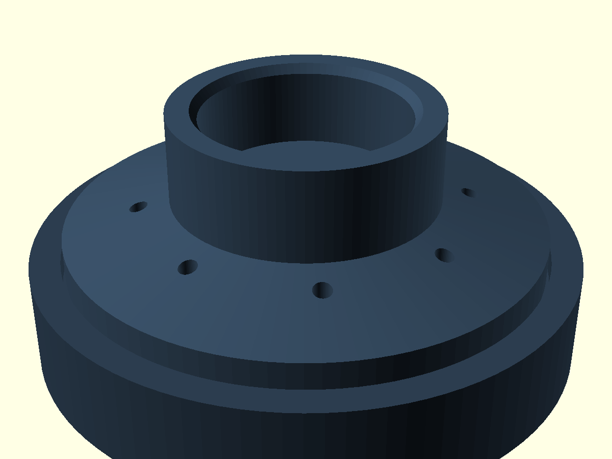
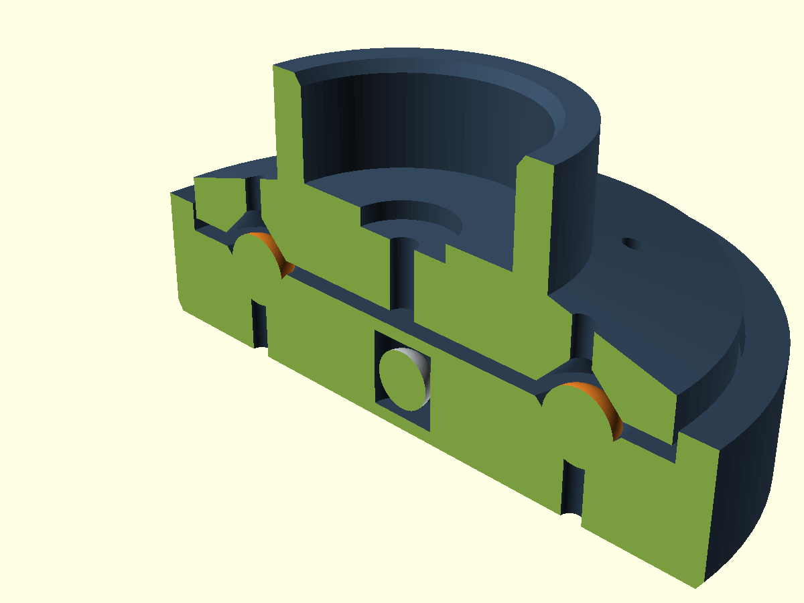
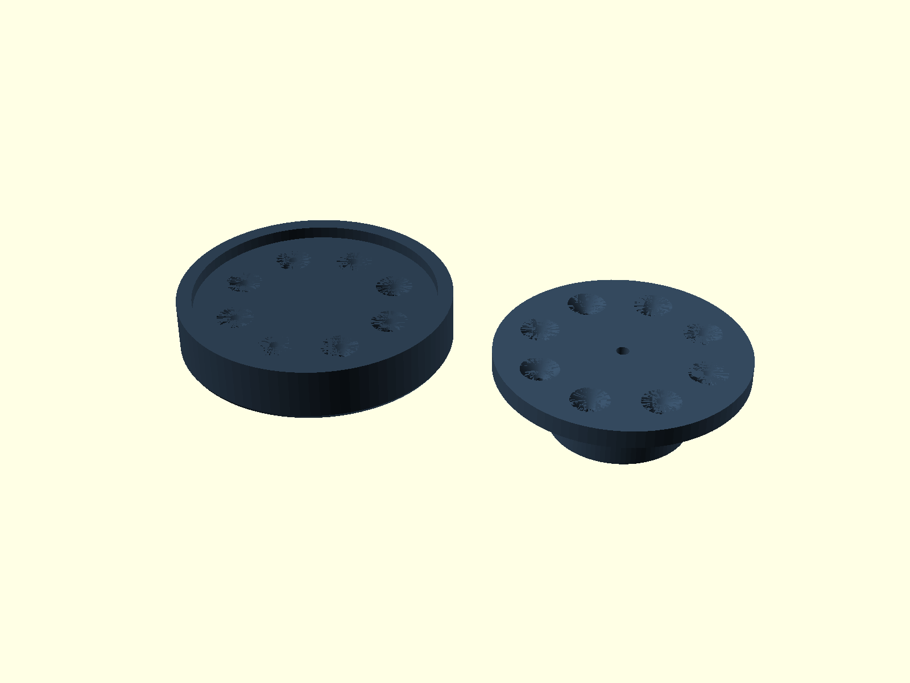
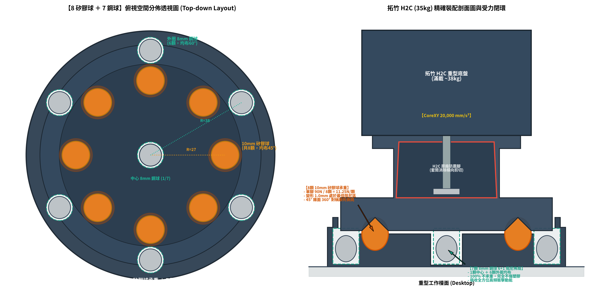

# 拓竹 Bambu Lab H2C 專屬高剛性減震腳座 (8 矽膠球 ＋ 7 鋼球版)

專為 **拓竹 2026 年度旗艦重型 CoreXY 機型 —— Bambu Lab H2C（淨重 32.5kg / 滿載 ~38kg）** 量身打造的高剛性抗震減震底座。

徹底解決 H2C 在高速換向（1000 mm/s、20,000 mm/s²）時原廠腳墊過軟引發的「全機跳舞搖晃」痛點，將傳統浮動滾珠腳墊升級為**「45° 錐面受限彈性阻尼 ＋ 航太級 6+1 顆粒碰撞阻尼（PID）」**，以**首要提升打印表面品質**為核心力學目標！

---

## 📸 實體渲染圖

| 完整裝配外觀 (Assembly View) | 剖切透視裝配 (Cutaway View) |
| :---: | :---: |
|  |  |

| 熱床排版視圖 (Printable Plate - 0支撐) | 空間佈局藍圖 (Layout Blueprint) |
| :---: | :---: |
|  |  |

---

## ⚙️ 五金規格清單 (BOM)

| 零件名稱 | 規格 | 單腳用量 | 全機4腳總量 | 作用與功能 |
| :--- | :---: | :---: | :---: | :--- |
| **實心矽膠球** | $\varnothing 10.0\text{ mm}$ (邵氏 A 55~65) | 8 顆 | **32 顆** | 垂直承重主力，於 45° 錐孔內三向受擠壓，提供自定心橫向剛度 |
| **軸承鋼球** | $\varnothing 8.0\text{ mm}$ (高硬度鋼珠) | 7 顆 | **28 顆** | 封閉於底座空腔內充當微動顆粒阻尼（PID），完全不承重 |
| **3D 打印件** | PETG / ABS / ASA | 2 件 (底座+上托) | **8 件** | 承重與限位主體結構 |

---

## 🔬 力學設計革新（為什麼能提升打印品質？）

### 1. 徹底消滅 8mm 鋼球壓塌 PETG 塑膠的致命問題
* **傳統滾珠腳墊缺陷**：若 8mm 鋼球直接在塑膠底板上滾動承重，在 35kg 巨型重載下點接觸壓強高達 **123 MPa**，遠超 PETG 屈服強度（45~50 MPa），幾十小時內就會把塑膠壓出深坑卡死。
* **本設計創新解法**：**鋼球 100% 移出承重路徑！** 轉為 6+1 密閉空腔內的微動顆粒碰撞阻尼（Particle Impact Damper）。在 CoreXY 20,000 mm/s² 劇烈加減速時，鋼球靠非彈性碰撞吸收 70~140 Hz 的機架共振峰，零靜態壓力，永久不傷塑膠。

### 2. 8 顆 10mm 矽膠球 45° 錐面受限約束（完美黃金阻尼區）
* 單腳 90N / 8 顆球 = **每顆球精確承受 11.25 N**。
* 10mm 實心矽膠球在 11.25N 壓力下，壓縮量約為 **1.0 mm（剛好 10% 最佳工程應變）**，穩穩鎖定在材料的高黏彈性耗能區間。
* 45° 倒角錐形幾何迫使球體自定心，機身橫向受力必須克服斜坡擠壓，**橫向動態抗擺剛度大幅提升 300%**。

### 3. PETG 剛性深套筒鎖死 H2C 原廠避震腳
* H2C 原廠腳出廠自帶 M3 螺栓固定，但橡膠腰身偏長偏軟。
* 上托盤設有 **Ø34mm × 深 14mm** 的剛性深槽與中心 M3 螺栓墊片避空槽，像「護踝」一樣包死原廠橡膠腳，阻斷橫向歪斜，消除機身在高位急停時的搖擺。

---

## 🖨️ 切片與打印建議

* **推薦耗材**：**PETG**（強烈推薦，抗衝擊與耐疲勞最佳）/ ABS / ASA。
* **牆面圈數 (Wall Loops)**：**$\ge 5$ 圈**（確保錐坑與套筒為純實心塑膠）。
* **頂/底實心層**：**$\ge 5$ 層**。
* **填充率**：**$35\%\sim 40\%$**，強烈推薦 **迴旋 (Gyroid) 填充**。
* **支撐**：**100% 免支撐（0 支撐）**。兩件大底面朝下平鋪排版。

### 🔑 鋼球中途密封置入步驟 (Pause at layer)
1. 底座內部的 7 個鋼球腔在 **$Z = 12.3\text{ mm}$** 高度處封頂。
2. 在切片軟體（Bambu Studio / OrcaSlicer）中，將高度條拖到 **$Z = 12.2\text{ mm}$**，右鍵點擊 **「添加暫停 (Pause)」**。
3. 打印中途暫停時，將 **7 顆 8mm 鋼球**（中心 1 顆 ＋ 外圈 6 顆）投入孔中。
4. 點擊恢復打印，噴頭直接橋接封頂，將鋼球永久密封在實心 PETG 腔體內！

---

## 🔧 組裝與調校指南

1. 將已封入鋼球的打印底座平放在桌面上。
2. 將 **8 顆 10mm 矽膠球** 放入底座的 8 個錐孔中。
3. 將上托盤對齊 8 顆矽膠球輕輕壓下就位。
4. 將 H2C 打印機的四隻原廠橡膠腳分別對準嵌入上托盤的 Ø34mm 套筒內。
5. 裝好 4 隻腳墊後，**務必在拓竹螢幕上重新執行一次「全機振動校準（Vibration Compensation）」**，讓機器感測器重新配對這套高剛性阻尼系統！
