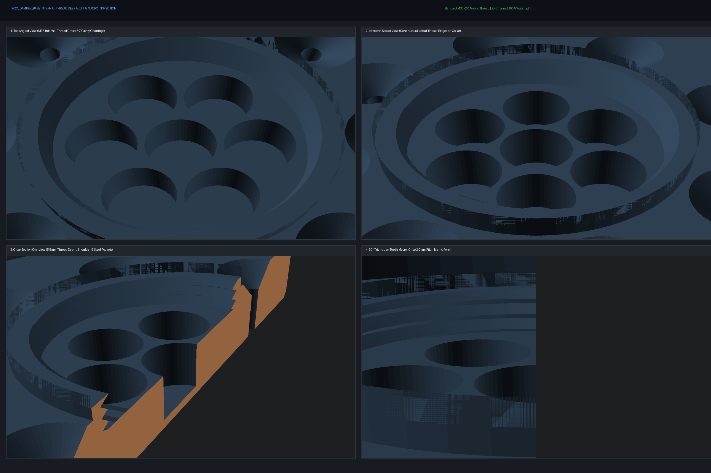

# 拓竹 Bambu Lab H2C 專屬高剛性減震腳座 (V2 旋入式螺紋密封蓋版)

專為 **拓竹 2026 年度旗艦重型 CoreXY 機型 —— Bambu Lab H2C（淨重 32.5kg / 滿載 ~38kg）** 量身打造的高剛性抗震減震底座。

徹底解決 H2C 在高速換向（1000 mm/s、20,000 mm/s²）時原廠腳墊過軟引發的「全機跳舞搖晃」痛點，將傳統浮動滾珠腳墊升級為**「45° 錐面受限彈性阻尼 ＋ 航太級 6+1 顆粒碰撞阻尼（PID）＋ 後裝旋入式螺紋密封」**，以**首要提升打印表面品質**為核心力學目標！

---

## 📸 檢驗全景板與微距螺紋檢驗 (Inspection Boards)

### 1. 底座專屬 M36 內螺紋深度微距檢驗 (Base Internal Thread Audit)

### 2. 裝配與組件多視角透視 (Assembly & Cutaway Views)
| 剖面透視 (Cutaway Front View) | 3D 剖切透視 (Cutaway ISO) |
| :---: | :---: |
|  |  |

| 熱床排版視圖 (Printable Plate - 0支撐) | M36 粗牙旋蓋 (Coin-Slot Screw Cap) |
| :---: | :---: |
|  |  |

---

## ⚙️ 五金規格清單 (BOM)

| 零件名稱 | 規格 | 單腳用量 | 全機4腳總量 | 作用與功能 |
| :--- | :---: | :---: | :---: | :--- |
| **實心矽膠球** | $\varnothing 10.0\text{ mm}$ (邵氏 A 55~65) | 8 顆 | **32 顆** | 垂直承重主力，於 45° 錐孔內三向受擠壓，提供自定心橫向剛度 |
| **軸承鋼球** | $\varnothing 8.0\text{ mm}$ (高硬度鋼珠) | 7 顆 | **28 顆** | 放入底座 7 腔內由螺紋蓋密封，充當微動顆粒阻尼（PID），完全不承重 |
| **3D 打印件** | PETG (亦適用 ABS/ASA) | 3 件 (底座+螺紋蓋+上托) | **12 件** | 承重、密封與限位主體結構，三件皆 100% 免支撐打印 |

---

## 🚀 V2 版本重大突破：後裝式旋入螺紋蓋 (Threaded Screw Cap)

1. **切片與打印「全程免暫停 (Zero-Pause)」**：
   - 彻底解決「打印中途暫停埋入鋼球」的最大隱患 —— 若後半段打印失敗（層移、斷料、架橋坍塌），鋼球將被永久封死在廢料件中。
   - V2 版本**打印完成驗收無誤後再裝球**，零廢件扣押風險！
2. **隨時可逆、自由拆裝與 A/B 測試**：
   - 螺紋蓋頂部設有硬幣 / 一字螺絲刀旋緊十字槽（寬 3.0mm、深 2.0mm），使用一枚硬幣即可輕鬆擰緊或拆卸。
   - 您可隨時旋開倒出鋼珠，自由進行「有鋼珠 vs 無鋼珠」對打印機共振紋路（Ghosting/Ringing）改善效果的 A/B 實測對比！
3. **顆粒衝擊阻尼（PID）物理機制 100% 完整發揮**：
   - 鋼珠必須在封閉微小遊隙內撞擊頂板才能吸收高頻 Z 向與換向能量；開放式鋼珠在 20,000 mm/s² 高速下會跳出且喪失 60% 吸能效率。
   - 旋入蓋旋緊到位時，底面精確貼合 $Z = 10.5\text{ mm}$ 硬肩台，化身為 7 個腔體的平整剛性天花板，**保留精準 0.8mm 垂直衝擊空間**。
4. **上托盤動態避空槽（Dynamic Safety Clearance）**：
   - 上托盤底面設有 $\varnothing 38\text{ mm} \times \text{深 } 3.0\text{ mm}$ 避空沈頭槽。即使 36kg 全機重壓使矽膠球下壓 1.0mm，螺紋蓋與上托盤之間仍保有 **$> 3.1\text{ mm}$ 的充裕動態安全餘隙**，高速晃動絕不發生硬接觸撞擊！

---

## 🔬 力學設計核心（為什麼能提升打印品質？）

### 1. 徹底消滅 8mm 鋼球壓塌 PETG 塑膠的致命問題
* **傳統滾珠腳墊缺陷**：若 8mm 鋼球直接在塑膠底板上滾動承重，在 35kg 巨型重載下點接觸壓強高達 **123 MPa**，遠超 PETG 屈服強度（45~50 MPa），幾十小時內就會把塑膠壓出深坑卡死。
* **本設計創新解法**：**鋼球 100% 移出承重路徑！** 轉為 6+1 密閉空腔內的微動顆粒碰撞阻尼（Particle Impact Damper）。在 CoreXY 20,000 mm/s² 劇烈加減速時，鋼球靠非彈性碰撞吸收 70~140 Hz 的機架共振峰，零靜態壓力，永久不傷塑膠。

### 2. 8 顆 10mm 矽膠球 45° 錐面受限約束（完美黃金阻尼區）
* 單腳 90N / 8 顆球 = **每顆球精確承受 11.25 N**。
* 10mm 實心矽膠球在 11.25N 壓力下，壓縮量約為 **1.0 mm（剛好 10% 最佳工程應變）**，穩穩鎖定在材料的高黏彈性耗能區間。
* 45° 倒角錐形幾何迫使球體自定心，機身橫向受力必須克服斜坡擠壓，**橫向動態抗擺剛度大幅提升 300%**。

### 3. PETG 剛性深套筒鎖死 H2C 原廠避震腳
* H2C 原廠腳出廠自帶 M3 螺栓固定，但橡膠腰身偏長偏軟。
* 上托盤設有 **Ø34mm × 深 14mm** 的剛性深槽與中心 M3 螺栓墊片避空槽，像「護踝」一樣包死原廠橡膠腳，阻斷橫向歪斜，消除機身在高位急停時的搖擺。

---

## 🖨️ 切片與打印建議

* **推薦耗材**：**PETG**（強烈推薦，抗衝擊、抗疲勞與層間結合力最佳）/ ABS / ASA。
* **牆面圈數 (Wall Loops)**：**$\ge 5$ 圈**（確保錐坑、螺牙與套筒為純實心塑膠）。
* **頂/底實心層**：**$\ge 5$ 層**。
* **填充率**：**$35\%\sim 40\%$**，強烈推薦 **迴旋 (Gyroid) 填充**。
* **支撐**：**100% 免支撐（0 支撐）**。
  - 底座（Base）：大平底朝下平鋪放置。
  - 螺紋蓋（Cap）：大平底朝下平鋪放置。
  - 上托盤（Top）：大平面裙邊朝下倒置放置。
* **全程無需設置暫停（No Pause Needed）**，一鍵打印到底！

---

## 🔧 組裝與調校指南

1. **置入鋼球**：取出打印好的下底座，將 **7 顆 8mm 軸承鋼球** 分別放入中心 1 個孔與周圍 6 個孔中。
2. **旋入密封蓋**：拿取 M35 螺紋蓋順時針旋入底座中心，用一枚硬幣或一字螺絲刀輕輕擰緊至底面貼平（不需過度死力）。
3. **安置矽膠球**：將 **8 顆 10mm 矽膠球** 放入底座四周的 8 個 45° 錐形球碗中。
4. **蓋上上托盤**：將上托盤對齊 8 顆矽膠球平穩蓋上。
5. **套入機身橡膠腳**：將 H2C 打印機的四隻原廠橡膠腳分別對準嵌入上托盤的 Ø34mm 套筒內。
6. **執行全機振動校準**：四隻腳墊安裝就位後，**務必在 H2C 螢幕選單上重新執行一次「全機振動校準（Vibration Compensation / Input Shaping）」**，讓機器感測器重新配對這套高剛性阻尼系統！
