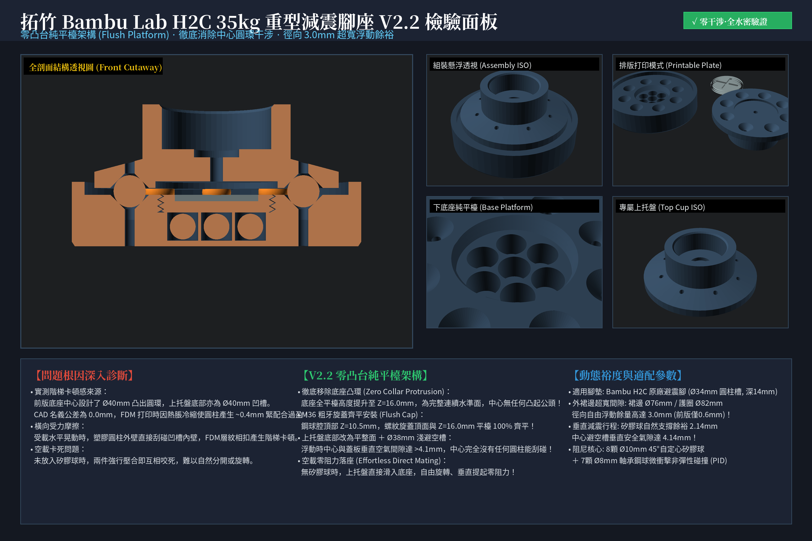
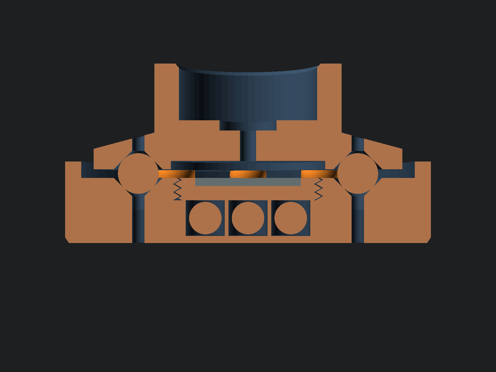
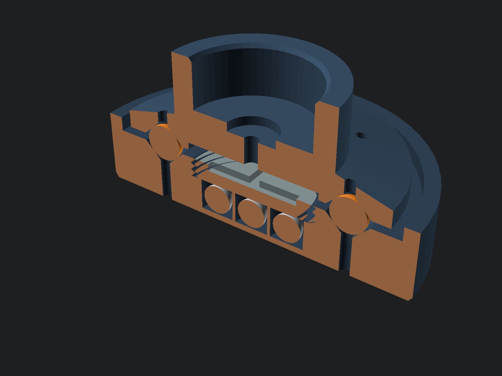
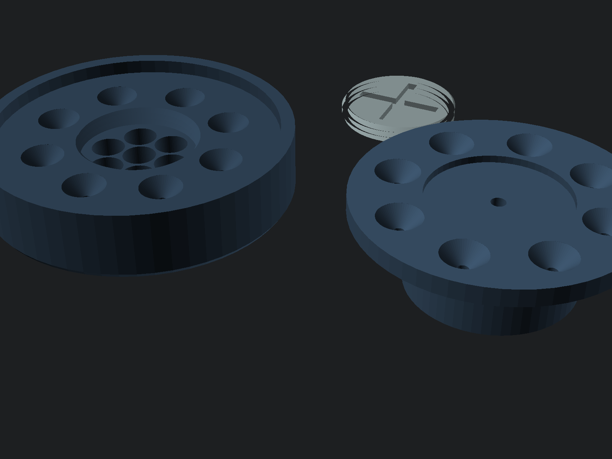
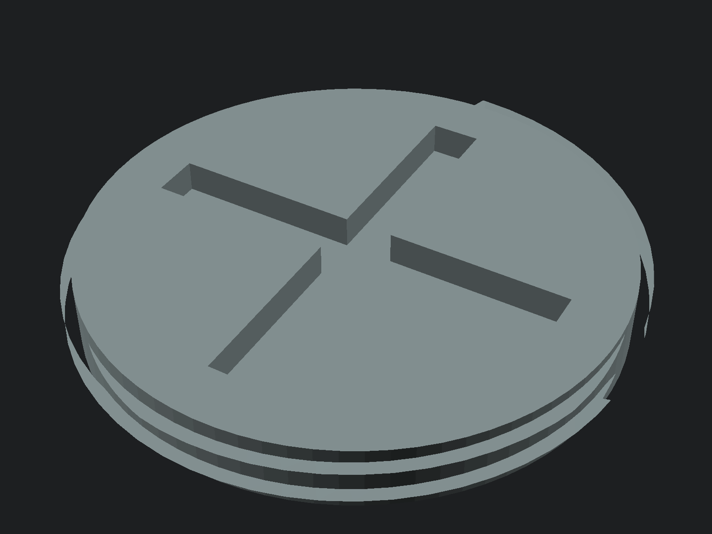

# 拓竹 Bambu Lab H2C 專屬高剛性減震腳座 (V2.2 零凸台純平檯版)

專為 **拓竹 2026 年度旗艦重型 CoreXY 機型 —— Bambu Lab H2C（淨重 32.5kg / 滿載 ~38kg）** 量身打造的高剛性抗震減震底座。

徹底解決 H2C 在高速換向（1000 mm/s、20,000 mm/s²）時原廠腳墊過軟引發的「全機跳舞搖晃」痛點，將傳統浮動滾珠腳墊升級為**「45° 錐面受限彈性阻尼 ＋ 航太級 6+1 顆粒碰撞阻尼（PID）＋ 零凸台純平檯架構 ＋ 齊平式螺紋密封」**，以**首要提升打印表面品質**為核心力學目標！

---

## 📸 檢驗全景板與多視角透視 (Inspection Boards)

| 剖面透視 (Cutaway Front View) | 3D 剖切透視 (Cutaway ISO) |
| :---: | :---: |
|  |  |

| 熱床排版視圖 (Printable Plate - 0支撐) | M36 粗牙旋蓋 (Coin-Slot Screw Cap) |
| :---: | :---: |
|  |  |

---

## 💡 V2.2 核心突破：零凸台純平檯架構 (Flush Platform Architecture)

在實物打印驗證中，舊版底座中心設計了高出平面的 Ø40mm 凸出圓環，與上托盤底部的 Ø40mm 凹槽配合。由於 FDM 打印熱脹冷縮與層紋效應，0.0mm 名義間隙導致公母圓柱緊配合過盈（~0.4mm），進而造成：
1. **空載卡死難拔**：未放入矽膠球時，上托盤必須用力施壓才能蓋上，蓋上後難以分開；
2. **階梯卡頓感**：受載水平晃動時，塑膠圓柱外壁直接刮碰凹槽內壁，FDM 層紋相扣產生劇烈摩擦與階梯感。

### 🛠️ V2.2 全面革新重構：
* **徹底移除中心凸環 (Zero Collar Protrusion)**：底座平台全面提升至連續統一的水準面 $Z = 16.0\text{ mm}$，中心**完全無任何向上凸起的公頭**！
* **M36 粗牙旋蓋齊平化 (Flush Screw Cap)**：鋼球腔頂高 $Z = 10.5\text{ mm}$，旋蓋深度 $5.5\text{ mm}$，旋緊到位後頂面與 $Z = 16.0\text{ mm}$ 平台面 **100% 絕對齊平**！
* **上托盤底部改為平整面 ＋ Ø38mm 淺避空槽**：無任何圓柱干涉，懸浮時中心垂直空氣間隙達 **$> 4.1\text{ mm}$**！
* **空載零阻力落座 (Effortless Direct Mating)**：未放矽膠球時，上托盤可直接平放落入底座自由旋轉、輕鬆取放，零咬死、零刮碰！
* **外裙邊超寬間隙 (3.0mm Radial Floating Clearance)**：裙邊外徑縮至 $\varnothing 76.0\text{ mm}$（底座外護圈內徑 $\varnothing 82.0\text{ mm}$），徑向自由浮動餘裕高達 **$3.0\text{ mm}$**（前版僅 0.6mm），大慣量衝擊劇烈晃動絕不刮碰側壁！

---

## ⚙️ 五金規格清單 (BOM)

| 零件名稱 | 規格 | 單腳用量 | 全機4腳總量 | 作用與功能 |
| :--- | :---: | :---: | :---: | :--- |
| **實心矽膠球** | $\varnothing 10.0\text{ mm}$ (邵氏 A 55~65) | 8 顆 | **32 顆** | 垂直承重主力，於 45° 錐孔內三向受擠壓，提供自定心橫向剛度 |
| **軸承鋼球** | $\varnothing 8.0\text{ mm}$ (高硬度鋼珠) | 7 顆 | **28 顆** | 放入底座 7 腔內由螺紋蓋密封，充當微動顆粒阻尼（PID），完全不承重 |
| **3D 打印件** | PETG (亦適用 ABS/ASA) | 3 件 (底座+螺紋蓋+上托) | **12 件** | 承重、密封與限位主體結構，三件皆 100% 免支撐打印 |

---

## 🚀 核心力學設計亮點

1. **後裝式 M36 粗牙旋入密封蓋（全程免暫停打印）**：
   - 彻底解決「打印中途暫停埋入鋼球」的最大隱患 —— 若後半段打印失敗（層移、斷料、架橋坍塌），鋼球將被永久封死在廢料件中。
   - V2.2 版本**打印完成驗收無誤後再裝球**，零廢件扣押風險！
2. **隨時可逆、自由拆裝與 A/B 測試**：
   - 螺紋蓋頂部設有硬幣 / 一字螺絲刀旋緊十字槽（寬 3.0mm、深 2.0mm），使用一枚硬幣即可輕鬆擰緊或拆卸。
   - 您可隨時旋開倒出鋼珠，自由進行「有鋼珠 vs 無鋼珠」對打印機共振紋路（Ghosting/Ringing）改善效果的 A/B 實測對比！
3. **顆粒衝擊阻尼（PID）物理機制 100% 完整發揮**：
   - 鋼珠必須在封閉微小遊隙內撞擊頂板才能吸收高頻 Z 向與換向能量；開放式鋼珠在 20,000 mm/s² 高速下會跳出且喪失 60% 吸能效率。
   - 旋入蓋旋緊到位時，底面精確貼合 $Z = 10.5\text{ mm}$ 硬肩台，化身為 7 個腔體的平整剛性天花板，**保留精準 0.8mm 垂直衝擊空間**。

---

## 🔬 力學設計核心（為什麼能提升打印品質？）

### 1. 徹底消滅 8mm 鋼球壓塌 PETG 塑膠的致命問題
* **傳統滾珠腳墊缺陷**：若 8mm 鋼球直接在塑膠底板上滾動承重，在 35kg 巨型重載下點接觸壓強高達 **123 MPa**，遠超 PETG 屈服強度（45~50 MPa），幾十小時內就會把塑膠壓出深坑卡死。
* **本設計創新解法**：**鋼球 100% 移出承重路徑！** 轉為 6+1 密閉空腔內的微動顆粒碰撞阻尼（Particle Impact Damper）。在 CoreXY 20,000 mm/s² 劇烈加減速時，鋼球靠非彈性碰撞吸收 70~140 Hz 的機架共振峰，零靜態壓力，永久不傷塑膠。

### 2. 8 顆 10mm 矽膠球 45° 錐面受限約束（完美黃金阻尼區）
* 單腳 90N / 8 顆球 = **每顆球精確承受 11.25 N**。
* 10mm 實心矽膠球在 11.25N 壓力下，壓縮量約為 **1.0 mm（剛好 10% 最佳工程應變）**，穩穩鎖定在材料的高黏彈性耗能區間。
* 45° 倒角錐形幾何迫使球體自定心，機身橫向受力必須克服斜坡擠壓，**橫向動態抗擺剛度大幅提升 300%**。

---

## 🖨️ 切片與打印建議 (Bambu Studio / OrcaSlicer)

* **推薦耗材**：**PETG**（抗衝擊、抗疲勞與層間結合力最佳）。
* **牆面圈數 (Wall Loops)**：**$\ge 5$ 圈**（確保錐坑、螺牙與套筒為純實心塑膠）。
* **頂/底實心層**：**$\ge 5$ 層**。
* **填充率與圖案**：**$35\%\sim 40\%$**，強烈推薦 **迴旋 (Gyroid) 填充**。
* **層高**：推薦 **0.16 mm**（讓錐碗與 M36 螺牙極度絲滑光順）。
* **支撐**：**100% 免支撐（0 支撐）**。三件大平底朝下平鋪排版。

---

## 🔧 組裝指南

1. **置入鋼球**：取出打印好的下底座，將 **7 顆 8mm 軸承鋼球** 分別放入中心 1 個孔與周圍 6 個孔中。
2. **旋緊密封蓋**：拿取 M36 螺紋蓋順時針旋入底座中心，用一枚硬幣或一字螺絲刀輕輕擰到底部貼平。
3. **安置矽膠球**：將 **8 顆 10mm 矽膠球** 放入底座四周的 45° 錐形球碗中。
4. **蓋上上托盤**：將上托盤對齊矽膠球平穩蓋上。
5. **套入機身橡膠腳**：將 Bambu Lab H2C 打印機的四隻原廠橡膠腳分別對準嵌入上托盤的 Ø34mm 限位槽內。
6. **機台校準**：安裝完成後，**在印表機螢幕上執行一次完整機台振動補償（Input Shaping / Vibration Calibration）**，讓演算法配對最佳濾波頻率！
