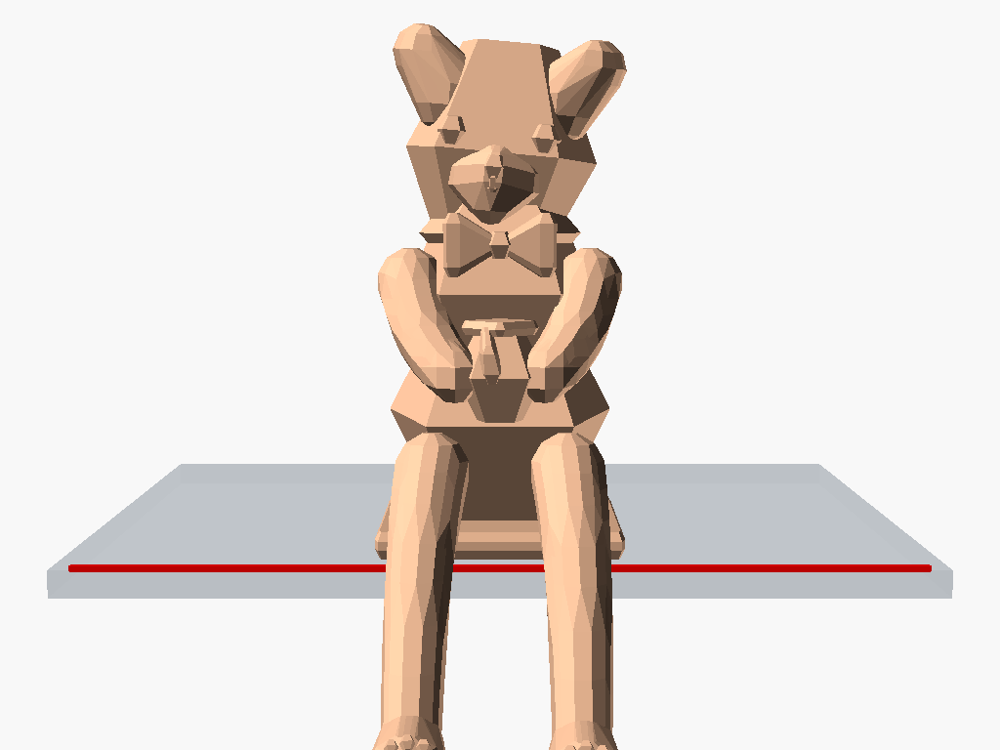
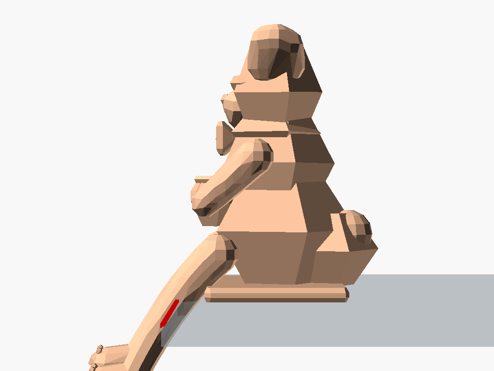
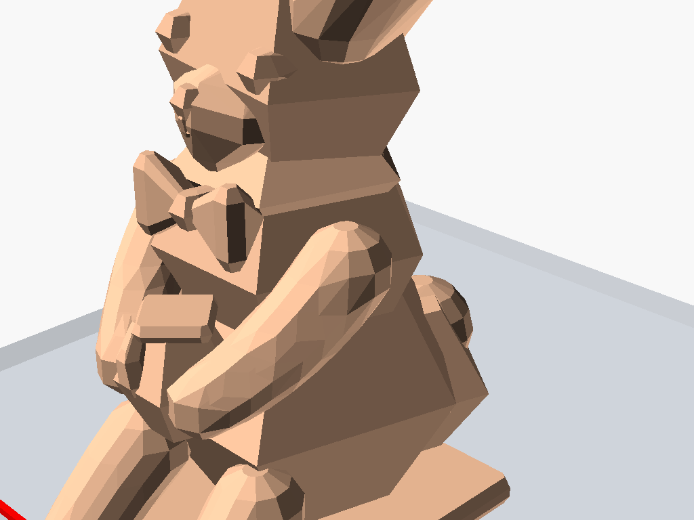
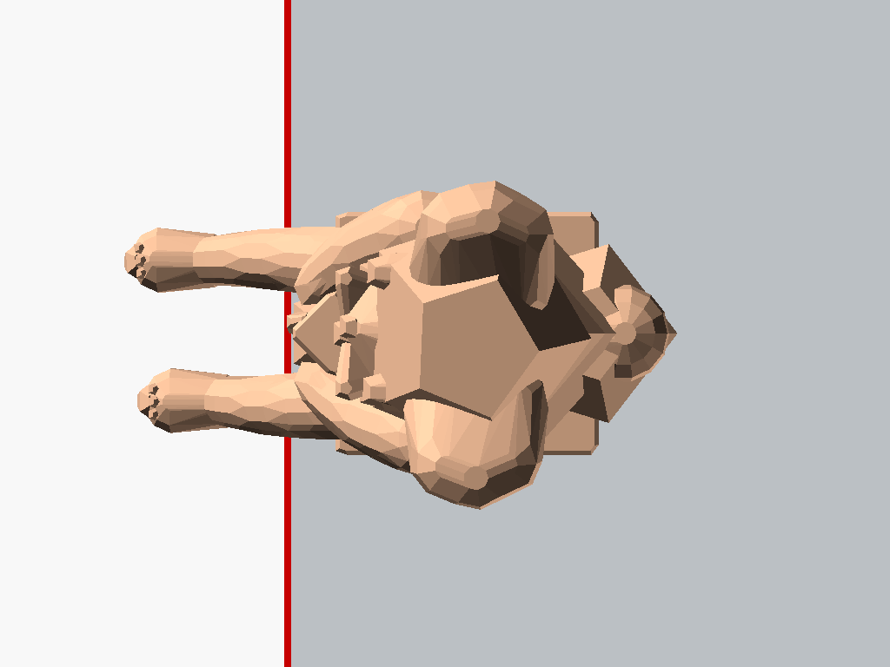
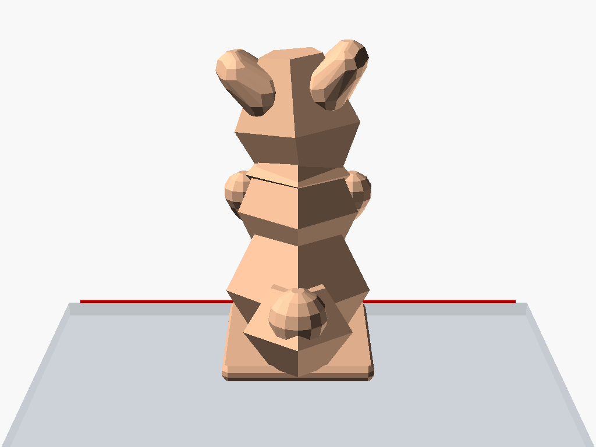
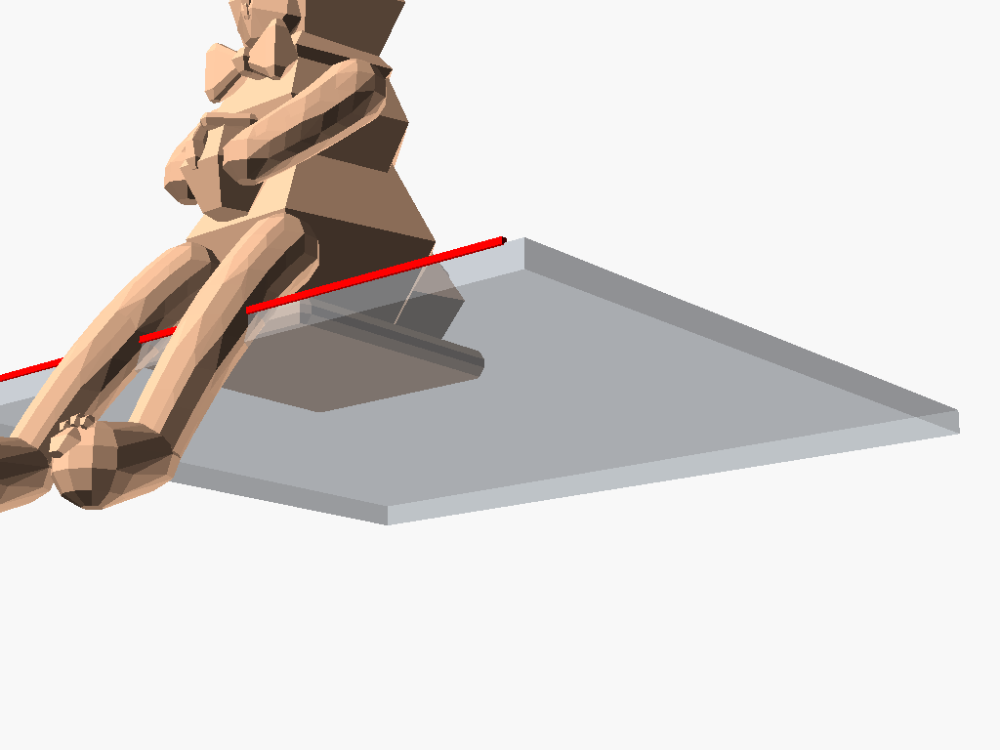

# 桌緣趴姿幾何萌熊公仔 (Faceted Biomimetic Chibi Ledge Bear)

承襲原版貓咪 SCAD 之經典**低多邊形菱角幾何美學（Low-Poly Faceted Biomimetic Mesh）**與黃金分割比例，打造兼具抽象雕塑感與可愛萌系神韻的桌緣公仔——**領結蜂蜜罐小熊 (Option D: Faceted Bear with Bowtie & Honey Pot)**。

本模型已通過 CGAL 實體流形幾何驗證（**Simple: yes, Volumes: 2，單一完全閉合水密實體，零懸空零破面**），後臀低重心結構確保在無膠無磁鐵下自平衡穩坐桌緣。

---

## 📸 多視角渲染檢視 (Multi-Angle Previews)

| 45° 俯瞰視角 (Isometric Perspective) | 正面神態 (Front Straight-On) |
| :---: | :---: |
|  |  |

| 側面剖面檢視 (Side Profile) | 特寫五官與領結蜜罐 (Closeup Face & Accessories) |
| :---: | :---: |
|  |  |

| 頂視俯瞰 (Top-Down) | 背部雕塑與球尾 (Rear & Bobtail) |
| :---: | :---: |
|  |  |

| 仰視底座與腿部垂懸 (Bottom Tabletop Stability) |
| :---: |
|  |

---

## 💎 核心設計特色 (Design & Structural Highlights)

1. **原汁原味菱角幾何美學 (Exact Natural Faceted Mesh)**：
   - 採用未經人為高階細分（$fn）的純粹三角/菱形幾何網面，光影折射分明，呈現如同當代折紙雕塑與鑽石切面的俐落現代質感。
2. **100% 實心無縫一體化焊接 (100% Watertight Solid Manifold)**：
   - **深根嵌入五官**：凸眼與立體鼻鈕自顱骨內部直接延伸 Hull 出面，杜絕菱角幾何曲率下的懸空脫節問題。
   - **無凹陷親切微笑**：實心微凸人中與微笑線自然融入吻部棱面，無任何陰影凹洞。
   - **折紙領結 (Origami Bowtie)**：雙側幾何翼展與中心紐扣深入胸膛 2.4 mm 熔接。
   - **腹中小蜜罐 (Faceted Honey Pot)**：罐體深植於腹部與大腿之間（重疊深度逾 4mm），雙前掌由肩胛順勢抱入罐側。
   - **堅固無弱點膝蓋 (Solid Continuous Knees)**：大腿至小腿一體成型平滑過渡，消除脆弱凹槽，腳底刻劃幾何肉球爪印。
3. **自平衡仿生力學 (Self-Balancing Stability)**：
   - 重心 $X \approx +8.0\text{ mm} > 0$（桌緣線位於 $X = 0$），提供充足抗傾倒力矩安全裕度。

---

## 📏 規格尺寸 (Specifications)

| 項目 | 數值 | 說明 |
| :--- | :--- | :--- |
| **桌面以上高度** | 約 49 mm | 不遮擋螢幕或桌面視線 |
| **桌面懸垂深度** | 約 -15.0 mm | 雙腿自然垂於桌緣外側 |
| **桌面佔用深度** | 約 35 mm | 底座平整接觸桌面 |
| **橫向最大寬度** | 約 26.5 mm | 雙耳及臀部對稱開展 |
| **幾何狀態** | 100% 封閉水密實體 | CGAL Nef Polyhedron 驗證無破面 |

---

## 🖨️ 3D 列印建議 (Printing Recommendations)

- **擺放方位**：底面平貼列印平台（$Z = 0$）。
- **支撐**：建議開啟「樹狀支撐 (Tree Supports)」，僅對懸垂於桌面外的雙腿下緣給予少量支撐即可。
- **層高**：`0.16mm` ~ `0.20mm`（菱角幾何面在微層紋下更顯切面質感）。
- **填充**：`20% ~ 25%`（建議後臀區域局部增加至 `40%` 加重平衡）。

---

## 📂 檔案清單 (File Structure)

- `chibi_ledge_bear.scad`：最新版完整 OpenSCAD 原始碼
- `chibi_ledge_bear.stl`：100% 單一閉合水密實體 STL 網格
- `renders/`：包含 7 個全方位視角的超清渲染圖目錄
