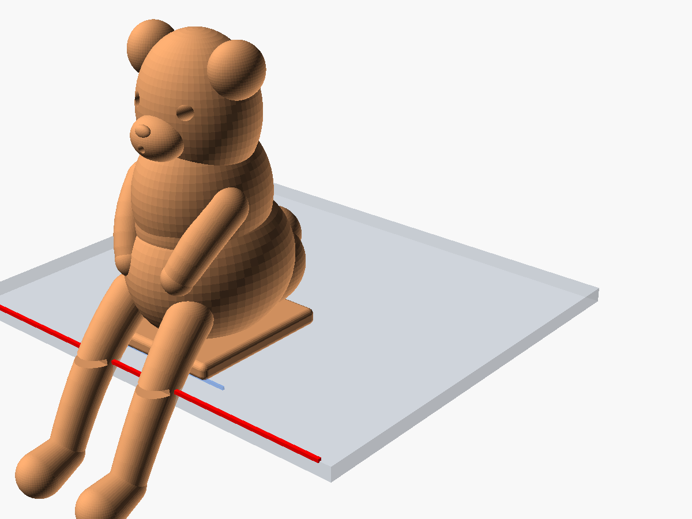
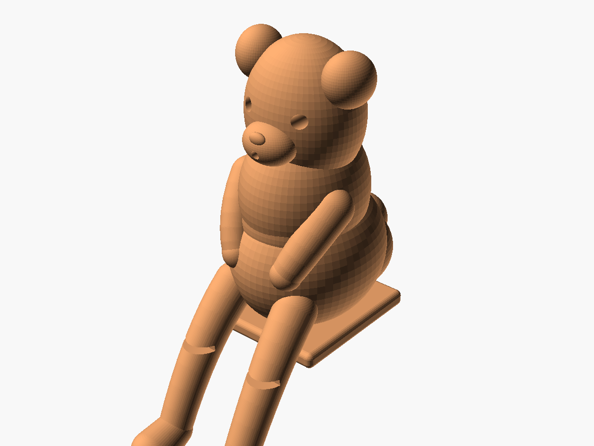
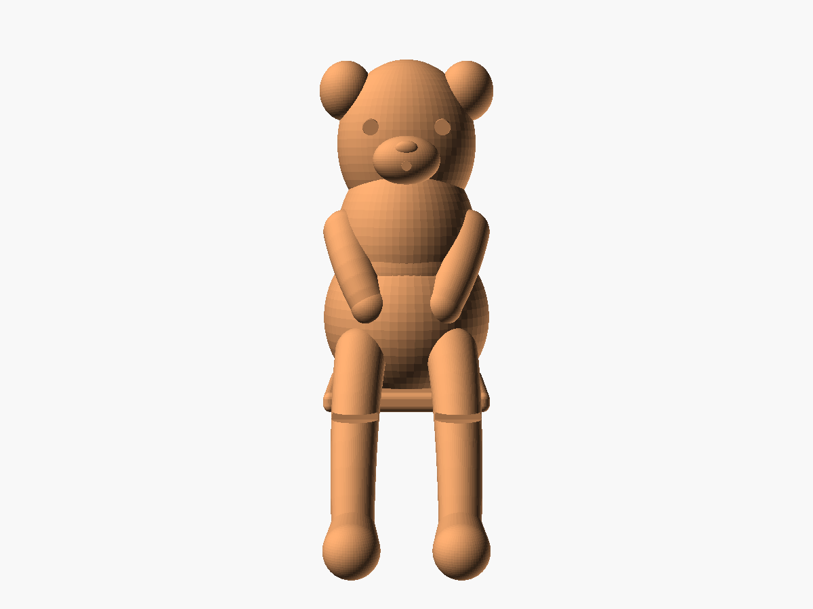
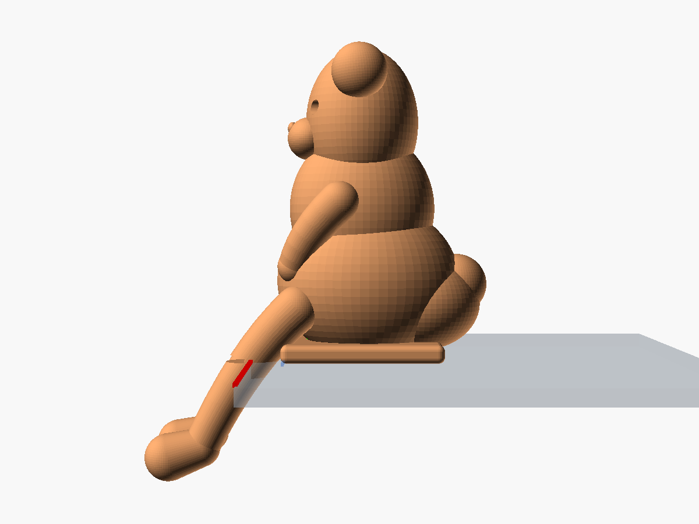

# 桌緣趴姿萌熊公仔 (Biomimetic Chibi Ledge Bear Figurine)

依循仿生學幾何與黃金比例設計的萌系桌緣公仔系列——**小熊版本 (Chibi Bear)**。結合圓潤小熊耳、立體口鼻部、圓滾小熊肚與毛茸球形尾巴，並透過低重心後臀幾何配重，實現無需黏膠、無磁鐵即可自平衡穩坐於任何桌子或展示架邊緣，雙腿自然懸垂於桌緣外。

---

## 📸 視覺預覽 (Visual Previews)

| 桌緣擺放示意 (Ledge View) | 模型立體視角 (Isometric Figurine) |
| :---: | :---: |
|  |  |

| 正面五官與垂爪 (Front View) | 側面力學重心平衡視角 (Side Profile & COM) |
| :---: | :---: |
|  |  |

---

## 📐 核心設計理念與小熊特徵 (Design Basis & Bear Features)

本模型承襲桌緣公仔系列之精密仿生力學，並專門針對熊科特徵進行有機建模：

1. **萌熊特徵造型 (Bear Anatomy)**：
   - **圓形微凹雙耳 (Rounded Bear Ears)**：擺脫貓咪的三角尖耳，採用微帶內凹耳廓的圓潤球弧耳，並以自然角度微外展傾斜。
   - **立體口鼻部 (Protruding Muzzle & Nose)**：具備專屬小熊口鼻隆起部（Muzzle），頂部點綴立體鼻鈕與下唇微凹線條。
   - **圓滾肚腩 (Chubby Bear Belly)**：稍微向前隆起的圓潤小肚肚，前肢小熊爪微向內彎搭在肚腩與膝蓋旁，更添憨厚可愛感。
   - **圓球短尾 (Round Bobtail)**：不同於貓咪的長捲尾，小熊採用圓滾滾毛球短尾巴，並自然融入後臀配重塊。
2. **黃金比例 ($\phi \approx 1.618$)**：
   - 頭部寬高、身軀縱深與頭身比例嚴格以黃金分割公式計算，視覺比例和諧溫馨。
3. **超橢球有機體 (Lamé Superellipsoids)**：
   - 頭部、軀幹與後臀皆以超橢球曲面演算法建構，表面平滑無突兀稜角。
4. **二次貝茲曲線四肢 (Quadratic Bézier Limbs)**：
   - 雙腿從桌內（$X > 0$）平滑跨越桌緣基準線（$X = 0$）垂懸至桌外（$X < 0$），下端為飽滿的熊掌造型，完全懸空避讓桌子側面垂直牆面。
5. **重心自平衡機制 (Self-Balancing Physics)**：
   - **受力底座**：底部設置 $26 \times 24\text{ mm}$ 寬闊平整接觸面，完全貼實於 $Z=0$ 桌面。
   - **低重心後配重**：低重心後臀（`rear_countermass`）與後置圓尾巴將公仔整體質心拉至桌緣內側約 $X \approx 8.5\text{ mm}$、$Z \approx 18.0\text{ mm}$，提供超過 5mm 的抗前傾力矩安全裕度。

---

## 📏 規格尺寸 (Specifications)

| 項目 | 數值 | 備註 |
| :--- | :--- | :--- |
| **桌面以上高度** | 約 48.5 mm | 嚴格控制在 50 mm 安全高度內，小巧不遮擋視線 |
| **懸垂深度** | 約 -15.2 mm | 垂於桌緣外側之腿部長度 |
| **桌面佔用深度** | 約 36 mm | 坐於桌內部分之最大長度（含後尾） |
| **最大橫向寬度** | 約 26.5 mm | 雙耳及臀部橫向最大寬度 |
| **底座接觸面積** | 約 $26 \times 24$ mm | 平整貼合於桌面 |

---

## 🖨️ 3D 列印與切片建議 (Slicing & Printing Guide)

### 建議列印方向
- **標準底面朝下（推薦）**：
  - 將模型底部平整接觸面置於列印熱板 ($Z=0$)。
  - **支撐設定**：在切片軟體中啟用「樹狀支撐 (Tree Supports)」，僅需少量支撐於懸空的腿部腳掌（$Z < 0$ 區域）。
  - **優點**：小熊頭部、雙耳、面部五官、肚腩與雙手臂紋理最細膩，拆除支撐後完全不影響外觀面。

### 建議切片參數
- **層高 (Layer Height)**：`0.12mm` ~ `0.16mm`（高品質曲面表現）
- **外牆圈數 (Wall Loops)**：`3` 圈以上
- **填充率 (Infill)**：`20% ~ 30%`（建議使用 Gyroid 陀螺儀填充）
  - *穩定度加強技巧*：可於切片軟體中在後臀部分新增高度區段或方塊 Modifier，將後臀填充率單獨設為 `40% ~ 50%`，可進一步增強自平衡配重效果。
- **適用材質**：PLA / PLA+ / PETG / 光固化樹脂 (Resin)

---

## 📂 檔案清單 (File Structure)

- `chibi_ledge_bear.scad`：OpenSCAD 原始程式碼（包含預覽桌面、桌緣安全線與重心標記開關）
- `chibi_ledge_bear.stl`：高品質輸出之 STL 三角網格檔案（已自動去除桌板預覽，可直接匯入切片軟體）
- `renders/`：多角度高解析度渲染圖目錄
