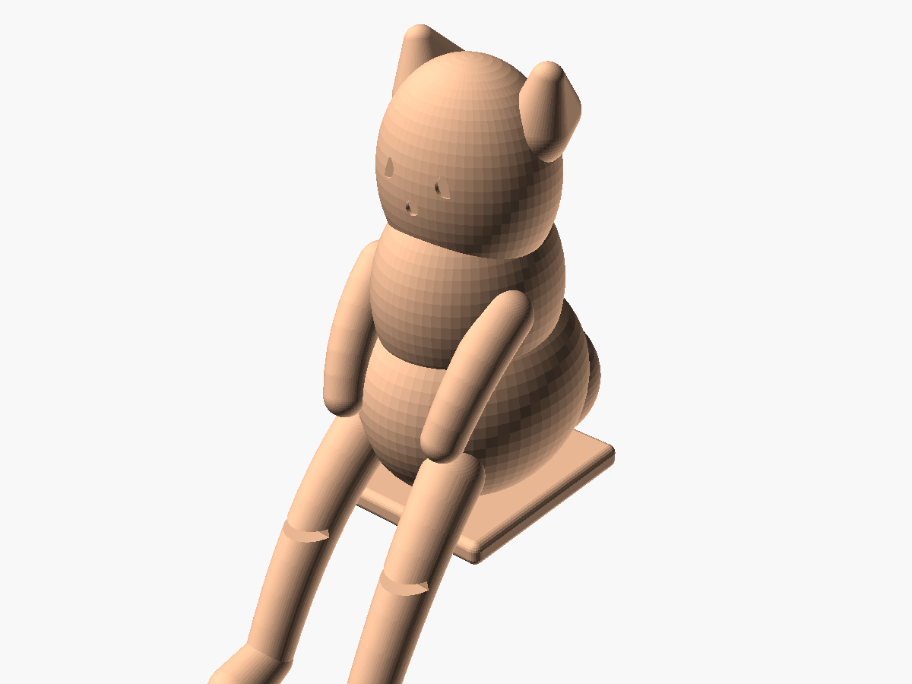
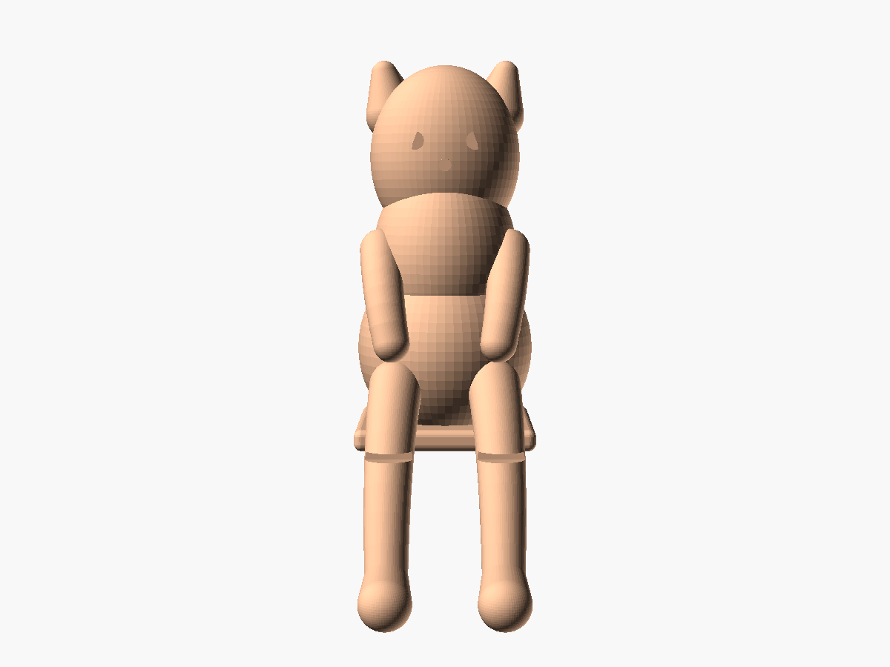
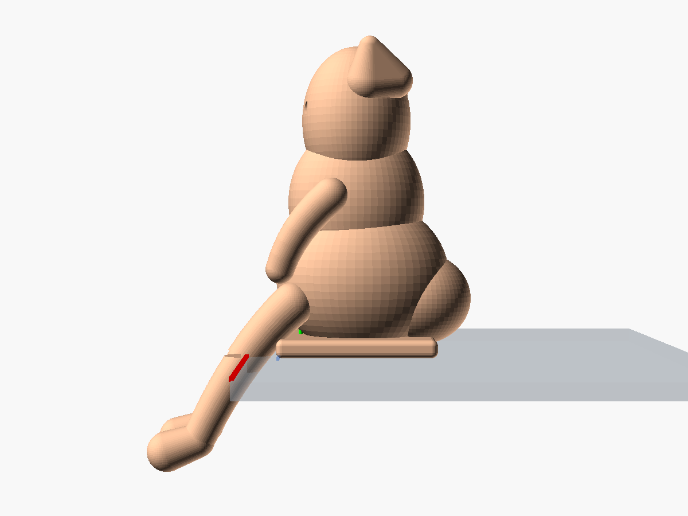

# 桌緣趴姿萌貓公仔 (Biomimetic Chibi Ledge Cat Figurine)

依循仿生學幾何與黃金比例設計的萌系桌緣公仔。利用隱藏式低重心後配重結構，使其能夠穩定趴坐於任何厚度與材質的桌子或置物架邊緣，雙腳自然懸垂於桌緣外，無需黏膠或額外固定座。

---

## 📸 視覺預覽 (Visual Previews)

| 桌緣擺放示意 (Ledge View) | 等角視角 (Isometric Figurine) |
| :---: | :---: |
|  |  |

| 正面視角 (Front View) | 側面力學重心視角 (Side Profile & COM) |
| :---: | :---: |
|  |  |

---

## 📐 核心設計理念與仿生力學 (Design Basis)

本模型結合數學幾何、仿生造型與靜力學平衡設計：

1. **黃金比例 ($\phi \approx 1.618$)**：
   - 頭部高寬比、身軀與頭部比例均以黃金分割定義，兼具可愛卡通（Chibi）身形與視覺舒適感。
2. **超橢球有機體 (Lamé Superellipsoid Approximation)**：
   - 頭部與軀幹運用平滑過渡的超橢球曲面，避免傳統幾何體的生硬邊角，呈現圓潤毛茸感。
3. **二次貝茲曲線四肢 (Quadratic Bézier Limbs)**：
   - 懸垂後腿自桌內（$X > 0$）自然延伸越過桌緣（$X = 0$）垂吊於桌外（$X < 0$），腳掌略微前傾放大，不碰觸桌子垂直側面。
4. **對數螺線蜷曲尾巴 (Logarithmic Spiral Tail)**：
   - 依循對數螺旋方程式 $r(\theta) = a \cdot e^{b\theta}$ 蜷曲於臀部後方，除了仿生美感外，亦兼具後方配重與防後傾穩定支點功能。
5. **重心自平衡機制 (Self-Balancing Physics)**：
   - **座標系統**：桌面 $Z = 0$，桌緣基準線 $X = 0$（桌內 $X > 0$，懸垂區 $X < 0$）。
   - **受力底座**：底部設置 $26 \times 24\text{ mm}$ 寬闊平整接觸面，完全受力於桌面。
   - **幾何配重**：低重心後臀（`rear_countermass`）將整體質心拉至桌緣內側 $X \approx 8\text{ mm}$、$Z \approx 18\text{ mm}$，提供超過 5mm 的抗傾覆安全裕度，擺放極為穩固。

---

## 📏 規格尺寸 (Specifications)

| 項目 | 數值 | 備註 |
| :--- | :--- | :--- |
| **桌面以上高度** | 約 48 mm | 總高小於 50 mm，適合作為螢幕下或桌角小擺飾 |
| **懸垂深度** | 約 -15.2 mm | 垂於桌緣下方的腿部垂直長度 |
| **桌面佔用深度** | 約 35 mm | 坐於桌內部分之最大長度（含尾巴） |
| **最大橫向寬度** | 約 26 mm | 雙耳與臀部橫向最大寬度 |
| **底座接觸面積** | 約 $26 \times 24$ mm | 平整貼合於桌面 |

---

## 🖨️ 3D 列印與切片建議 (Slicing & Printing Guide)

### 建議列印方向
- **標準姿態（底面朝下，推薦）**：
  - 將模型底部平整接觸面置於熱床 ($Z=0$)。
  - **支撐設定**：開啟「樹狀支撐 (Tree Supports)」以支撐前垂腳掌（$Z < 0$ 區域）。
  - **優點**：貓咪頭頂、雙耳、面部五官細節朝上，層紋最平整，表面質感最佳。

### 建議切片參數
- **層高 (Layer Height)**：`0.12mm` ~ `0.16mm`（細緻曲面呈現）
- **外牆圈數 (Wall Loops)**：`3` 圈以上
- **填充率 (Infill)**：`20% ~ 30%`（Gyroid 或 Grid 填充）
  - *進階技巧*：若想進一步提升抗碰撞防掉落穩定度，可在切片軟體中於後臀區域新增一個 Modifier，將後臀填充率提升至 `40% ~ 50%`，可進一步後移重心。
- **適用材質**：PLA / PLA+ / PETG / 光固化樹脂 (Resin)

---

## 📂 檔案清單 (File Structure)

- `chibi_ledge_cat.scad`：OpenSCAD 原始程式碼（包含 `show_table`、`show_edge_line`、`show_com_marker` 等預覽開關）
- `chibi_ledge_cat.stl`：高品質輸出之 STL 三角網格檔案（已去除桌板預覽，可直接匯入切片軟體）
- `renders/`：多視角高解析度渲染圖目錄
