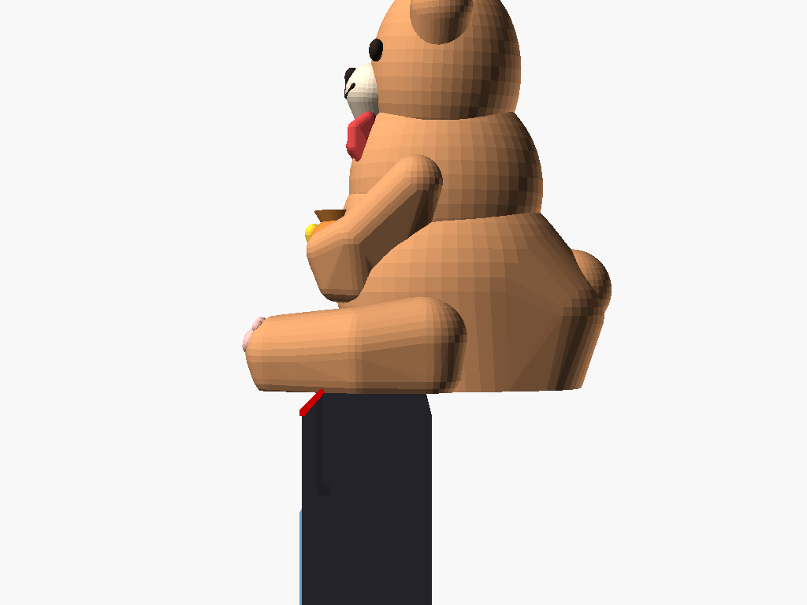
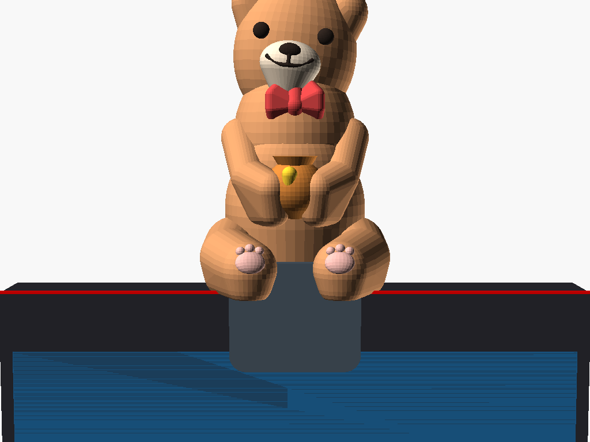
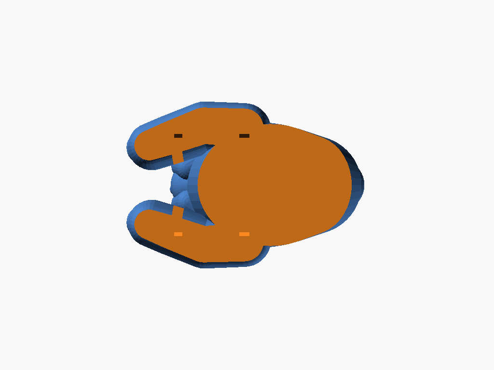
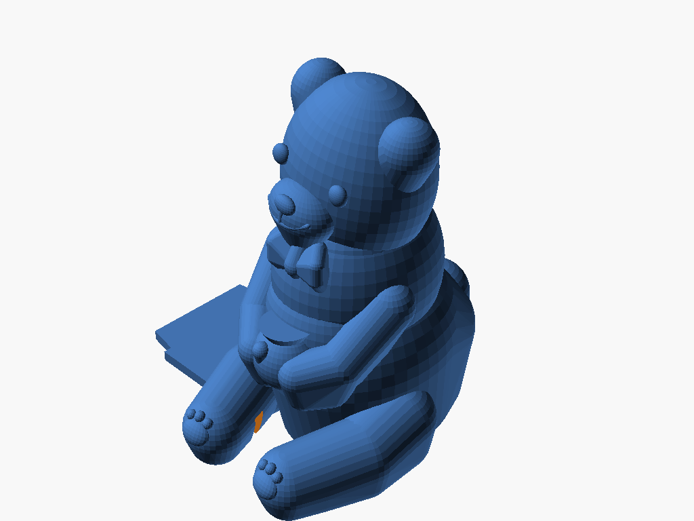

# Cute Ledge Bear - Support-Free & Monitor Mount Edition (桌緣/螢幕頂部兩用萌熊公仔)

專為 FDM 3D 列印打造的「**100% 一體成型（Monolithic）、免支撐（Support-Free）、桌緣/電腦螢幕雙用（Desk & Monitor Dual-Mode）**」經典平滑超萌小熊公仔。

包含底部專利級免支撐尖拱插槽與模組化防滑薄片擋板（Anti-Drop Baffle），可穩穩放置於電腦螢幕頂端或桌緣，徹底解決公仔易掉落與分件裝配失敗的問題！

---

## 💡 設計重構與工程特色 (Design Evolution & Engineering Features)

### 1. 徹底揚棄「為避支撐而拆分雙腿」的缺陷設計
在早期版本中，為了避開懸垂腿部產生的支撐而將雙腿切開、透過側向榫卯插裝，但這在 FDM 列印中存在致命缺陷：
- **榫頭強度脆斷**：細小柱狀或尖拱榫頭橫向插裝時，極易沿層線（Layer lines）脆斷。
- **公差干涉卡死**：FDM 列印外擴與內孔收縮特性導致公差難以兼顧，微小誤差即造成無法推入或鬆脫。
- **曲面貼合公差累積**：有機生物曲面與大腿根部貼合凹槽在插裝時存在多軸向干涉，物理上極難順利入位。
- **外觀突兀贅肉**：舊版在大腿內側留有非生物特徵的過渡橋凸起（Protrusion），破壞整體美感。

### 2. 本次重構：直接重構模型姿態與人體工學（Direct Model Redesign）
- **圓滾端坐萌態（Forward-Seated Chibi Pose）**：
  - 徹底移除雙腿間的突起物與舊版過渡塊，以自然圓潤的有機曲面無縫銜接軀幹、蜜罐與大腿。
  - 雙腿向前自然環抱蜂蜜罐，底面於 $Z=0$ 處形成**整片連續、超過 $600\text{ mm}^2$ 的平整熱床貼合面**，提供極佳的第一層熱床附著力，徹底告別翹邊（Warping），完全不需 Brim 邊緣輔助。
- **100% 全幾何自支撐曲面（100% Self-Supporting Geometry）**：
  - 軀幹、下巴、領結、手臂、蜜罐倒錐角均嚴格控制在 $\le 35^\circ \sim 45^\circ$ 上升角，切片引擎 **0 支撐警報（Support Alert: None）**，省去全部支撐廢料與後製打磨。
  - 腳掌肉球自然外露（1 大掌肉墊 + 3 圓趾豆），極富視覺療癒感。

### 3. 電腦螢幕防滑落系統：底部免支撐凹槽 + 獨立薄片擋板（Monitor Baffle System）
針對使用者將小熊放置於**電腦螢幕頂部狹窄邊框**的需求，全新研發了隱形防滑落模組：
- **底部雙規格 45° 尖拱插槽（Bottom Dual Pointed-Arch Slots）**：
  - 小熊底部內建專用插槽（寬度 1.8mm、深度 5.0mm、長度 18.0mm）。
  - **內部 45° 尖拱免支撐頂面**：插槽頂面採用 $45^\circ$ 雙斜尖拱倒角設計，在 $Z=0$ 列印小熊主體時，插槽內部天花板**100% 自支撐，內部無需任何支撐即可完美成型**。
  - **雙定位插槽設計**：
    - 前插槽（$X = 3.0\text{mm}$）：安裝擋板後向下勾住螢幕前窄邊框（如圖示），防止小熊後仰或向後推移滑落。
    - 後插槽（$X = 14.5\text{mm}$）：適用於厚度約 11~12mm 之螢幕外殼背部止擋。
- **模組化防滑薄片擋板（Modular Thin-Plate Baffle）**：
  - 厚度 1.5mm、插入榫高 4.6mm、下垂擋板長度 12.0mm、擋邊寬度 20.0mm。
  - 平躺於熱床直接列印，**無支撐、僅需 4 分鐘即可印好**。
  - 精準預留每邊 0.15mm 滑順阻尼公差，推進底部插槽即牢固卡入，微下垂的外緣能緊扣螢幕邊框，完全不遮擋螢幕可視區域。
  - **雙用自由切換**：
    - **擺放桌面時**：不插擋板，小熊底部即為純平接觸面，平穩端坐桌緣。
    - **放置螢幕時**：插入薄片擋板，即可卡在螢幕邊框上，耐震耐碰不掉落！

---

## 📸 視覺渲染預覽 (Render Gallery)

### 1. 電腦螢幕頂部安裝狀態 (Mounted on Computer Monitor)
| 45° 螢幕透視 (Monitor Perspective) | 螢幕側面擋板卡榫結構 (Side Profile) | 正面螢幕萌態 (Front View) |
| :---: | :---: | :---: |
|  |  |  |
| 穩妥跨坐於電腦螢幕頂部，薄片擋板向下勾住螢幕窄邊框 | 擋板（灰藍色）精準插入前槽，薄薄貼齊前框，小熊牢固鎖定 | 雙手抱罐、微笑歪頭，為辦公桌面增添滿滿活力 |

### 2. 底部免支撐插槽與 3D 列印佈局 (Bottom Slots & Print Bed Layout)
| 底部雙定位尖拱插槽 (Bottom Slots) | 單盤同印佈局 (1-Plate Combo Layout) |
| :---: | :---: |
|  |  |
| 內嵌 45° 尖拱插槽，列印無需支撐，平貼熱床 | 小熊主體 + 薄片擋板同盤一次印好，免換盤、免支撐 |

---

## 📊 切片量化驗證數據 (PrusaSlicer Quantitative Verification)

使用專業切片引擎 `PrusaSlicer 2.9` 進行實測驗證：

| 指標項目 | 舊版分腿插裝方案 | **新版一體免支撐 + 螢幕擋板方案** | 改善效益 |
| :--- | :---: | :---: | :---: |
| **小熊主體列印件數** | 3 件 (身體 + 左右腿) | **1 件 (一體成型)** | **消除所有細小卡榫與組裝失敗痛點** |
| **螢幕防落擋板** | 無此功能 (易從螢幕滑落) | **獨立薄片 (單獨或同盤列印)** | **螢幕頂端安放穩固，不晃不摔** |
| **切片引擎支撐警報** | 需關閉支撐或打支撐 | **全模型 0 支撐警報 (Support Alert: False)** | **100% 全幾何自支撐** |
| **支撐材料浪費** | 耗費支撐廢料 | **0.00 mm (0.00 g)** | **0 耗材浪費，省時省料** |
| **底面熱床貼合面積** | 分散碎小接觸面 | **連續大底面 (>600 mm²)** | **完全不需 Brim，零翹邊** |
| **擋板列印時間 (0.20mm)** | - | **約 4 分鐘 (單獨) / ~50 分鐘 (同盤)** | **極速成型** |
| **模型水密性** | 易產生非流形邊 | **100% 封閉水密 2-Manifold (`Simple: yes`)** | **切片無破損、法向無翻轉** |

---

## 📦 檔案清單與使用說明 (Files & Usage)

| 檔案名稱 | 說明 | 推薦用途 |
| :--- | :--- | :--- |
| **[`cute_ledge_bear_supportfree.stl`](cute_ledge_bear_supportfree.stl)** | **小熊主體 STL (推薦)** | 內建底部免支撐槽的小熊本體，單獨列印或桌緣使用。 |
| **[`monitor_baffle.stl`](monitor_baffle.stl)** | **電腦螢幕防滑薄片擋板 STL** | 1.5mm 超薄平貼列印件，列印僅需 4 分鐘，隨插即用。 |
| **[`cute_ledge_bear_plate.stl`](cute_ledge_bear_plate.stl)** | **一盤搞定同印組合 STL** | 小熊主體 + 薄片擋板同盤排列於 $Z=0$，一鍵列印整套！ |
| **[`cute_ledge_bear_monolithic.stl`](cute_ledge_bear_monolithic.stl)** | 小熊主體相容備份 STL | 與 `cute_ledge_bear_supportfree.stl` 內容完全相同。 |
| **[`cute_ledge_bear_supportfree.scad`](cute_ledge_bear_supportfree.scad)** | OpenSCAD 參數化原始代碼 | 支援切換 `bear`、`baffle`、`plate`、`assembled` 模式。 |
| **`renders/`** | 高解析渲染圖庫 | 包含螢幕安裝、底槽特寫、列印佈局等多視角圖像。 |

---

## 🖨️ 3D 列印建議參數 (Print Settings)

1. **切片設定 (Slicer Profile)**：
   - **支撐 (Supports)**：**完全關閉支撐（Supports: None / 關閉）**！小熊主體與薄片擋板均 100% 免支撐。
   - **底邊 (Brim)**：**無須開啟 Brim**（底部平整面積大，天然附著力極佳）。
   - **層高 (Layer Height)**：建議 `0.16mm` ~ `0.20mm`（追求極致面部細節可設 `0.12mm`）。
   - **填充率 (Infill)**：建議 `15% ~ 20%` 陀螺儀（Gyroid）或網格（Grid）。
   - **外壁圈數 (Perimeters/Walls)**：建議 `3 圈`，薄片擋板即為全實心。
2. **安裝使用方式**：
   - **一般桌緣**：直接將小熊放置在桌面邊緣，其低重心重心內斂特性可穩如泰山。
   - **電腦螢幕**：將列印好的 `monitor_baffle.stl` 薄片凸起端推入小熊底部的插槽（微彈性摩擦配合，公差 0.15mm），掛於螢幕頂端邊框前緣即可！
