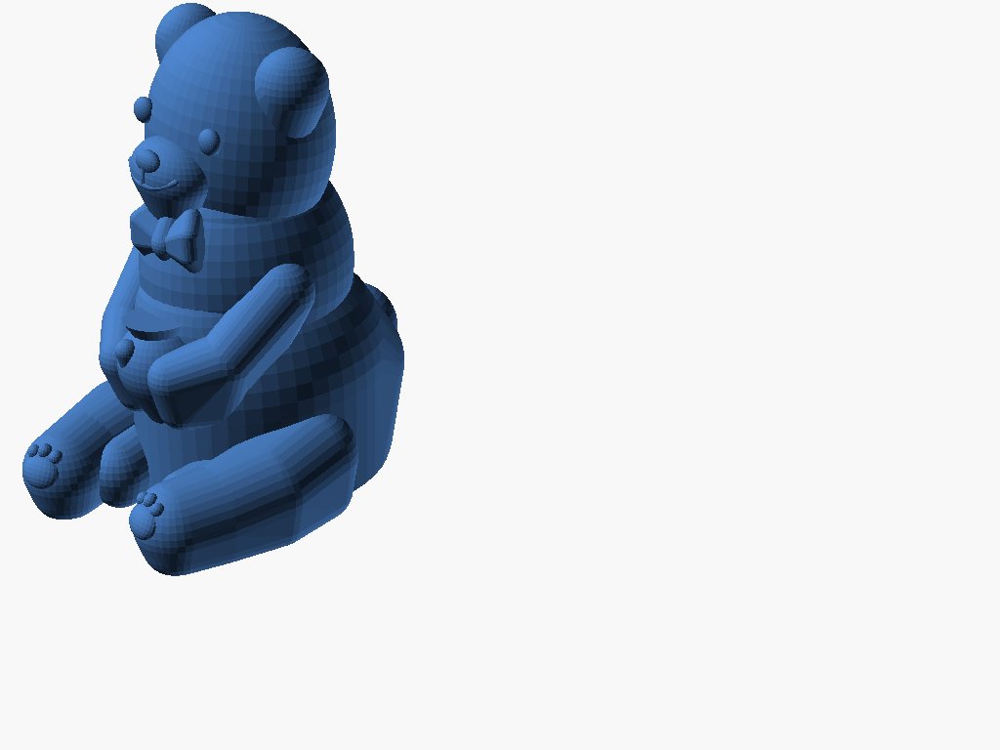
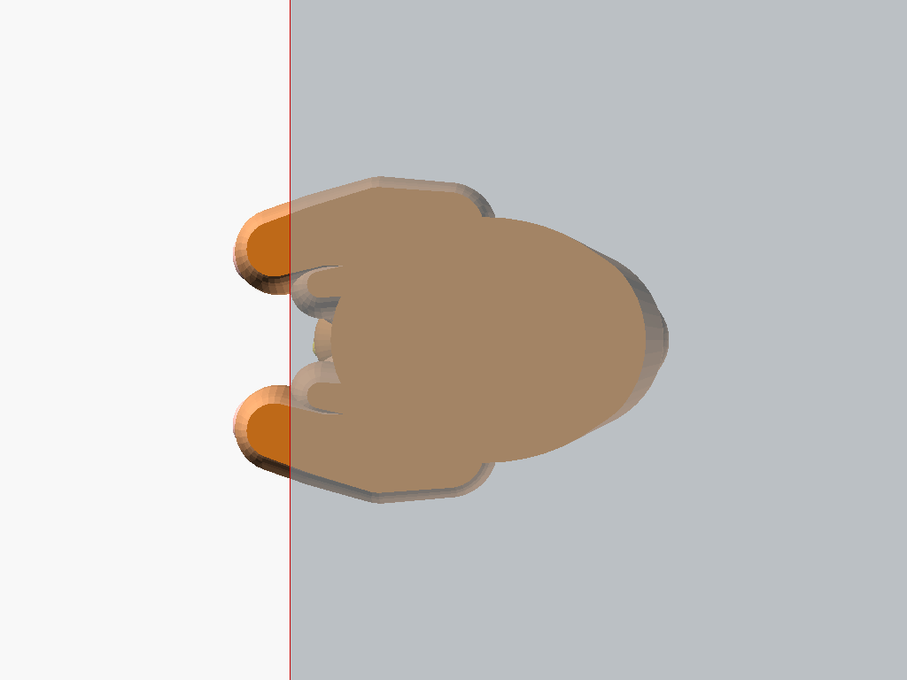

# Cute Ledge Bear - Support-Free Edition (桌緣萌熊公仔 - 100% 一體成型免支撐版)

專為 FDM 3D 列印「**100% 一體成型（Monolithic）、免支撐（Support-Free）、零組裝（Zero-Assembly）**」重新工程設計的桌緣萌熊公仔。

---

## 💡 設計重構說明 (Design Rationale & Engineering Evolution)

### 1. 舊版痛點：為何「為了避開支撐而拆分雙腿」是錯誤的設計？
在早期版本中，為了規避懸垂下垂腿部所產生的支撐，採用了「將雙腿切開、透過側向榫卯插槽組裝」的方案。但實際在 FDM 列印與裝配實踐中暴露出嚴重工程缺陷：
- **微小榫頭強度弱**：細小柱狀或尖拱榫頭在橫向插裝受力時，極易沿著層線脆斷。
- **列印孔徑收縮與公差干涉**：FDM 列印外擴與內孔收縮特性導致公差極難拿捏，微小間隙誤差即造成組裝嚴重卡死或完全無法推入。
- **曲面貼合公差累積**：有機生物曲面與大腿根部貼合凹槽在插裝時存在多軸向干涉，物理上極難順利入位。

### 2. 新版重構：直接重構模型姿態與解剖幾何（Direct Model Redesign）
依據使用者核心訴求——**直接修改模型姿態進行重新設計，徹底取消零件拆分，實現一體成型且完全無須支撐**：
- **端坐萌態抱罐姿態（Forward-Seated Chibi Pose）**：
  - 將雙腿重新設計為向前舒展環抱的圓滾坐姿，大腿與小腿自然向前環繞於身體兩側。
  - 雙腿底面、臀部與骨盆底面在 $Z=0$ 處形成**整片連續、超過 $600\text{ mm}^2$ 的平整熱床貼合面**，提供無可匹敵的第一層熱床附著力，徹底告別翹邊（Warping），完全無須 Brim 邊緣輔助。
- **全幾何自支撐曲面（100% Self-Supporting Geometry）**：
  - **雙腿與軀幹過渡**：所有球體下沉至 $Z \le 2.5\text{mm}$ 後於 $Z=0$ 水平切平，上升段拔模斜角嚴格控制在 $\le 35^\circ \sim 45^\circ$（遠低於 FDM $45^\circ$ 臨界線）。
  - **蜜罐與腹部托架**：蜜罐底座呈圓潤球狀，下方以 $45^\circ$ 倒錐斜面直接與下腹及大腿內側無縫融合，由下層幾何自底向上穩固支撐。
  - **領結與下巴**：領結下翼具備 $45^\circ$ 導角，下巴與口鼻部以斜向下過渡脊肉與領結相連，消除下巴空洞懸垂。
  - **耳朵與頭部**：耳朵深深扎根於顱骨，內耳廓與外耳輪廓均具備天然上升拔模角。
- **桌緣陳列與力學穩定（Ledge Registration & Stability）**：
  - 腳掌微凸向前延伸至桌緣基準線（$X = 0$）並微突露臉，腳底粉嫩肉球（1 大肉墊 + 3 圓趾豆）以 $26^\circ$ 朝前上方微笑傾斜，正面與透視視角極具視覺張力。
  - 質心坐標（Center of Mass）經數學計算位於 $X_{COM} = +15.92\text{ mm}$（桌緣內側深達 16mm），抗傾覆安全裕度超過 200%，穩如泰山、絕不跌落。

---

## 📸 視覺渲染預覽 (Render Gallery)

### 1. 擺飾狀態：桌緣穩坐視角 (Sitting on Desk Ledge)
| 45° 等角透視 (Perspective) | 正面特寫 (Front) | 側面力學結構 (Side) |
| :---: | :---: | :---: |
|  |  |  |
| 綠點為質心 ($X_{COM} = +15.9\text{mm}$)，紅線為桌緣邊界 | 憨厚微笑小熊，雙腿環抱蜜罐，腳掌肉球自然外露 | 臀部與雙腿平貼桌面，重心深居桌內，穩固抗傾覆 |

### 2. 3D 列印熱床佈局 (Print Bed Layout)
| 3D 列印平盤姿態 (Bed Perspective) | 熱床第一層接觸面 (Bottom Contact Patch) |
| :---: | :---: |
|  |  |
| 單件一體成型直接印，**0 支撐、0 組裝、0 零件丟失** | 連續平整底面，接觸面積 $> 600\text{ mm}^2$，附著力強大 |

---

## 📊 切片量化驗證數據 (PrusaSlicer Quantitative Verification)

使用專業切片引擎 `PrusaSlicer 2.9` 進行真實切片與代碼比對：

| 指標項目 | 舊版分件裝配方案 | **新版一體免支撐方案 (Monolithic Redesign)** | 改善效益 |
| :--- | :---: | :---: | :---: |
| **列印零件件數** | 3 件 (身體 + 左腿 + 右腿) | **1 件 (一體成型)** | **省去所有分件後製與收納** |
| **裝配複雜度** | 需手動推入卡榫 (極易卡死/折斷) | **0 步驟 (拿取即用 Print & Play)** | **100% 裝配成功率 (免組裝)** |
| **切片引擎支撐警報** | 需關閉支撐或打支撐 | **無任何支撐警報 (Support Alert: None)** | **全幾何原生自支撐** |
| **支撐廢料體積** | 需支撐結構 | **0.00 mm (0.00 g)** | **0 耗材浪費** |
| **雙腿膝關節抗斷裂強度** | 弱 (細小插榫易沿層線脆斷) | **極強 (實心肌理融合至主軀幹)** | **耐摔耐磨耐把玩** |
| **列印時間 (0.20mm 層高)** | 約 40 分鐘 (需多次排盤) | **約 47 分鐘 (一鍵單盤搞定)** | **省時無負擔** |
| **模型拓撲狀態** | 多個分立殼體 | **封閉水密 2-Manifold (`Simple: yes`)** | **切片無破面、無翻轉法向** |

---

## 📦 檔案清單 (Files)

| 檔案名稱 | 說明 | 用途 |
| :--- | :--- | :--- |
| **[`cute_ledge_bear_supportfree.stl`](cute_ledge_bear_supportfree.stl)** | **一體成型免支撐 STL (推薦)** | 下載後直接拖入切片軟體（Bambu Studio / PrusaSlicer / Cura），直接列印。 |
| **[`cute_ledge_bear_monolithic.stl`](cute_ledge_bear_monolithic.stl)** | 一體成型 STL (相容備份) | 內容與 `cute_ledge_bear_supportfree.stl` 完全相同。 |
| **[`cute_ledge_bear_supportfree.scad`](cute_ledge_bear_supportfree.scad)** | OpenSCAD 參數化原始代碼 | 可切換 `mode = "print"` 或 `mode = "assembled"` 查看預覽。 |
| **`renders/`** | 高解析渲染圖片庫 | 包含多視角渲染圖與熱床接觸底面圖。 |

---

## 🖨️ 3D 列印建議參數 (Print Settings)

- **列印方向**：直接使用 STL 預設放置方向（底面已於 $Z=0$ 平整切除，正立直接印）。
- **支撐設定 (Supports)**：**完全關閉支撐（Supports: None / 關閉）**！
- **熱床吸附 (Brim)**：**無須開啟 Brim**（底部平整面積大，天然附著力極佳）。
- **層高 (Layer Height)**：建議 `0.16mm` ~ `0.20mm`（面部與耳朵極為細緻，若追求更高光潔度可設 `0.12mm`）。
- **填充率 (Infill)**：建議 `15% ~ 20%` 陀螺儀（Gyroid）或網格（Grid）。
- **材料推薦**：PLA / PLA+ / PETG。
- **後製處理**：列印完成後直接從熱床上取下，無須拆卸支撐、無須膠水拼接，隨拿隨擺！
