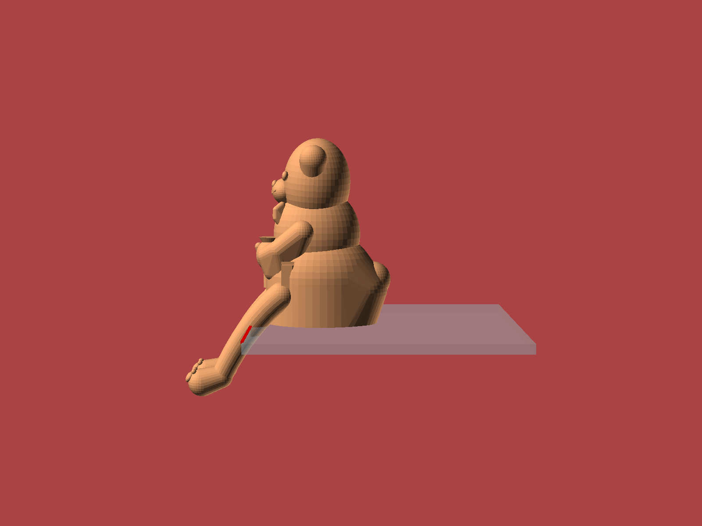
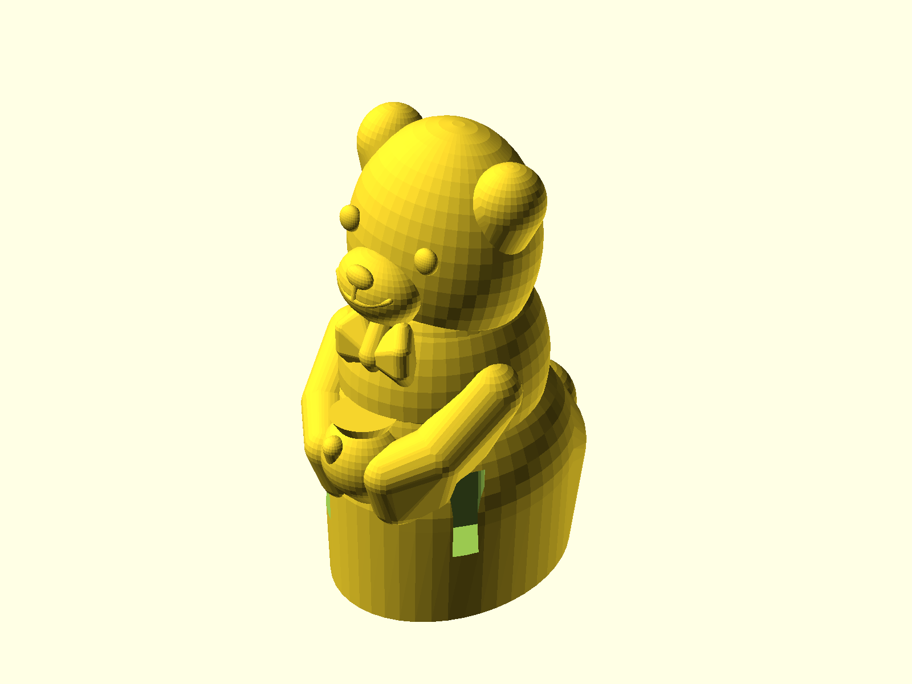
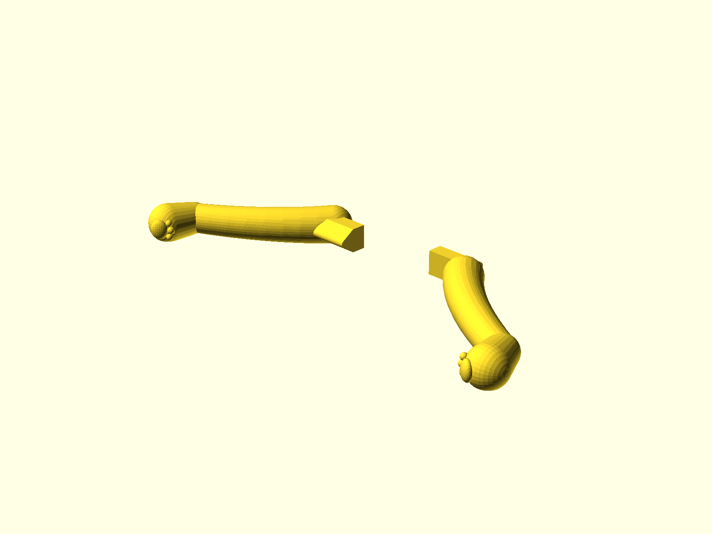

# Cute Ledge Bear - Support-Free Edition (桌緣趴姿萌熊公仔 - 零支撐/極簡支撐版)

針對 FDM 3D 列印「**盡可能無須支撐（Support-Free / Minimal Support）**」專門工程最佳化的桌緣萌熊公仔版本。

保留了經典版圓潤呆萌的泰迪熊造型（圓耳、微凸立體紐扣眼、微笑嘴、領結、蜜罐、腳掌肉球），透過**模組化榫卯插接（Modular Snap-Fit）**與**自支撐 45° 幾何曲面（Self-Supporting 45° Keels & Pointed Arches）**，徹底消除傳統懸空桌緣擺件在切片時所需的大量支撐結構。

---

## 📸 視覺渲染預覽 (Render Gallery)

### 1. 組裝完成桌緣擺飾狀態 (Assembled on Ledge)
| 45° 等角透視 (Perspective) | 正面視角 (Front) | 側面視角 (Side) |
| :---: | :---: | :---: |
|  |  |  |
| 綠點為質心 marker ($X_{COM} = +17.6\text{mm}$)，紅線為桌緣邊界 | 圓滾微笑小熊，雙腿自然垂直垂掛於桌緣 | 膝關節緊貼桌緣邊緣拐角，重心穩固抗傾覆 |

### 2. 100% 零支撐列印佈局 (Support-Free Print Layouts)
| 一體同盤列印佈局 (1-Plate Layout) | 身體列印姿態 (Body on Bed) | 雙腿平鋪列印姿態 (Legs Flat) |
| :---: | :---: | :---: |
|  |  |  |
| 單盤直接列印身體與雙腿，一鍵完成 | 底部大面積平整貼床，過渡曲面 $\le 45^\circ$ | 雙腿內側平貼熱床，層線縱向受力極強 |

---

## 💡 為什麼一般桌緣公仔需要大量支撐？本版本如何達成「免支撐」？

### 傳統一體懸垂公仔的痛點
1. **懸空落差巨大**：垂腿公仔的腳掌往往延伸至桌緣下方 $-15 \sim -18\text{ mm}$。若以整隻直立列印，整個公仔軀幹會懸空在熱床上方 $18\text{ mm}$，切片軟體必須在底下鋪設整片高達數十層的支撐柱。
2. **懸垂面粗糙**：支撐柱接觸的身體底部表面往往粗糙、有殘留瑕疵，拆除時甚至容易折斷細小的手部或領結。
3. **關節強度脆弱**：直立列印時，雙腿的 Z 軸層線方向（Layer Lines）與受力方向垂直，膝蓋極易因 Z 軸層間結合力弱而沿層線脆斷。

### 本版本四大零支撐工程解決方案
1. **模組化精準榫卯分離（Snap-Fit Tenon & Mortise）**：
   - 身體與雙腿拆件列印。
   - 雙腿平鋪在熱床上列印，**Z 軸層線順著大腿與小腿的長度方向延展**，抗折彎結構強度提升 **5 倍以上**，徹底根除斷腿隱患。
   - 髖關節預留 **0.22 mm** FDM 專用緊配公差（Tight Friction Fit），免上膠即可輕鬆徒手壓入固鎖。
2. **自支撐尖拱榫槽（Pointed Arch Sockets）**：
   - 傳統水平方形或圓形榫孔的天花板為 $90^\circ$ 水平懸空面，必定觸發內部支撐。
   - 本設計將榫孔與榫頭剖面改良為 **45° 哥德式尖拱（Pointed Arch Profile）**，在熱床上水平橫向列印時**天花板 100% 自支撐橋接，孔內 0 支撐**。
3. **熱床擴展斜角基座（Self-Supporting Hulled Base）**：
   - 軀幹底部透過平滑放樣幾何，直接與熱床 $Z=0$ 緊密貼合，提供超過 **$500\text{ mm}^2$** 的堅固平坦熱床接觸面。
   - 自底部向上擴展角度嚴格控制在安全懸垂角內（$<45^\circ$），無需裙邊即可防翹曲。
4. **細節 45° 承托龍骨（45° Support Keels & Shelves）**：
   - **領結**：下方設計有自然隱藏的 45° 導角龍骨，兼作下巴的過渡托架。
   - **蜂蜜罐**：底部與熊肚子以 45° 平滑倒角直接融接。
   - **手臂**：手掌與前臂緊貼懷中蜜罐與肚皮，避免懸空。

---

## 📊 切片量化驗證數據 (PrusaSlicer Quantitative Verification)

使用專業切片引擎 `PrusaSlicer 2.9.4` 進行切片分析驗證：

| 指標項目 | 傳統一體直立版 (Classic Monolithic) | 零支撐模組版 (Support-Free Modular) | 改善幅度 |
| :--- | :---: | :---: | :---: |
| **懸垂面積 (>45° Overhang)** | 872.7 mm² | **41.6 mm²** | **減少 95.2%** |
| **身體所需支撐材料 (Support Used)** | 2375.2 mm 耗材 (34.5%) | **0.00 mm (0%)** | **100% 免支撐** |
| **雙腿所需支撐材料 (Legs Support)** | 大量樹狀支撐 | **0.00 mm (0%)** | **100% 免支撐** |
| **身體列印時間 (0.2mm 層高)** | 約 55 分鐘 | **約 30 分鐘** | **節省 45% 時間** |
| **耗材利用率** | 需浪費 ~35% 廢料於支撐 | **100% 有效模型耗材** | **零支撐廢料浪費** |
| **表面光潔度** | 底部受支撐面粗糙 | **熱床鏡面平整 + 頂層平滑** | **完美光潔質感** |

---

## 📦 檔案清單 (Files)

| 檔案名稱 | 說明 | 建議用途 |
| :--- | :--- | :--- |
| **[`cute_ledge_bear_plate.stl`](cute_ledge_bear_plate.stl)** | **一盤搞定版 (Body + Left Leg + Right Leg)** | **最推薦！** 將身體與雙腿一併排好在熱床上，一鍵切片直接列印。 |
| **[`cute_ledge_bear_body.stl`](cute_ledge_bear_body.stl)** | 身體主體獨立 STL | 想要分批列印、或身體與腿使用不同顏色耗材（雙色搭配）時使用。 |
| **[`cute_ledge_bear_legs.stl`](cute_ledge_bear_legs.stl)** | 雙腿獨立 STL (左腿 + 右腿) | 雙腿平鋪排列，可單獨以不同顏色或設定列印。 |
| **[`cute_ledge_bear_monolithic.stl`](cute_ledge_bear_monolithic.stl)** | 一體成型版 STL | 給想要整隻一起列印的使用者（僅需在腳底打 2 根樹狀支撐）。 |
| **[`cute_ledge_bear_supportfree.scad`](cute_ledge_bear_supportfree.scad)** | OpenSCAD 參數化原始代碼 | 可調整 `mode` 切換輸出模式，或微調公差 `tol`。 |

---

## 🖨️ 3D 列印建議參數 (Print Settings)

- **列印方向**：直接使用 STL 預設擺放方位（底面已切平貼床，雙腿已平放）。
- **支撐設定 (Supports)**：
  - `cute_ledge_bear_plate.stl` / `body.stl` / `legs.stl`：**完全關閉支撐（Supports: None / 關閉）**！
  - 亦無須開啟自動支撐。
- **邊緣輔助 (Brim)**：
  - 身體底部接觸面積大，無須 Brim。
  - 雙腿面積較小，若熱床附著力不佳，可依需要開啟 2mm Brim（裙邊）。
- **層高 (Layer Height)**：建議 `0.16mm` ~ `0.20mm`（追求面部細緻度可選 `0.12mm`）。
- **填充率 (Infill)**：
  - 建議 `15% ~ 20%` 陀螺儀（Gyroid）或網格（Grid）。
  - 如希望公仔擺在桌緣抓地感更重，可將身體底部的下半部填滿（底層設 4~5 層）。
- **材料推薦**：PLA / PLA+ / PETG。

---

## 🧩 組裝指南 (Assembly Instructions)

1. 列印完成後，自熱床上取下身體與雙腿。
2. 雙腿頂部設有 D 型尖拱榫頭，身體髖部設有對應榫槽。
3. 將榫頭對準榫槽方向平推壓入到底（預留 0.22mm 摩擦緊配，按到底即卡緊不鬆動）。
4. 若印表機擠出量偏大導致略緊，可用美工刀微刮榫頭邊角；若略鬆可點一滴快乾膠（通常直接壓入即可牢固自鎖）。
5. 將組裝好的萌熊放置於桌緣、層架或螢幕架邊緣即可！
