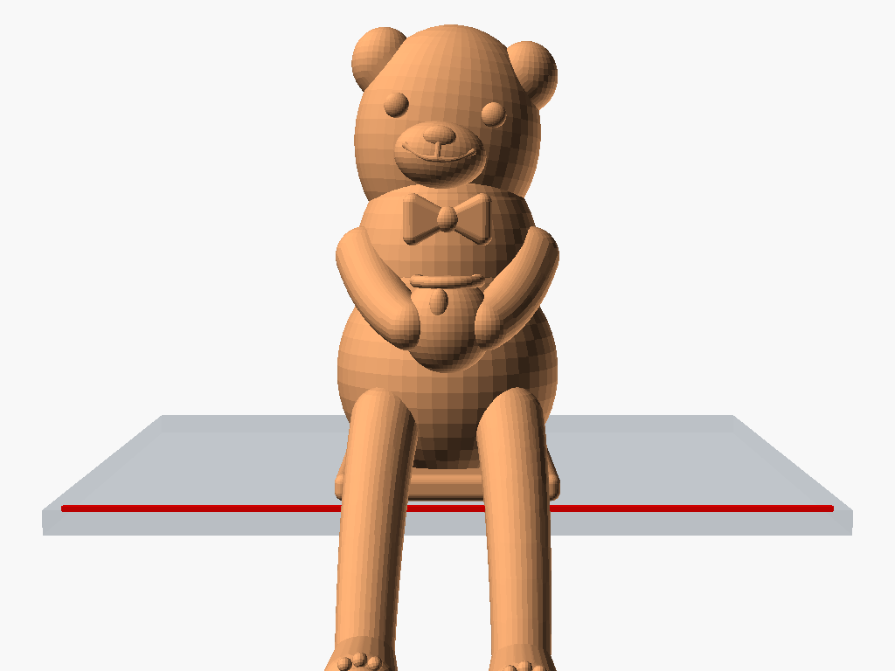
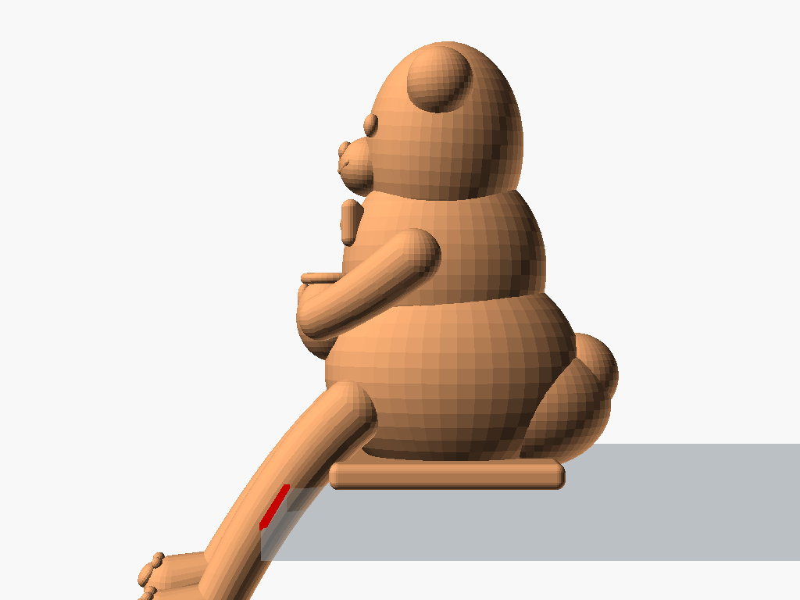
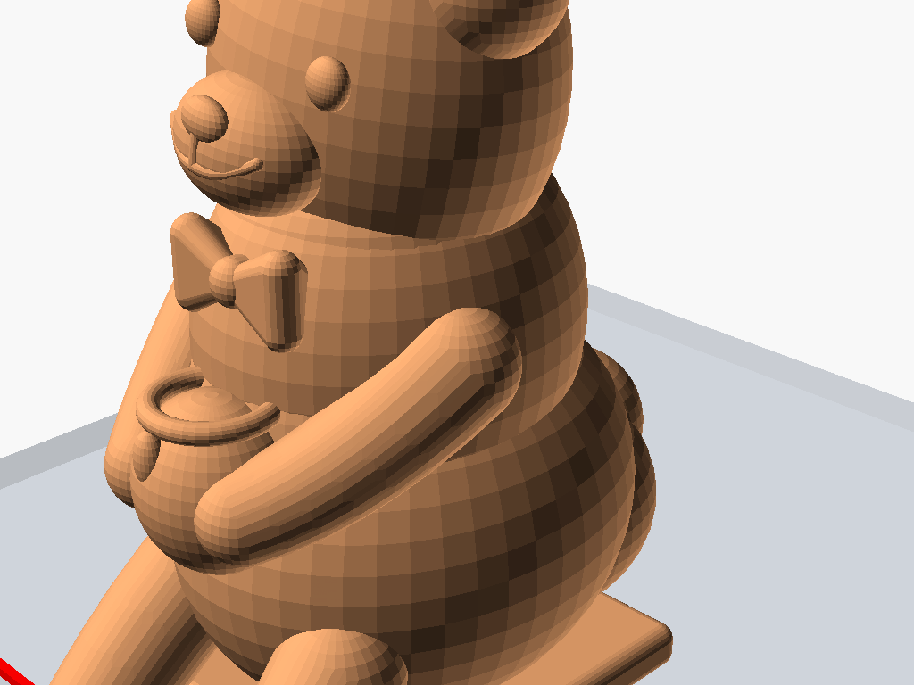
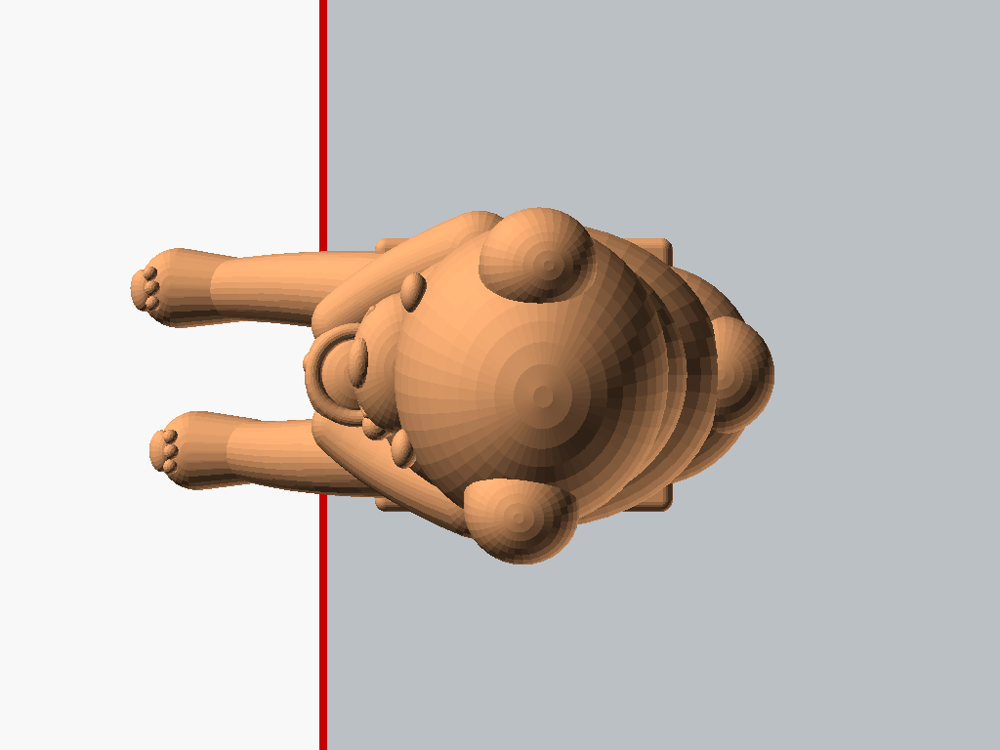
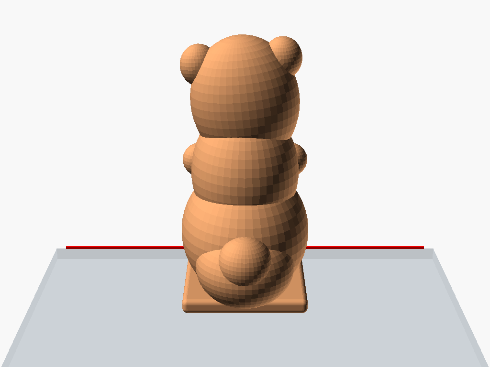
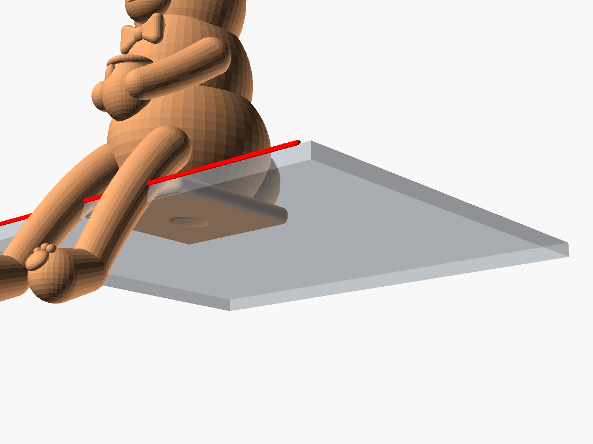

# 桌緣趴姿經典萌熊公仔 (Classic Cute Chibi Ledge Bear)

這是一款採用標準平滑有機曲面（Smooth Organic CAD）精心雕琢的萌系桌緣自平衡公仔——**經典領結蜜罐萌熊 (Cute Ledge Bear with Bowtie & Honey Pot)**。

告別抽象菱角網格，回歸極致溫潤、圓滾憨厚的超萌泰迪熊風格。結合可愛的圓耳、凸圓紐扣眼、憨厚微凸微笑線、胖嘟嘟小肚肚、小領結與懷中抱著的迷你蜜罐。雙腿自然悠哉地垂懸於桌緣外，底座搭配後臀低重心幾何配重，**無需膠水、無需磁鐵，即可自平衡穩坐於任何桌子、螢幕或展示層架邊緣**。

---

## 📸 全方位多視角渲染檢視 (Multi-Angle Previews)

| 45° 俯瞰視角 (Isometric Perspective) | 正面呆萌神態 (Front Straight-On) |
| :---: | :---: |
|  |  |

| 側面力學平衡剖視 (Side Profile & Balance) | 臉部、領結與蜜罐特寫 (Closeup) |
| :---: | :---: |
|  |  |

| 頂視俯瞰圓耳與身軀 (Top-Down) | 背部圓滾身軀與毛球短尾 (Rear & Bobtail) |
| :---: | :---: |
|  |  |

| 仰視底座貼面與懸垂熊掌 (Bottom Stability) |
| :---: |
|  |

---

## 🍯 核心特徵與細節工藝 (Design Highlights)

1. **極致溫潤平滑曲面 (Ultra-Smooth Organic Styling)**：
   - 採用高品質曲面細分（`$fn = 48 ~ 64`），線條如陶瓷與糖膠玩具般溫潤光滑。
2. **經典超萌五官 (Classic Chibi Bear Features)**：
   - **圓形微凹小熊雙耳 (Teddy Bear Ears)**：10 點與 2 點鐘方向的圓潤熊耳，內嵌立體耳廓，深根熔接於顱骨內，100% 牢固無薄壁破裂風險。
   - **立體飽滿口鼻部 (Plump Muzzle & Oval Nose Button)**：向前隆起圓滾吻部，頂部點綴光滑橢圓小鼻鈕。
   - **立體微凸圓潤紐扣眼 (Non-recessed Button Eyes)**：雙眼為半球形微凸水汪汪紐扣眼（非凹陷孔洞），神態溫柔有神，上色容易。
   - **經典親切微凸微笑線 (Non-recessed Embossed Smile)**：由鼻部垂直向下的人中線，平滑分支為兩道優雅上揚的立體微凸微笑弧線（非凹槽），神情親切治癒。
3. **精緻配件與可愛姿態 (Accessories & Posture)**：
   - **小紳士蝴蝶結領結 (Dapper Bowtie)**：胸前點綴圓潤蝴蝶領結，雙翼與中央鈕扣深植胸膛。
   - **懷抱迷你蜂蜜罐 (Mini Honey Jar with Drip)**：雙臂環抱一隻圓滾滾的小陶罐，罐口帶有流淌下來的立體小蜜滴。
   - **厚實無弱點膝關節 (Robust Continuous Knees)**：大腿跨越桌緣過渡至小腿，保持平滑厚實無凹槽，徹底消除列印或把玩時的斷裂隱患。
   - **俏皮懸垂雙腿與足底肉球 (Paw Pads & Toe Beans)**：左腿自然垂落，右腿帶著約 5° 悠哉外踢的放鬆角度；腳掌傾斜向上，刻有大掌心肉墊與三顆圓潤腳趾豆豆。
4. **100% 閉合水密實體 (100% Watertight 2-Manifold)**：
   - 通過 CGAL Nef Polyhedron 嚴格幾何驗證（**Simple: yes, Volumes: 2**），單一封閉實體，無任何破面、無內部空腔、無懸空游離碎片。
5. **重心自平衡機制 (Self-Balancing Physics)**：
   - 底座平整面貼合於 $Z = 0$ 桌面，後臀配重塊與後置圓球尾巴將整體公仔重心拉至桌緣內側約 $X \approx +8.5\text{ mm}$，安全抗傾倒裕度超過 5mm。

---

## 📏 規格尺寸 (Specifications)

| 項目 | 數值 | 備註 |
| :--- | :--- | :--- |
| **桌面以上高度** | 約 48.8 mm | 精準控制在 50 mm 內，小巧討喜 |
| **桌面懸垂深度** | 約 -15.0 mm | 雙腿垂懸於桌子垂直外牆 |
| **桌面佔用深度** | 約 35.5 mm | 底座與後臀佔用桌面深度 |
| **橫向最大寬度** | 約 26.5 mm | 雙耳與臀部橫向寬度 |
| **重心位置 (COM)** | $X \approx +8.5\text{ mm}, Z \approx 18.0\text{ mm}$ | 位於桌緣線 $X = 0$ 內側，免膠自平衡 |
| **模型狀態** | 100% 封閉水密實體 | 支援所有 FDM / SLA 3D 列印切片軟體 |

---

## 🖨️ 3D 列印與切片建議 (Printing Guide)

- **列印擺放方向**：標準底面朝下平貼於熱床（$Z = 0$）。
- **支撐設定**：
  - 建議在切片軟體（Bambu Studio, PrusaSlicer, Cura 等）中開啟「樹狀支撐 (Tree Supports)」。
  - 僅需對垂懸於桌面外的雙腿下端（$Z < 0$ 區域）及蜜罐底緣提供少量支撐。
- **層高建議**：`0.12mm` ~ `0.16mm`（能最完美展現頭部、圓耳與五官的平滑弧度）。
- **外牆圈數**：建議設為 `3` 圈或以上，增強四肢結構剛性。
- **填充率**：
  - 一般區域：`20%`（建議採用 Gyroid 陀螺儀填充）。
  - 後臀配重技巧：若希望進一步加強抗震穩定性，可在切片軟體中於後臀區域（$X > 20$）新增高度區段或方塊 Modifier，單獨將後臀填充率提高至 `40% ~ 50%`。
- **推薦耗材**：
  - 奶油棕、奶茶色、暖白色或焦糖色 PLA / PETG，列印效果極度溫馨治癒。

---

## 📂 檔案清單 (File Structure)

- `cute_ledge_bear.scad`：完整可自訂參數之 OpenSCAD 原始碼
- `cute_ledge_bear.stl`：100% 水密無破面 STL 列印檔（已自動隱藏輔助桌面與重心標記）
- `renders/`：包含 7 個多角度高解析度渲染圖目錄
