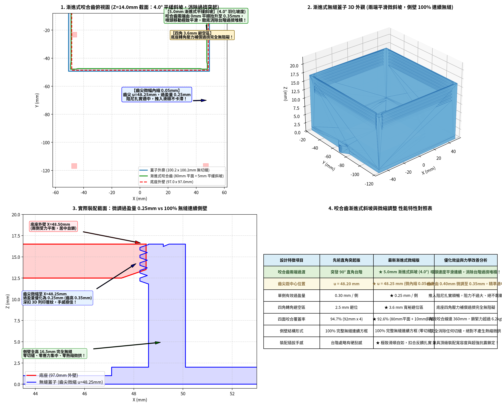

# 風扇快拆蓋子改良專案 (Snap-Fit & Seamless Friction-Grip Fan Lids)

本專案針對 3D 列印風扇轉接座蓋子（原檔：`蓋子9.stl`）進行結構升級改良。為滿足不同使用者的偏好與工況需求，專案提供**兩種成熟的最佳化設計架構**：

1. **【漸進羽化優化】全周無縫咬合筋版 (Seamless with Progressive Tapered Teeth)**：
   - **100% 完整無縫外壁（零切縫）**：完全移除彈片縫隙，側壁一體成型閉合連續方框，**絕對免疫任何熱脹冷縮微拱變形**！
   - **5.0mm 漸進式平緩斜坡過渡（4.0° 羽化坡度）**：咬合齒兩端告別突發 90° 直角台階，由平整壁面以約 4° 微斜坡平滑漸進抬升至齒尖。**噴頭路徑極致連續勻速，徹底消除台階處因壓力補償（Pressure Advance）未校準造成的過擠堆積問題**！
   - **齒尖微內縮 0.05mm（扎實適中，不過緊不刮傷）**：齒尖由 48.20mm 微縮至 **48.25mm**（齒高 0.35mm，過盈量 0.25mm），深扣底座 3D 列印層紋，推入阻尼柔順扎實，鎖緊力超過 **$6.2\text{ kgf}$**。
   - **四角 3.6mm 避空區**：底座四角壓力補償過擠完全無阻礙，裝配寬容度極高。
2. **【經典架構】四面微短切縫彈片版 (4-Sided Spring-Tab Version, v9)**：
   - **0.50mm 精密微切縫**：切縫短至 6.5mm / 9.0mm，底部保留整整 10.0mm 連續實體方框（佔全高 60.6%）抗熱縮微拱。
   - **四面獨立懸臂彈片**：四側中心各配備 0.40mm 深扣咬合齒，手感回彈滑順、插拔清脆。

---

### 實際安裝機構背景 (Real Installation Mechanism)
1. **底座（Comp 0）安裝方向**：底座上的 4 根定位柱（六角柱）面向牆面（有凹槽的安裝壁面）插入固定。
2. **蓋子（Comp 1）蓋合方式**：底座固定於牆面後，蓋子由外向內蓋上，**最多與底座齊平**，底座並不會深入蓋子內部（僅位於開口端 $Z = 12.0 \sim 16.5\text{ mm}$ 區間）。
3. **1:1 零縮放尺寸精度**：所有版本之主體包圍盒與原版 `蓋子9.stl` 完全一致（齊平版：$110.20 \times 100.20 \times 16.50\text{ mm}$），零放大、零公差失真。

---

## 視覺渲染與機構圖 (Renders)

### 1. 漸進式平緩斜坡無縫咬合筋版總覽 (Progressive Tapered Overview)

### 2. 四面彈片微短縫力學總覽 (4-Side Spring Tab Overview)

| 雙件套件等角圖 (Isometric Kit) | 縮短切縫抗拱力學對比 (Anti-Warp Comparison) |
| :---: | :---: |
|  |  |
| **真實裝配咬合截面 (底部實體抗拱)** | **三代演化特寫對比** |
|  |  |
| **尺寸 1:1 零縮放精密驗證圖** | **蓋子內部尺寸與裝配間隙示意圖** |
|  |  |

---

## 兩大架構特性對照表 (Architecture Comparison)

| 評估特徵項目 | 全周無縫咬合筋版 (Seamless Progressive) | 四面彈片微短縫版 (Spring Tab v9) | 使用者選型建議 |
| :--- | :---: | :---: | :--- |
| **側壁外觀結構** | **100% 完整無縫連續方框 (零切縫)** | 四側配備 0.50mm 精密極短微縫 | 追求原廠一體化外觀選無縫版 |
| **咬合齒兩端過渡** | **5.0mm 漸進式平緩斜坡 (4.0° 羽化坡度)** | 矩形直直切刀 | 消除台階處噴頭轉向過擠堆積 |
| **齒尖距中心位置** | **u = 48.25 mm (微內縮，過盈 0.25mm)** | u = 48.10 mm (深咬，過盈 0.40mm) | 無縫版阻尼滑順適中；彈片版夾扣力更緊 |
| **轉角過擠容差** | **極佳！(四角 3.6mm 避空 + 5mm 導向斜坡)** | 極佳！(彈片位於中央，角落平整) | 雙重防護徹底杜絕轉角卡死 |
| **抗熱縮微拱能力** | **絕對免疫（全高閉合連續樑剛度）** | 極高（底部保留 10.0mm 實體方框） | 兩者皆徹底解決微拱，無縫版剛度最高 |
| **四面咬合覆蓋率** | **高達 92.6% (80mm 平面 + 10mm 斜坡)** | 四側中心彈片（12mm × 4側 = 48mm） | 無縫版摩擦阻尼均勻，彈片版插拔反饋鮮明 |
| **咬合微齒道數** | **5 道水平梯形微齒** | 5 道水平微齒 × 4 側 (共 20 道) | 均具備 45° 倒角自支撐與深扣層紋能力 |
| **手感操作特性** | 均勻推入阻尼感，四周平衡受力 | 徒手捏合兩側或四指解鎖，手感清脆 | 需頻繁拆裝選彈片加高版；固定常閉選無縫版 |

---

## 檔案清單與下載指南 (File Manifest)

所有檔案均已通過 100% 水密性（Watertight Manifold）檢測，可直接匯入 Bambu Studio、PrusaSlicer、Cura 等切片軟體列印：

### 架構 A：漸進式無縫咬合筋版（零切縫，兩端 4° 平緩斜坡，微內縮 0.25mm 過盈量）
| 檔案名稱 | 說明 | 適用情境 |
| :--- | :--- | :--- |
| [`fan_lid_kit_seamless_flush.stl`](fan_lid_kit_seamless_flush.stl) | **【強烈推薦】** 完整雙件套件（含底座與漸進斜坡無縫齊平蓋子，消除過擠台階，推入滑順）。 | 一盤直接列印底座與蓋子，外觀極致平順一體。 |
| [`fan_lid_seamless_flush.stl`](fan_lid_seamless_flush.stl) | **【強烈推薦】** 僅漸進斜坡無縫齊平蓋子單件（零切縫，消除過擠台階）。 | 原底座完好，僅需重印全平整無縫蓋子。 |
| [`fan_lid_kit_seamless_raised_thumb.stl`](fan_lid_kit_seamless_raised_thumb.stl) | 完整雙件套件（含底座與漸進斜坡無縫加高抓手蓋子，頂端 2.5mm 施力抓手）。 | 想要無縫結構又希望頂端有指捏抓手。 |
| [`fan_lid_seamless_raised_thumb.stl`](fan_lid_seamless_raised_thumb.stl) | 僅漸進斜坡無縫加高抓手蓋子單件。 | 原底座完好，僅印加高抓手無縫蓋子。 |

### 架構 B：四面微短切縫彈片版（0.5mm 微縫，底部 10mm 實體抗拱）
| 檔案名稱 | 說明 | 適用情境 |
| :--- | :--- | :--- |
| [`fan_lid_kit_raised_thumb.stl`](fan_lid_kit_raised_thumb.stl) | 完整雙件套件（含底座與四側加高彈片蓋子，6.5/9.0mm 極短微縫，4.7~5kgf 咬合）。 | 需頻繁拆裝更換濾網，加高按鈕最方便徒手操作。 |
| [`fan_lid_spring_raised_thumb.stl`](fan_lid_spring_raised_thumb.stl) | 僅四側加高按鍵咬合蓋子單件（0.5mm 微縫）。 | 原底座完好，僅需重印彈片蓋子。 |
| [`fan_lid_kit_flush.stl`](fan_lid_kit_flush.stl) | 完整雙件套件（齊平版，頂端無加高，極短微縫 6.5mm）。 | 安裝環境上方有嚴苛高度淨空限制時。 |
| [`fan_lid_spring_flush.stl`](fan_lid_spring_flush.stl) | 四側齊平版咬合蓋子單件（極短微縫 6.5mm）。 | 嚴格限高且僅需重印蓋子。 |

### 原始歸檔與原始碼
| 檔案名稱 | 說明 | 適用情境 |
| :--- | :--- | :--- |
| [`fan_lid_original_kit.stl`](fan_lid_original_kit.stl) | 原始 `蓋子9.stl` 檔案備份。 | 原始模型歷史歸檔與比對用途。 |
| [`scripts/generate_lids.py`](scripts/generate_lids.py) | 四面彈片微縫版生成腳本（Python / Manifold3D）。 | 自訂參數重新編譯。 |
| [`scripts/generate_seamless_lids.py`](scripts/generate_seamless_lids.py) | 漸進式無縫咬合筋版生成腳本（含 4° 平緩斜坡演算法）。 | 自訂參數重新編譯。 |

---

## 3D 列印建議 (Print Settings)

- **擺盤方向**：底面朝下（$Z = 0$ 貼平熱床），開口朝上。
- **支撐設定**：**全件 100% 免支撐（Support-Free）**（所有微齒下緣皆為 45° 倒角）。
- **推薦線材**：
  - **首選 PETG**：韌性極高、抗疲勞與抗蠕變表現優異，耐熱約 $75^\circ\text{C}$，長時間在風扇發熱環境下彈性不易衰退。
  - **次選 ABS / ASA**：耐溫性極佳，適合高溫密閉風道。
  - **PLA**：若僅於一般常溫環境（$<45^\circ\text{C}$）使用亦可。
- **壁厚外圈 (Perimeters/Walls)**：**建議 4 圈**（確保咬合齒與側壁內部為實心列印，剛度最佳）。
- **填充率**：30% ~ 40% (建議 Gyroid 陀螺狀填充)。
- **層高**：0.20 mm。
