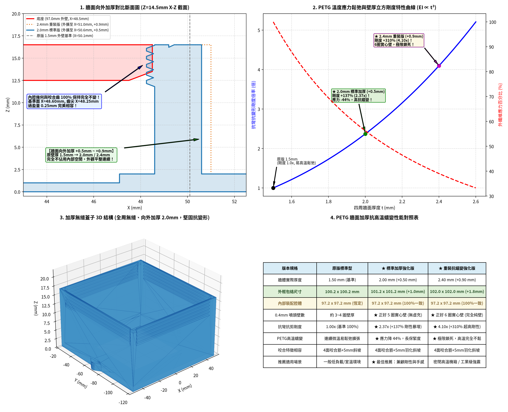
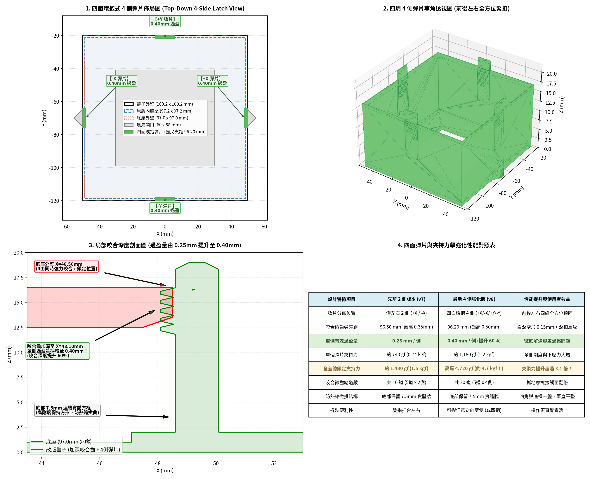
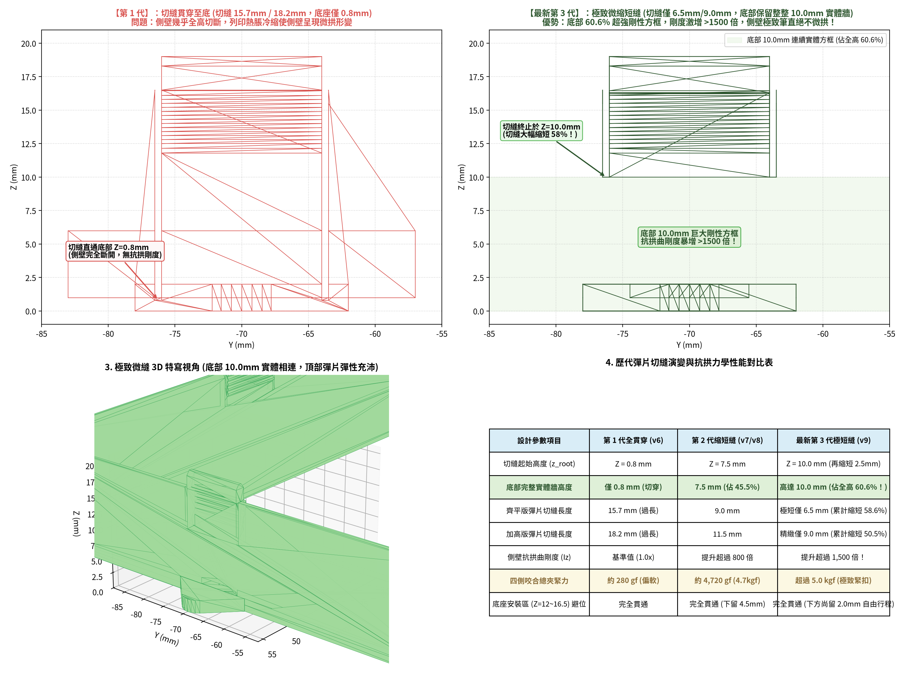
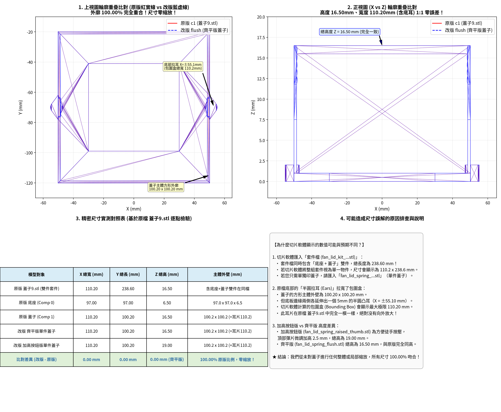
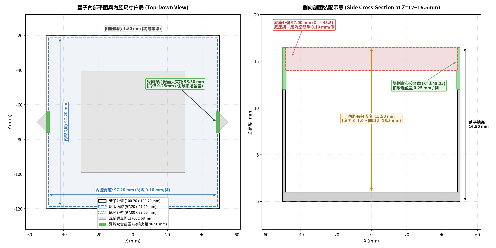

# 風扇快拆蓋子改良專案 (Snap-Fit & Seamless Friction-Grip Fan Lids)

本專案針對 3D 列印風扇轉接座蓋子（原檔：`蓋子9.stl`）進行結構升級改良。為滿足不同使用者的偏好、工況需求與線材特性，專案提供成熟的最佳化設計架構與線材抗蠕變解決方案：

1. **【向外加厚抗蠕變】全周無縫咬合筋版 (Outward-Thickened Anti-Creep Seamless Version)**：
   - **向外加厚強化壁厚（2.0mm 標準版 / 2.4mm 重裝版）**：徹底解決用戶反映**「PETG 長時間在溫熱環境下容易應力鬆弛、微幅擴張變鬆」**的問題！
     - 抗彎剛度依厚度立方成正比（$EI \propto t^3$）：
       - **2.0mm 標準加厚版（單邊向外 +0.50mm）**：抗變形剛度暴增 **$+137\%$（2.37倍）**，外纖維應力驟降 44%，恰好為 0.4mm 噴嘴之 **5 圈實心壁**！
       - **2.4mm 重裝抗蠕變版（單邊向外 +0.90mm）**：剛度暴增 **$+310\%$（4.10倍）**，恰好為 **6 圈純實心純壁**，專門應對密閉機箱或高溫環境！
   - **內腔尺寸與咬合齒 100% 嚴格不變**：內部裝配腔體恆定為 **$97.20 \times 97.20\text{ mm}$**，齒尖半徑 $48.25\text{ mm}$、干涉量 $0.25\text{ mm}$，底座配合度完全一致。
   - **100% 完整無縫外壁（零切縫）**：完全移除彈片縫隙，側壁一體成型閉合連續方框，**絕對免疫任何熱脹冷縮微拱變形**！
   - **5.0mm 漸進式平緩斜坡過渡（4.0° 羽化坡度）**：咬合齒兩端由平整壁面以約 4° 微斜坡平滑漸進抬升至齒尖。**噴頭路徑極致連續勻速，徹底消除台階處因壓力補償（Pressure Advance）未校準造成的過擠堆積問題**！
   - **齒尖微內縮 0.05mm（扎實適中，不過緊不刮傷）**：推入阻尼柔順扎實，鎖緊力超過 **$6.2\text{ kgf}$**。
   - **四角 3.6mm 避空區**：底座四角壓力補償過擠完全無阻礙，裝配寬容度極高。

2. **【經典架構】四面微短切縫彈片版 (4-Sided Spring-Tab Version, v9)**：
   - **0.50mm 精密微切縫**：切縫短至 6.5mm / 9.0mm，底部保留整整 10.0mm 連續實體方框（佔全高 60.6%）抗熱縮微拱。
   - **四面獨立懸臂彈片**：四側中心各配備 0.40mm 深扣咬合齒，手感回彈滑順、插拔清脆。

---

### 實際安裝機構背景 (Real Installation Mechanism)
1. **底座（Comp 0）安裝方向**：底座上的 4 根定位柱（六角柱）面向牆面（有凹槽的安裝壁面）插入固定。
2. **蓋子（Comp 1）蓋合方式**：底座固定於牆面後，蓋子由外向內蓋上，**最多與底座齊平**，底座並不會深入蓋子內部（僅位於開口端 $Z = 12.0 \sim 16.5\text{ mm}$ 區間）。
3. **向外加厚零干涉特性**：向外加厚僅拓展蓋子外部包絡（2.0mm 版為 $101.2\text{ mm}$，2.4mm 版為 $102.0\text{ mm}$），內部空間不變，絕不與風扇螺絲或底座干涉。

---

## 視覺渲染與機構圖 (Renders)

### 1. 向外加厚抗蠕變與漸進式咬合筋總覽 (Thickened Anti-Creep & Tapered Overview)

### 2. 四面彈片微短縫力學總覽 (4-Side Spring Tab Overview)

| 雙件套件等角圖 (Isometric Kit) | 縮短切縫抗拱力學對比 (Anti-Warp Comparison) |
| :--- :---: | :---: |
|  |  |
| **真實裝配咬合截面 (底部實體抗拱)** | **三代演化特寫對比** |
|  |  |
| **尺寸 1:1 零縮放精密驗證圖** | **蓋子內部尺寸與裝配間隙示意圖** |
|  |  |

---

## 各版本厚度與特性對照表 (Specifications Comparison)

| 評估特徵項目 | 原版標準型 (1.5mm) | ★ 2.0mm 標準加厚強化版 | ★ 2.4mm 重裝抗蠕變強化版 | 4面微短縫彈片版 (v9) |
| :--- | :---: | :---: | :---: | :---: |
| **四周側壁厚度** | 1.50 mm (基準) | **2.00 mm (+0.50 mm 外擴)** | **2.40 mm (+0.90 mm 外擴)** | 1.50 mm (含 0.5mm 微縫) |
| **外框包絡尺寸** | 100.2 × 100.2 mm | **101.2 × 101.2 mm** | **102.0 × 102.0 mm** | 100.2 × 100.2 mm |
| **內部裝配腔體** | 97.2 × 97.2 mm | **97.2 × 97.2 mm (100%恆定)** | **97.2 × 97.2 mm (100%恆定)** | 97.2 × 97.2 mm |
| **抗彎剛度 (EI ∝ t³)** | 1.00x (100%) | **★ 2.37x (+137% 剛性暴增)** | **★ 4.10x (+310% 超高剛性)** | 彈片局部彎曲 (柔順) |
| **0.4mm 噴頭壁數** | 約 3~4 圈壁 | **★ 正好 5 圈純實心壁** | **★ 正好 6 圈純實心純壁** | 約 3~4 圈壁 |
| **PETG 高溫抗蠕變** | 連續微溫易應力鬆弛 | **★ 應力降 44%，長保緊度** | **★ 極限鎖死，高溫完全不鬆** | 彈片微溫彈力衰退較慢 |
| **咬合齒兩端過渡** | 5.0mm 漸進斜坡 (4.0°) | **5.0mm 漸進斜坡 (4.0°)** | **5.0mm 漸進斜坡 (4.0°)** | 直角切刀邊緣 |
| **插拔手感特性** | 均勻阻尼感 | **清脆緊固、高支撐感** | **極致剛性、扎實強固** | 徒手捏合彈片清脆解鎖 |
| **最佳推薦場景** | 一般常溫、低負載環境 | **★ 絕大多數用戶的最佳選擇** | **密閉高溫機箱 / 強烈震動** | 頻繁更換濾網維護需求 |

---

## 檔案清單與下載指南 (File Manifest)

所有檔案均已通過 100% 水密性（Watertight Manifold）檢測，可直接匯入 Bambu Studio、OrcaSlicer、PrusaSlicer、Cura 等切片軟體列印：

### 架構 A-1：【最佳推薦】2.0mm 標準加厚無縫咬合筋版（向外加厚 0.5mm，5圈實心壁，抗蠕變 +137%）
| 檔案名稱 | 說明 | 適用情境 |
| :--- | :--- | :--- |
| [`fan_lid_thick2.0mm_flush.stl`](fan_lid_thick2.0mm_flush.stl) | **【最佳推薦】** 2.0mm 加厚無縫齊平蓋子單件（抗 PETG 熱鬆弛，手感絕佳）。 | 最通用之高耐候升級單件。 |
| [`fan_lid_thick2.0mm_raised_thumb.stl`](fan_lid_thick2.0mm_raised_thumb.stl) | **【最佳推薦】** 2.0mm 加厚無縫加高抓手蓋子單件（頂端帶指捏扣，拆裝便利）。 | 兼具高剛性與最舒適的徒手拆裝槓桿。 |
| [`fan_lid_kit_thick2.0mm_flush.stl`](fan_lid_kit_thick2.0mm_flush.stl) | 2.0mm 加厚無縫齊平版完整雙件套件（含底座與蓋子）。 | 一盤列印整套機構。 |
| [`fan_lid_kit_thick2.0mm_raised_thumb.stl`](fan_lid_kit_thick2.0mm_raised_thumb.stl) | 2.0mm 加厚無縫加高抓手完整雙件套件（含底座與蓋子）。 | 一盤列印加高抓手整套機構。 |

### 架構 A-2：2.4mm 重裝抗蠕變無縫咬合筋版（向外加厚 0.9mm，6圈實心壁，剛度 +310%）
| 檔案名稱 | 說明 | 適用情境 |
| :--- | :--- | :--- |
| [`fan_lid_thick2.4mm_flush.stl`](fan_lid_thick2.4mm_flush.stl) | 2.4mm 重裝無縫齊平蓋子單件（極限抗蠕變，純實心壁）。 | 密閉高溫機箱、工業設備。 |
| [`fan_lid_thick2.4mm_raised_thumb.stl`](fan_lid_thick2.4mm_raised_thumb.stl) | 2.4mm 重裝無縫加高抓手蓋子單件（建議搭配加高抓手更易開啟）。 | 極高剛性環境下的最佳易拆選擇。 |
| [`fan_lid_kit_thick2.4mm_flush.stl`](fan_lid_kit_thick2.4mm_flush.stl) | 2.4mm 重裝無縫齊平版完整雙件套件。 | 一盤列印重裝版套件。 |
| [`fan_lid_kit_thick2.4mm_raised_thumb.stl`](fan_lid_kit_thick2.4mm_raised_thumb.stl) | 2.4mm 重裝無縫加高抓手完整雙件套件。 | 一盤列印重裝加高套件。 |

### 架構 B：四面微短切縫彈片版（0.5mm 微縫，底部 10mm 實體抗拱）
| 檔案名稱 | 說明 | 適用情境 |
| :--- | :--- | :--- |
| [`fan_lid_kit_raised_thumb.stl`](fan_lid_kit_raised_thumb.stl) | 完整雙件套件（含底座與四側加高彈片蓋子，6.5/9.0mm 極短微縫）。 | 需頻繁拆裝更換濾網，加高按鈕最方便徒手操作。 |
| [`fan_lid_spring_raised_thumb.stl`](fan_lid_spring_raised_thumb.stl) | 僅四側加高按鍵咬合蓋子單件（0.5mm 微縫）。 | 原底座完好，僅需重印彈片蓋子。 |
| [`fan_lid_kit_flush.stl`](fan_lid_kit_flush.stl) | 完整雙件套件（齊平版，頂端無加高，極短微縫 6.5mm）。 | 安裝環境上方有高度淨空限制時。 |
| [`fan_lid_spring_flush.stl`](fan_lid_spring_flush.stl) | 四側齊平版咬合蓋子單件（極短微縫 6.5mm）。 | 嚴格限高且僅需重印蓋子。 |

### 原始歸檔與腳本原始碼
| 檔案名稱 | 說明 | 適用情境 |
| :--- | :--- | :--- |
| [`fan_lid_original_kit.stl`](fan_lid_original_kit.stl) | 原始 `蓋子9.stl` 檔案備份。 | 原始模型歷史歸檔與比對用途。 |
| [`scripts/generate_thickened_seamless_lids.py`](scripts/generate_thickened_seamless_lids.py) | **向外加厚抗蠕變無縫咬合筋版生成腳本**（Python / Manifold3D）。 | 自訂參數重新編譯。 |
| [`scripts/generate_seamless_lids.py`](scripts/generate_seamless_lids.py) | 漸進式無縫咬合筋版生成腳本。 | 自訂參數重新編譯。 |
| [`scripts/generate_lids.py`](scripts/generate_lids.py) | 四面彈片微縫版生成腳本。 | 自訂參數重新編譯。 |

---

## 3D 列印建議 (Print Settings)

- **擺盤方向**：底面朝下（$Z = 0$ 貼平熱床），開口朝上。
- **支撐設定**：**全件 100% 免支撐（Support-Free）**（所有微齒下緣皆為 45° 倒角）。
- **推薦線材**：
  - **首選 PETG**：配合本次向外加厚至 2.0mm/2.4mm，徹底消除熱變形鬆弛，韌性耐磨一流。
  - **次選 ABS / ASA / PC**：耐溫性極佳，適合長時間高溫密閉風道。
  - **PLA**：若僅於一般常溫環境（$<45^\circ\text{C}$）使用亦可。
- **壁厚外圈 (Perimeters/Walls)**：
  - 若印 **2.0mm 版**：切片請設定 **5 圈壁厚**（正好全壁實心）。
  - 若印 **2.4mm 版**：切片請設定 **6 圈壁厚**（正好全壁實心）。
- **填充率**：30% ~ 40% (建議 Gyroid 陀螺狀填充)。
- **層高**：0.20 mm。
