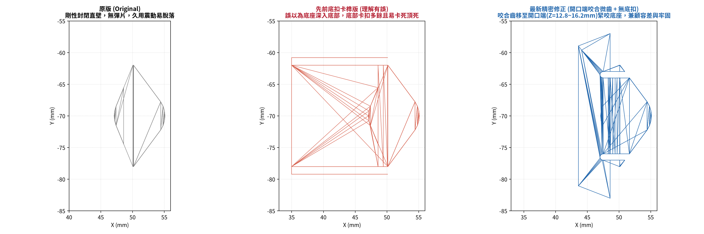
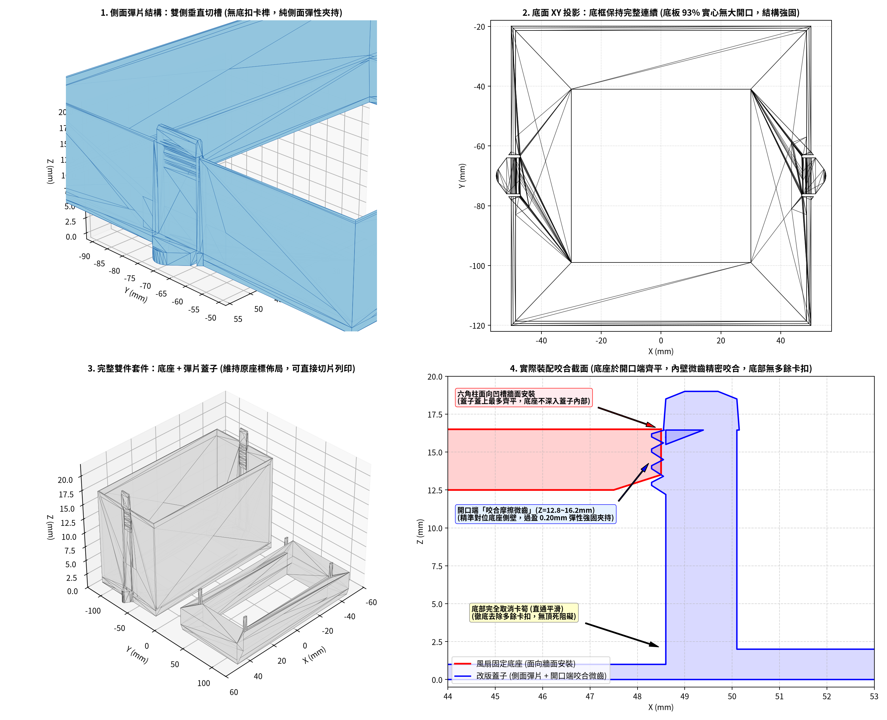
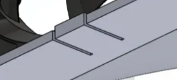

# 風扇快拆蓋子 - 雙側彈片防脫落改良版 (Snap-Fit Fan Lid with Friction-Grip Spring Tabs)

本專案為針對 3D 列印風扇轉接座蓋子（原檔：`蓋子9.stl`）進行的結構優化改良。解決原始設計在長時間運轉震動與環境發熱下容易塑性潛變（Creep）、疲勞鬆動脫落的問題。

### 實際安裝機構背景 (Real Installation Mechanism)
1. **底座（Comp 0）安裝方向**：底座上的 4 根定位柱（六角柱）面向牆面（有凹槽的安裝壁面）插入固定。
2. **蓋子（Comp 1）蓋合方式**：底座固定於牆面後，蓋子由外向內蓋上，**最多與底座齊平**，底座並不會深入蓋子內部（僅位於開口端 $Z = 12.5 \sim 16.5\text{ mm}$ 區間）。
3. **無多餘卡筍**：完全取消底部多餘的倒扣卡勾（直通平滑，絕不頂死、絕不刮傷）。
4. **精準咬合摩擦微齒**：咬合齒設置於開口端（$Z = 12.8 \sim 16.2\text{ mm}$），在蓋上時直接夾持咬合底座外壁，兼顧列印容差並提供強大夾持力！

---

## 視覺渲染與機構圖 (Renders)

| 完整雙件套件 (Isometric Kit) | 原版 vs 舊底扣版 vs 最新開口端咬合微齒版 對比 |
| :---: | :---: |
|  |  |
| **真實裝配咬合截面 (底座開口端齊平)** | **使用者設計概念參考圖** |
|  |  |

---

## 機構設計核心理念 (Design Principles)

### 1. 咬合齒位置精準對位開口端（$Z = 12.8 \sim 16.2\text{ mm}$）
- 依據實際安裝情境，底座面向凹槽牆面安裝後，蓋子蓋上最多僅齊平（底座僅深入開口端 $4.0\text{ mm}$）。
- 將 4 道水平梯形咬合微齒精準配置於開口端接觸區（$Z = 12.8 \sim 16.2\text{ mm}$），微凸 $0.30\text{ mm}$（過盈 $0.20\text{ mm}$），緊扣底座外壁。
- 微齒頂部設置 $45^\circ$ 自定心導引斜坡，蓋上時平順滑入。

### 2. 底部完全取消多餘卡筍（No Bottom Catch Teeth）
- 底座並不會深入蓋子底部，先前於底部設置的卡扣純屬多餘且易頂死。
- 本版完全削平底部內壁，直通平順，無任何阻擋阻礙。

### 3. 彈片維持在側面，底框保持完整連續
- 彈片回歸側壁本體（雙側垂直切槽），底板保有超過 **93% 的完整剛性實心框體**。
- 12.0mm 寬的側壁板簧樑，提供充沛的彈性微撓空間（兼顧列印公差）與持續向內的彈性預緊夾持力（強效防脫）。

---

## 尺寸規格 (Specifications)

- **蓋子外廓尺寸 (Lid)**：$100.2 \times 100.2 \times 19.0\text{ mm}$ (加高按鈕版) / $16.5\text{ mm}$ (齊平版)
- **底座外廓尺寸 (Base)**：$97.0 \times 97.0 \times 6.5\text{ mm}$ (含 4 根定位柱)
- **咬合齒分佈位置**：開口端 $Z = 12.8 \sim 16.2\text{ mm}$
- **彈片寬度 (Tab Width)**：$12.0\text{ mm}$
- **切槽間隙 (Slot Width)**：$1.0\text{ mm}$
- **內壁摩擦齒微凸量**：$0.30\text{ mm}$ (過盈夾持量 $0.20\text{ mm}$)
- **卡扣形式**：**無底扣卡榫**，純側面彈性夾持 + 開口端咬合摩擦微齒

---

## 3D 列印建議 (Print Settings)

- **擺盤方向**：底面朝下（$Z = 0$ 貼平熱床），開口朝上。
- **支撐設定**：**全件 100% 免支撐（Support-Free）**。所有切槽與微齒斜角皆在自支撐範圍內。
- **建議線材**：**PETG** 或 **ABS / ASA**（優選，抗疲勞韌性最佳；PLA 亦可順暢使用）。
- **壁厚外圈 (Perimeters/Walls)**：建議 3～4 圈（確保彈片本體為實心列印）。
- **填充率**：25% ~ 40% (建議 Gyroid 陀螺狀填充)。
- **層高**：0.20 mm。

---

## 檔案清單 (File Catalog)

| 檔案名稱 | 說明 | 適用情境 |
| :--- | :--- | :--- |
| [`fan_lid_kit_raised_thumb.stl`](fan_lid_kit_raised_thumb.stl) | **【最推薦】** 完整雙件套件（含底座與加高按鍵咬合摩擦蓋子，原座標佈局）。 | 直接匯入切片軟體一盤列印底座與蓋子。 |
| [`fan_lid_spring_raised_thumb.stl`](fan_lid_spring_raised_thumb.stl) | **【最推薦】** 僅加高按鍵咬合摩擦蓋子單件。 | 原有底座完好，僅需重印改版蓋子。 |
| [`fan_lid_kit_flush.stl`](fan_lid_kit_flush.stl) | 完整雙件套件（齊平版，頂端無加高，全高 16.5mm）。 | 安裝環境上方有極為嚴苛的高度淨空限制時。 |
| [`fan_lid_spring_flush.stl`](fan_lid_spring_flush.stl) | 僅齊平版咬合摩擦蓋子單件。 | 嚴格限高且僅需重印蓋子。 |
| [`fan_lid_original_kit.stl`](fan_lid_original_kit.stl) | 原始 `蓋子9.stl` 檔案備份。 | 原始模型歷史歸檔與比對用途。 |
| [`scripts/generate_lids.py`](scripts/generate_lids.py) | Python 幾何生成原始碼（基於 `manifold3d` 與 `trimesh`）。 | 可自訂修改切槽參數或咬合微齒尺寸。 |
