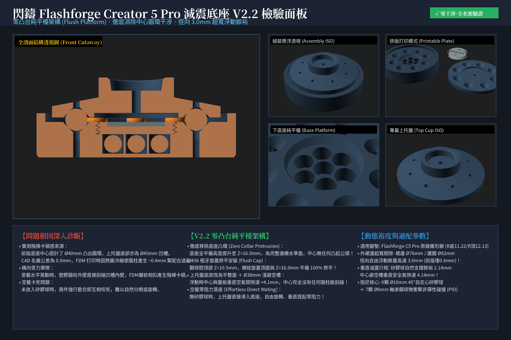
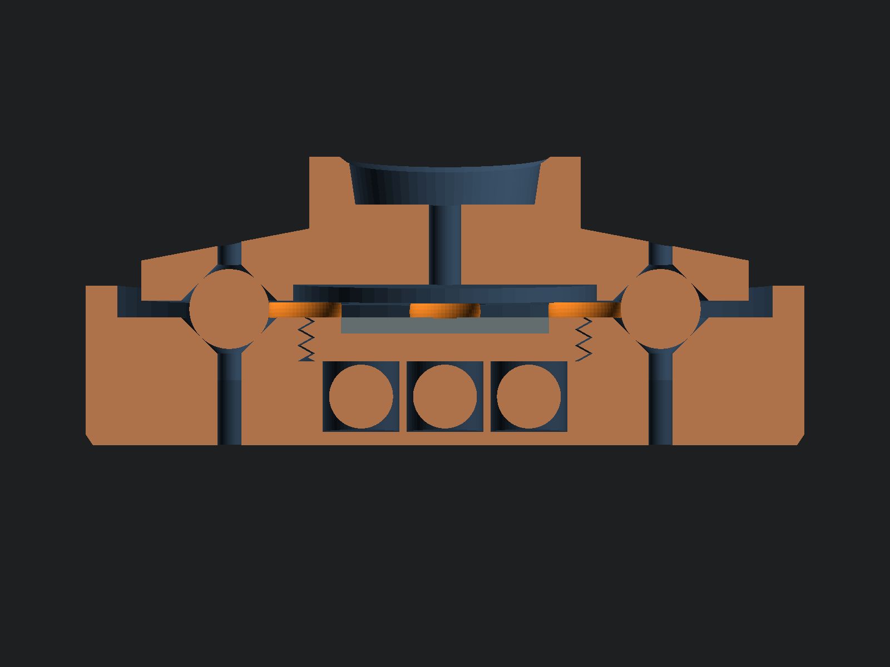
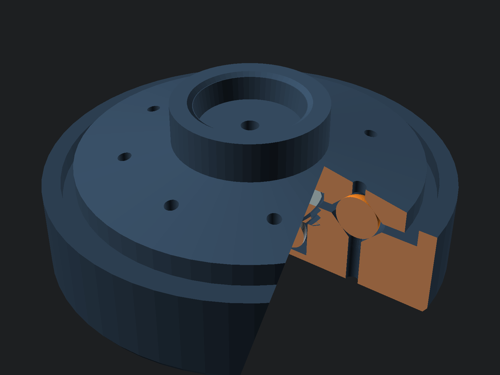
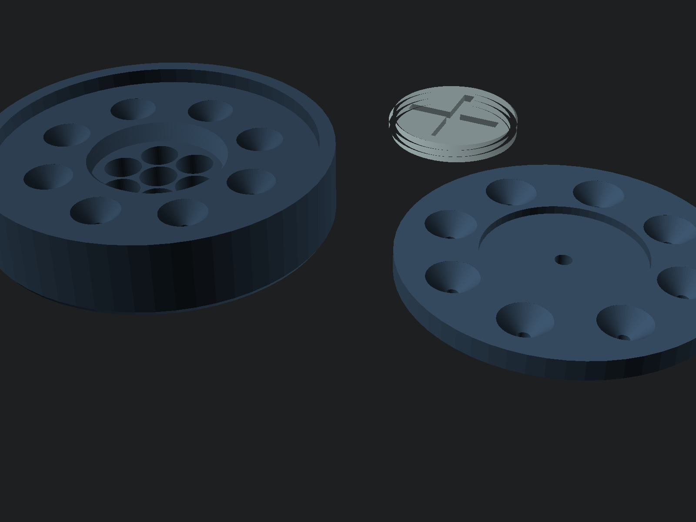
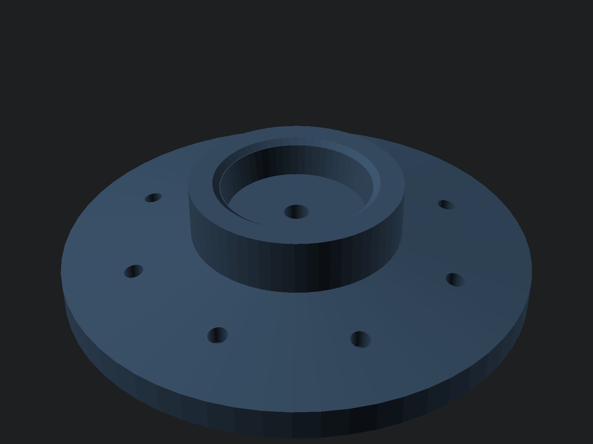

# 閃鑄 Flashforge Creator 5 Pro (C5 Pro) 專屬高剛性抗震減震底座 (V2.2 零凸台純平檯版)

專為 **閃鑄 2026 年度旗艦四噴頭換刀 CoreXY 機型 —— Flashforge Creator 5 Pro (C5 Pro / 淨重 18kg / 運作滿載 ~22kg)** 量身打造的高剛性抗震減震底座。

嚴格根據實測原廠橡膠腳規格逆向建模：**孔底半徑 11.22mm（直徑 22.44mm）、孔頂半徑 12.127mm（直徑 24.254mm）、深度 5.998mm（約 6.0mm）** 的微錐度緊定孔，完美包裹原廠腳墊，消除高速換刀與換向（600 mm/s）時的機身搖晃，以**首要提升打印表面品質**為核心力學目標！

---

## 📸 多視角檢驗全景板 (C5 Pro Inspection Board)

| 剖面透視 (Cutaway Front View) | 3D 剖切透視 (Cutaway ISO) |
| :---: | :---: |
|  |  |

| 熱床排版視圖 (Printable Plate - 0支撐) | C5 Pro 專屬上托盤 (Top Cup ISO) |
| :---: | :---: |
|  |  |

---

## 💡 V2.2 核心突破：零凸台純平檯架構 (Flush Platform Architecture)

在實物打印驗證中，舊版底座中心設計了高出平面的 Ø40mm 凸出圓環，與上托盤底部的 Ø40mm 凹槽配合。由於 FDM 打印熱脹冷縮與層紋效應，0.0mm 名義間隙導致公母圓柱緊配合過盈（~0.4mm），進而造成：
1. **空載卡死難拔**：未放入矽膠球時，上托盤必須用力施壓才能蓋上，蓋上後難以分開；
2. **階梯卡頓感**：受載水平晃動時，塑膠圓柱外壁直接刮碰凹槽內壁，FDM 層紋相扣產生劇烈摩擦與階梯感。

### 🛠️ V2.2 全面革新重構：
* **徹底移除中心凸環 (Zero Collar Protrusion)**：底座平台全面提升至連續統一的水準面 $Z = 16.0\text{ mm}$，中心**完全無任何向上凸起的公頭**！
* **M36 粗牙旋蓋齊平化 (Flush Screw Cap)**：鋼球腔頂高 $Z = 10.5\text{ mm}$，旋蓋深度 $5.5\text{ mm}$，旋緊到位後頂面與 $Z = 16.0\text{ mm}$ 平台面 **100% 絕對齊平**！
* **上托盤底部改為平整面 ＋ Ø38mm 淺避空槽**：無任何圓柱干涉，懸浮時中心垂直空氣間隙達 **$> 4.1\text{ mm}$**！
* **空載零阻力落座 (Effortless Direct Mating)**：未放矽膠球時，上托盤可直接平放落入底座自由旋轉、輕鬆取放，零咬死、零刮碰！
* **外裙邊超寬間隙 (3.0mm Radial Floating Clearance)**：裙邊外徑縮至 $\varnothing 76.0\text{ mm}$（底座外護圈內徑 $\varnothing 82.0\text{ mm}$），徑向自由浮動餘裕高達 **$3.0\text{ mm}$**（前版僅 0.6mm），大慣量衝擊劇烈晃動絕不刮碰側壁！

---

## ⚙️ 五金規格清單 (BOM)

| 零件名稱 | 規格 | 單腳用量 | 全機4腳總量 | 作用與功能 |
| :--- | :---: | :---: | :---: | :--- |
| **實心矽膠球** | $\varnothing 10.0\text{ mm}$ (邵氏 A 55~65) | 8 顆 (或中載 4 顆) | **32 顆 (或 16 顆)** | 垂直承重主力，於 45° 錐孔內三向受擠壓，提供自定心橫向剛度 |
| **軸承鋼球** | $\varnothing 8.0\text{ mm}$ (高硬度鋼珠) | 7 顆 | **28 顆** | 放入底座 7 腔內由 M36 螺紋蓋密封，充當微動顆粒阻尼（PID），完全不承重 |
| **3D 打印件** | PETG (亦適用 ABS/ASA) | 3 件 (底座+螺紋蓋+C5Pro上托) | **12 件** | 承重、密封與限位主體結構，三件皆 100% 免支撐打印 |

> [!TIP]
> **載重配比建議**：C5 Pro 淨重 18kg（滿載約 22kg），單腳承載約 5.5kg（55N）。若放入全部 **8 顆 Ø10mm 矽膠球**，每球承壓 6.8N，適合極致穩固工況；亦可選擇在 **$90^\circ$ 十字對稱位置放入 4 顆矽膠球**（每球承壓 13.7N，約 1.1mm 壓縮量），達到最高黏彈性耗能區間！

---

## 📐 Flashforge C5 Pro 原廠腳墊限位孔規格

上托盤頂部限位孔嚴格依據原廠腳墊錐度幾何切削：
* **底部半徑 ($R_1$)**：`11.22 mm`（底部直徑 $\varnothing 22.44\text{ mm}$）
* **頂部半徑 ($R_2$)**：`12.127 mm`（頂部口徑 $\varnothing 24.254\text{ mm}$）
* **錐孔深度 ($H$)**：`5.998 mm`（標稱深約 $6.0\text{ mm}$）
* **口部導向斜邊**：`0.8 mm` 喇叭口導角，利於原廠橡膠腳平滑滑入卡死
* **中心排氣孔**：`Ø4.0 mm` 直通孔，消除塞入時的氣阻活塞效應並方便頂出拆卸

---

## 🚀 核心力學設計亮點

1. **後裝式 M36 粗牙旋入密封蓋（全程免暫停打印）**：
   - 無需在打印中途暫停埋珠，徹底杜絕後半段打印失敗扣押鋼珠的痛點。
   - 螺紋蓋頂部設有硬幣 / 一字起子十字槽，隨時可拆裝倒出鋼球進行 A/B 測試。
2. **6+1 蜂巢密閉顆粒衝擊阻尼（PID）**：
   - 7 顆 8mm 鋼球集中於底座中心應力真空區（PCD Ø21mm），保留連續 1.7mm 平整限位肩台。
   - 旋蓋到底精確封頂，保留 0.8mm 垂直微動遊隙，專門吸收 CoreXY 四噴頭換刀急停激發的 70~140Hz 高頻衝擊波。
3. **完全非受力浮動阻尼**：
   - 鋼球零靜載壓力，永久不壓塌 PETG 底板。
   - 垂直減震行程由矽膠球提供 2.14mm 自定心自然浮動空間。

---

## 🖨️ 切片與打印建議 (Bambu Studio / OrcaSlicer / FlashPrint)

* **推薦耗材**：**PETG**（抗衝擊、抗疲勞與層間結合力最佳）。
* **牆面圈數 (Wall Loops)**：**$\ge 5$ 圈**（確保錐坑、螺牙與套筒為純實心塑膠）。
* **頂/底實心層**：**$\ge 5$ 層**。
* **填充率與圖案**：**$35\%\sim 40\%$**，強烈推薦 **迴旋 (Gyroid) 填充**。
* **層高**：推薦 **0.16 mm**（讓錐碗與 M36 螺牙極度絲滑光順）。
* **支撐**：**100% 免支撐（0 支撐）**。三件大平底朝下平鋪排版。

---

## 🔧 組裝指南

1. **置入鋼球**：取出打印好的下底座，將 **7 顆 8mm 軸承鋼球** 分別放入中心 1 個孔與周圍 6 個孔中。
2. **旋緊密封蓋**：拿取 M36 螺紋蓋順時針旋入底座中心，用一枚硬幣或一字螺絲刀輕輕擰到底部貼平。
3. **安置矽膠球**：將 **8 顆（或十字對稱 4 顆）10mm 矽膠球** 放入底座四周的 45° 錐形球碗中。
4. **蓋上 C5 Pro 上托盤**：將上托盤對齊矽膠球平穩蓋上。
5. **套入機身橡膠腳**：將 Flashforge C5 Pro 打印機的四隻原廠橡膠腳分別對準嵌入上托盤的專屬錐形孔內。
6. **機台校準**：安裝完成後，**在印表機螢幕上執行一次完整機台振動補償（Input Shaping / Vibration Calibration）**，讓演算法配對最佳濾波頻率！
