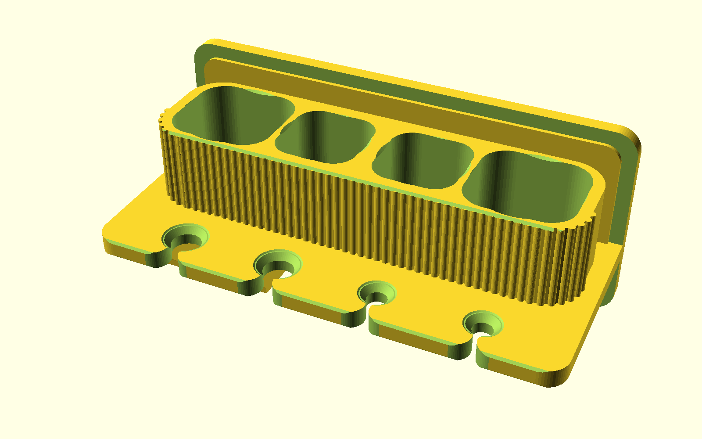
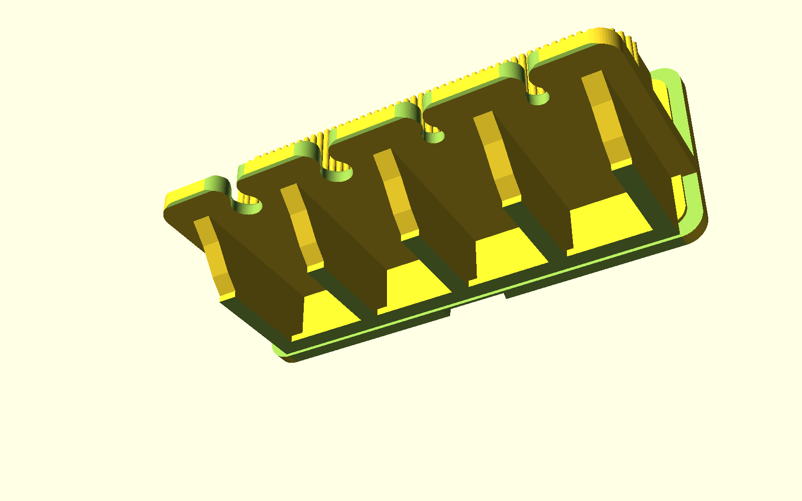
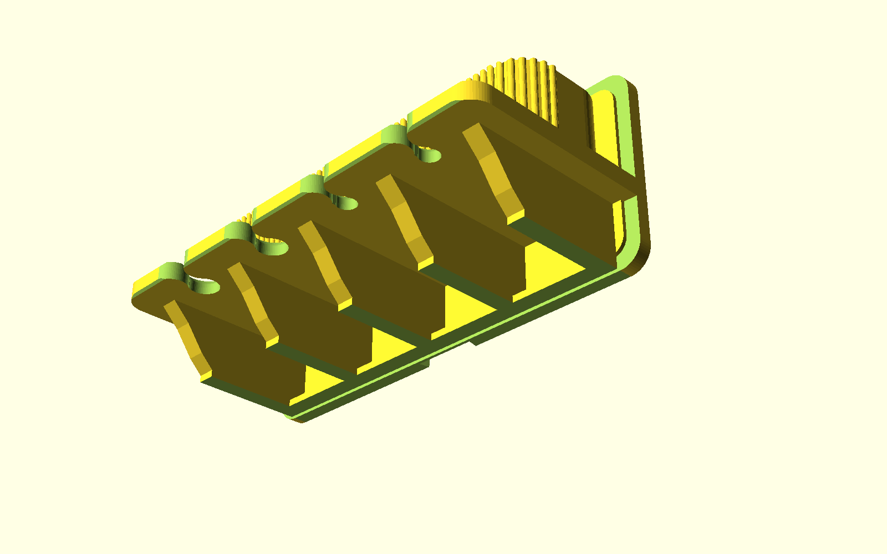

# Luxury Wall-Mounted Toothbrush, Toothpaste & Cleanser Organizer (奢華壁掛前推前取式洗面乳牙刷牙膏置物架 - 羅馬殿堂旗艦版)

專為 **玫瑰金絲綢金屬線材（Rose Gold / Copper Silk PLA）** 量身打造的五星級輕奢衛浴收納套裝。

提供兩大規格配置：
- **旗艦大殿版（Grand Edition 8-in-1 Suite，寬 204mm，★預設推薦）**：**雙洗面乳大艙（相容 Ø44mm 厚實大圓蓋）+ 雙牙膏大艙（相容 Ø36mm 厚實大圓蓋）+ 四前推牙刷位**（2 支重型電動 + 2 支手動）。
- **經典雅緻版（Compact Edition 6-in-1 Suite，寬 168mm）**：**雙超大牙膏艙 + 四前推牙刷位**。

針對一般衛浴收納「需要向上提起 20cm 碰撞鏡櫃」、「**洗面乳與牙膏蓋子偏大且有厚度無法插入入座**」、「孔徑過大導致普通牙刷容易滑落掉落」、「苯重如同水泥塊或怪異鰭片」、「各部件干涉碰撞」等關鍵痛點進行徹底幾何重構：

---

## 🏛️ 旗艦大殿版核心幾何亮點 (Grand 8-in-1 Architecture)

1. **大厚度大圓蓋全相容·後排一體化長虹連貫迴廊艙（Universal Deep Palazzo Fluted Gallery）**：
   - **一體無死角連貫宮殿迴廊**：寬度 $188.0\text{ mm}$、深度 $50.0\text{ mm}$、高度 $36.0\text{ mm}$。整面滿鋪羅馬長虹柱（Pitch 3.6mm, R 1.5mm），一體成型徹底告別分體夾縫死角，杜絕發霉卡垢。
   - **左右兩側：雙洗面乳專屬大艙（Twin Facial Cleanser Chambers, $X = \pm 66\text{ mm}$）**：
     - 尺寸大幅擴增為 **$46 \times 44\text{ mm}$**（四角導圓角 $R = 12\text{ mm}$），深度達 **$33.5\text{ mm}$**。
     - **100% 物理相容市售直徑高達 $\varnothing 44\text{ mm}$、厚度達 $15 \sim 25\text{ mm}$ 的超大厚實圓形翻蓋洗面乳**（如資生堂專科 Senka、Biore 蜜妮、曼秀雷敦 Mentholatum、Lab Series、Kiehl's、Uno、Innisfree 等）與 100g~150g 大容量扁身擠壓軟管！
     - 艙口自帶 $45^\circ$ 喇叭狀盲插導流漏斗口，順手一插自然導中滑入。
   - **正中兩側：雙多功能牙膏大艙（Twin Universal Toothpaste Wells, $X = \pm 22\text{ mm}$）**：
     - 尺寸擴增為 **$36 \times 38\text{ mm}$**（四角導圓角 $R = 10\text{ mm}$），深度達 **$33.5\text{ mm}$**。
     - **100% 物理相容市售直徑高達 $\varnothing 36\text{ mm}$、厚度達 $15 \sim 22\text{ mm}$ 的立體直立圓蓋牙膏**（如高露潔全效 Colgate Total 立式大圓蓋、Crest 3D White、好來 Darlie 翻蓋、Marvis、Sensodyne 等）與 200g 超大家庭號直立管。
   - **4 處獨立底層平坦支撐台階 + $45^\circ$ 極速自排空倒角漏斗 + $\varnothing 8\text{ mm}$ 垂直通天排空口**：
     - 倉底設有寬闊水平邊階供厚實大圓蓋平穩站立，中央銜接 $45^\circ$ 自排空斜面與直徑 $8\text{mm}$ 垂直導水孔，直通下方開放空氣。水滴順坡秒排，絕無死角積水、滑膩發黑！

2. **前排 4 組人體工學前推取放牙刷位（Four Precision Front-Release Berths）**：
   - **超寬 20mm 前景平台（20mm Front Terrace Clearance）**：後排收納艙前壁位於 $Y = 58.0\text{ mm}$，前排牙刷懸掛中心位於 $Y = 78.0\text{ mm}$，兩者淨空長達 **$20.0\text{ mm}$**！粗柄電動牙刷（直徑 $27\text{mm}$）後方保留充足的 **$6.5\text{ mm}$ 空氣餘裕**，抽插後排洗面乳或牙膏時手部與瓶身絕不碰撞前方牙刷頭！
   - **軸線對稱韻律（Pitch 44mm）**：4 個牙刷位坐落於 $X = [-66, -22, +22, +66\text{ mm}]$，與後方 4 個收納艙精確同軸對齊。
   - **左側 1 & 2 號位（面對產品左側）：重型電動牙刷專屬位**
     - 導引喇叭口寬 $20.0\text{ mm}$，內部喉寬 $10.5\text{ mm}$。
     - 防掉沉孔 $\varnothing 19.0\text{ mm}$（深 $3.2\text{ mm}$）：手柄肩部穩妥坐入沉孔內，碰撞絕不傾倒翻落！
   - **右側 3 & 4 號位（面對產品右側）：手動牙刷精密防掉位**
     - 導引喇叭口寬 $16.0\text{ mm}$，內部喉寬僅 $7.0\text{ mm}$。
     - 防掉沉孔 $\varnothing 14.5\text{ mm}$（深 $3.2\text{ mm}$）。
     - **100% 物理防掉保證**：普通手動牙刷刷頭（$11.5 \sim 13\text{ mm}$）遠大於 $7.0\text{ mm}$ 喉口，整整保留 $4.5 \sim 6\text{ mm}$ 的實心阻擋肩，**旋轉傾斜亦絕不會向前脫出掉落**！

3. **5 組古典托樑柱與 4 處開闊下垂通風艙（Tuscan Modillion Pilasters & Open Bays）**：
   - **5 組寬厚實心托樑柱**：寬度 $8.0\text{ mm}$，依序坐落於 $X = [-88, -44, 0, +44, +88\text{ mm}]$。採用古典反曲鵝頸線，全段懸垂角嚴格 $\le 45^\circ$，100% 免支撐列印。
   - **4 處開闊下垂通風艙**：托柱與 4 個牙刷位交錯排布，形成 **4 個寬達 $36\text{ mm}$ 的全通透開放空間**。粗手柄電動牙刷（直徑 $27\text{mm}$）兩側各有 $4.5\text{mm}$ 寬裕淨空，水滴自由垂直滴落排空！
   - **底層一體化連續地基底座（Continuous Baseline Plinth）**：在 $Z = 0$ 處設有一體成型連續底座，將 5 組托柱與背板緊密鎖定，熱床貼合面積高達 **$>3500\text{ mm}^2$**，徹底消除列印翹曲風險。

4. **8mm 纖薄懸浮展台（Slender Floating Cantilever Deck）**：
   - 前緣四角採用 $R = 10\text{ mm}$ 大導圓角，邊緣輔以 $45^\circ$ 雙道微珠光滾邊，洗漱時手感圓潤不割手，視覺輕盈優雅。

5. **快拆錐形燕尾背板模組（Universal Wall Bracket）**：
   - 隱藏式 $12^\circ$ 錐形燕尾滑軌，具備 $>1500\text{ mm}^2$ 超大免打孔黏貼面與 2 個 M4 沉頭螺絲孔，清潔時向上推移 2cm 即可秒拆下架直沖水龍頭！

---

## 💎 三大奢華風格 (Aesthetic Styles for Rose Gold Filament)

### 三大風格對比 (Grand 8-in-1 Side-by-Side Comparison)

*(由左至右：羅馬長虹柱面款 Fluted、極簡柔和曲面款 Curved、裝飾藝術幾何切面款 Faceted)*

---

### 風格 1：羅馬長虹柱面 + 建築托樑托柱 (Palazzo Fluted) —— ★ 旗艦推薦
- **設計語彙**：大容量長虹柱面收納大艙 + 8mm 纖薄懸浮展台 + 5 組古典牛腿托樑柱。
- **光影效果**：精工半圓長虹柱面紋理（Pitch 3.6mm, R 1.5mm），隨視線產生如同豎琴拉絲般的立體金屬光影。
- **對應檔案**：[`luxury_holder_grand_fluted.stl`](luxury_holder_grand_fluted.stl) 與 [`combo_plate_grand_fluted.stl`](combo_plate_grand_fluted.stl)

### 風格 2：極簡柔和曲面 (Minimalist Satin Curve)
- **設計語彙**：極簡連續光潔流線，艙體與托樑呈現純粹平滑的大曲率過渡。
- **光影效果**：大面積展現金屬線材流動柔和的高光漸層，極致純粹現代。
- **對應檔案**：[`luxury_holder_grand_curved.stl`](luxury_holder_grand_curved.stl)

### 風格 3：裝飾藝術幾何切面 (Art Deco Faceted)
- **設計語彙**：艙體外壁鋪設 $45^\circ$ 幾何菱形筋條，托柱邊緣附帶立體倒角切面。
- **光影效果**：在浴室鏡前燈照射下，折射出璀璨立體的稜角反光，極具珠寶工藝感。
- **對應檔案**：[`luxury_holder_grand_faceted.stl`](luxury_holder_grand_faceted.stl)

---

## 📸 視覺渲染畫廊 (Render Gallery)

### 1. 衛浴安裝與厚實大圓蓋全能收納演示 (Bathroom Wall Installations)
| 風格 1：長虹柱面（★推薦） | 風格 2：極簡柔和曲面 | 風格 3：幾何切面 |
| :---: | :---: | :---: |
|  |  |  |
| 典雅長虹光影，Ø44mm 大圓蓋洗面乳 + Ø36mm 大圓蓋牙膏穩固就位 | 純粹流體曲面，極簡大器 | 俐落幾何稜角，珠寶工藝感 |

### 2. 羅馬柱旗艦款多視角實拍 (Palazzo Architecture Details)
| 頂面平整展台 (Top Deck) | 底部托樑與開放艙 (Bottom Underside) | 側翼優雅線條 (Side Profile) |
| :---: | :---: | :---: |
|  |  |  |
| 4 大深槽收納內倉 + 切線喇叭口與防掉沉孔 | 5 組托柱 + 4 處開闊下垂通風艙（36mm）+ 排空口 | 45° 完美自支撐托樑，厚實優雅 |

| 前方典雅輪廓 (Front Lip) | 正面等角透視 (Isometric Front) | 仰角等角透視 (Isometric Underside) |
| :---: | :---: | :---: |
|  |  |  |
| 雙導角圓弧唇邊，手感溫潤 | 羅馬柱與托架渾然一體，氣度優雅 | 45° 拱托 + 連續地基底座，堅如磐石 |

### 3. 精密人體工學特寫 (Ergonomics Detail)
| 圓滑切線喇叭口與防掉沉孔 | 快拆錐形燕尾背板 (Wall Slide Bracket) | 單盤同印佈局 (1-Plate Combo Layout) |
| :---: | :---: | :---: |
|  |  |  |
| 消除直角之切線圓滑喇叭口，盲插極致順滑 | 100% 平整熱床貼合面 + 沉頭螺絲孔 + 錐形自鎖燕尾軌 | $204 \times 136\text{mm}$ 單盤排版，主體 + 快拆背板一盤印完 |

---

## ⚡ 前推前取與防掉落幾何設計解密 (Ergonomics & Anti-Drop Physics)

| 懸掛位類型 | 規格參數 | 牙刷適用規格 | 防掉落與操作幾何原理 |
| :--- | :--- | :--- | :--- |
| **左側 1 & 2 號位： 重型電動牙刷位** | • 喇叭口寬：$20.0\text{ mm}$ • 內部喉寬：$10.5\text{ mm}$ • 通孔徑：$\varnothing 13.0\text{ mm}$ • 沉孔徑：$\varnothing 19.0\text{ mm}$ • 沉孔深：$3.2\text{ mm}$ | Oral-B（iO / Pro / Genius 全系列）、Philips Sonicare、小米、Panasonic 等粗手柄電動牙刷 | • **無直角圓滑喇叭口**：正面採用 $C^1$ 切線圓弧過渡，20mm 寬導引口，無須精確瞄準即可輕鬆推入。 • **沉孔咬鎖**：手柄頂部金屬圓環/圓錐肩部穩妥坐入沉孔內。 • **防傾防掉**：手柄肩部遠大於 $10.5\text{ mm}$ 喉口，沉孔前壁形成實心阻擋壁，晃動不脫出。 |
| **右側 3 & 4 號位： 手動牙刷精密防掉位** | • 喇叭口寬：$16.0\text{ mm}$ • 內部喉寬：$7.0\text{ mm}$ • 通孔徑：$\varnothing 8.5\text{ mm}$ • 沉孔徑：$\varnothing 14.5\text{ mm}$ • 沉孔深：$3.2\text{ mm}$ | 高露潔、黑人/好來、獅王 Lion、舒適達 Sensodyne、瑞士 Curaprox 等所有市售普通手動牙刷 | • **無直角圓滑喇叭口**：正面切線圓弧倒角，16mm 寬導引口，輕輕一碰即可自動聚攏導向中心。 • **物理零掉落**：刷頭寬度遠大於 $7.0\text{ mm}$ 喉口，整整保留 $4.5 \sim 6\text{ mm}$ 的實體阻擋台階！即便旋轉傾斜亦**絕對無法從前方脫出**！ • **刷頭定位**：刷頭底部過渡區安穩落入 $\varnothing 14.5\text{ mm}$ 沉孔，重心筆直下垂。 |

---

## 📐 尺寸與幾何規格表 (Specifications)

| 功能組件 | 旗艦大殿版（Grand 8-in-1） | 經典雅緻版（Compact 6-in-1） | 設計原理與功能優勢 |
| :--- | :--- | :--- | :--- |
| **外觀總尺寸** | **寬 204mm × 深 94mm × 高 88mm** | 寬 168mm × 深 94mm × 高 88mm | 支援標準 $220 \times 220$、$250 \times 210$、$256 \times 256$ 列印床 |
| **後排收納艙** | **4 倉一體連貫長虹迴廊（寬 188mm × 深 50mm）** • 2 洗面乳倉（$46 \times 44\text{mm}$，**相容 Ø44mm 厚圓蓋**） • 2 牙膏倉（$36 \times 38\text{mm}$，**相容 Ø36mm 厚圓蓋**） | 2 倉獨立長虹艙（寬 90mm × 深 50mm） • 2 牙膏倉（$36 \times 38\text{mm}$） | 洗面乳與牙膏各得其所，倒錐底漏斗 + $\varnothing 8\text{mm}$ 排水孔秒速自排空 |
| **前排牙刷位** | **4 位（間距 44mm）** $X = [-66, -22, +22, +66\text{mm}]$ | 4 位（間距 36mm） $X = [-54, -18, +18, +54\text{mm}]$ | 左側 2 電動 + 右側 2 手動，與後艙精確同軸對齊 |
| **建築托柱** | **5 組實心托柱（間距 44mm）** 4 處開闊通風艙（**寬度 36mm**） | 5 組實心托柱（間距 36mm） 4 處開闊通風艙（寬度 28mm） | 45° S 反曲鵝頸線，100% 免支撐列印 |
| **熱床貼合面積** | **$> 3500\text{ mm}^2$**（連續地基底座） | $> 3000\text{ mm}^2$ | 徹底消除列印翹曲風險 |
| **快拆背板** | 寬 44mm × 高 34mm × 厚 6.8mm | 寬 44mm × 高 34mm × 厚 6.8mm | 共用通用規格，支援免打孔黏貼與 M4 沉頭螺絲孔 |

---

## 🖨️ 3D 列印建議參數 (Optimized for Rose Gold Silk PLA)

1. **切片設定 (Slicer Settings)**：
   - **支撐結構 (Supports)**：**完全關閉（Supports: None）**！全模型內部天花板均採用 $45^\circ$ 尖拱與懸臂斜撐設計，100% 自支撐（0.00g 支撐廢料）。
   - **底邊 (Brim)**：**無須開啟 Brim**（主體底面接觸面積達 $>3500\text{ mm}^2$）。
   - **層高 (Layer Height)**：推薦 `0.16mm` ~ `0.20mm`（展台外觀細膩平滑；追求極致金屬光澤外壁層高可設 `0.12mm`）。
   - **列印方向**：直接使用 STL 預設放置方向（主體平貼底面正立印、背板平躺印）。
   - **熱床尺寸相容**：
     - Bambu Lab（X1 / P1 / A1，256×256）：直接單盤同印組合檔（$204 \times 136\text{mm}$）。
     - Prusa（MK3 / MK4，250×210）：直接單盤同印組合檔（$204 \times 136\text{mm}$，遠小於 $250 \times 210$）。
     - Creality（Ender-3 系列，220×220）：主體 204mm 舒適放入，單盤同印（$204 \times 136\text{mm}$）開箱即印！
2. **絲綢線材調校建議 (Silk PLA Optical Optimization)**：
   - **噴嘴溫度 (Nozzle Temp)**：建議比一般 PLA 提高 $5^\circ\text{C} \sim 10^\circ\text{C}$（約 $215^\circ\text{C} \sim 220^\circ\text{C}$），溫度稍高有助於金屬絲綢光澤充分析出。
   - **外壁速度 (Outer Wall Speed)**：建議降低至 `35 ~ 45 mm/s`，外壁走速平緩均勻能讓金屬高光折射最為璀璨。
   - **外壁圈數 (Wall Loops)**：建議設為 `3 ~ 4 圈`，增強結構剛度與耐用度。

---

## 📦 檔案清單 (STL Catalog)

### 旗艦大殿版（Grand Edition 8-in-1，★預設推薦）
| 檔案名稱 | 說明 | 規格 |
| :--- | :--- | :--- |
| **[`luxury_holder_grand_fluted.stl`](luxury_holder_grand_fluted.stl)** | **古典羅馬長虹柱面旗艦置物架 (★首選)** | 雙洗面乳（相容 Ø44mm 大圓蓋）+ 雙牙膏（相容 Ø36mm 大圓蓋）+ 4 牙刷，188mm 連貫長虹柱面，5 組托樑。 |
| **[`combo_plate_grand_fluted.stl`](combo_plate_grand_fluted.stl)** | **旗艦版整盤同印組合檔 (一鍵開印)** | 長虹柱面主體 + 快拆背板同盤排列（佔用 $204 \times 136\text{mm}$）。 |
| **[`luxury_holder_grand_curved.stl`](luxury_holder_grand_curved.stl)** | 極簡柔和曲面旗艦置物架 | 溫潤大圓角與連續流體曲面，純粹現代優雅。 |
| **[`luxury_holder_grand_faceted.stl`](luxury_holder_grand_faceted.stl)** | 裝飾藝術幾何切面旗艦置物架 | 幾何稜角與倒角托柱，折射璀璨鑽石光芒。 |

### 經典雅緻版（Compact Edition 6-in-1）
| 檔案名稱 | 說明 | 規格 |
| :--- | :--- | :--- |
| **[`luxury_holder_compact_fluted.stl`](luxury_holder_compact_fluted.stl)** | 經典長虹柱面置物架主體 | 雙牙膏（相容 Ø36mm 大圓蓋）+ 4 牙刷（寬度 168mm）。 |
| **[`combo_plate_compact_fluted.stl`](combo_plate_compact_fluted.stl)** | 經典版整盤同印組合檔 | 佔用 $168 \times 136\text{mm}$。 |

### 通用與原始碼
| 檔案名稱 | 說明 | 備註 |
| :--- | :--- | :--- |
| **[`wall_bracket.stl`](wall_bracket.stl)** | **快拆免打孔雙用背板 (共用件)** | 適用所有款式，平貼熱床印，背貼 3M 膠或打螺絲。 |
| **[`luxury_wall_toothbrush_holder.scad`](luxury_wall_toothbrush_holder.scad)** | OpenSCAD 參數化原始代碼 | 支援自定義版本（`grand` / `compact`）、風格切換與所有尺寸微調。 |
| **`renders/`** | 高解析多視角渲染圖庫 | 包含全套對比圖、各風格單獨視角、前推取放特寫與單盤切片排版。 |
