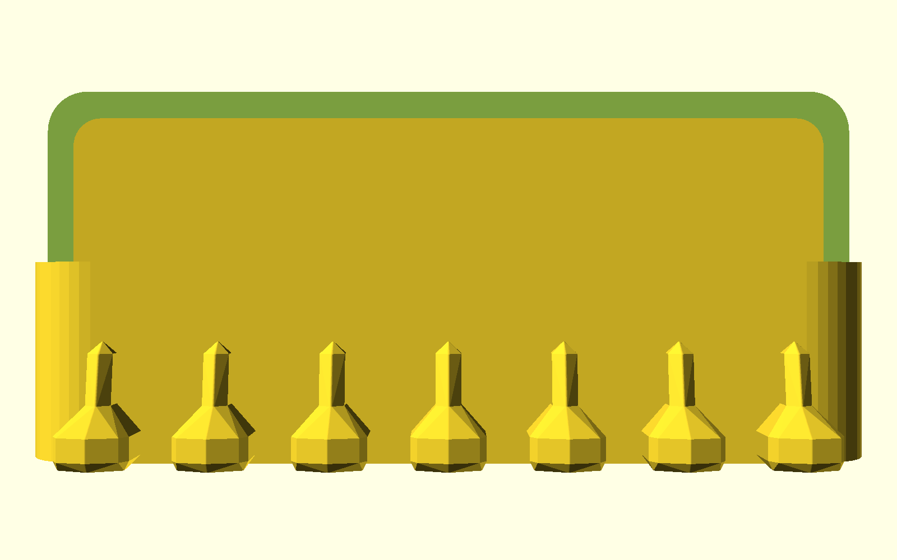
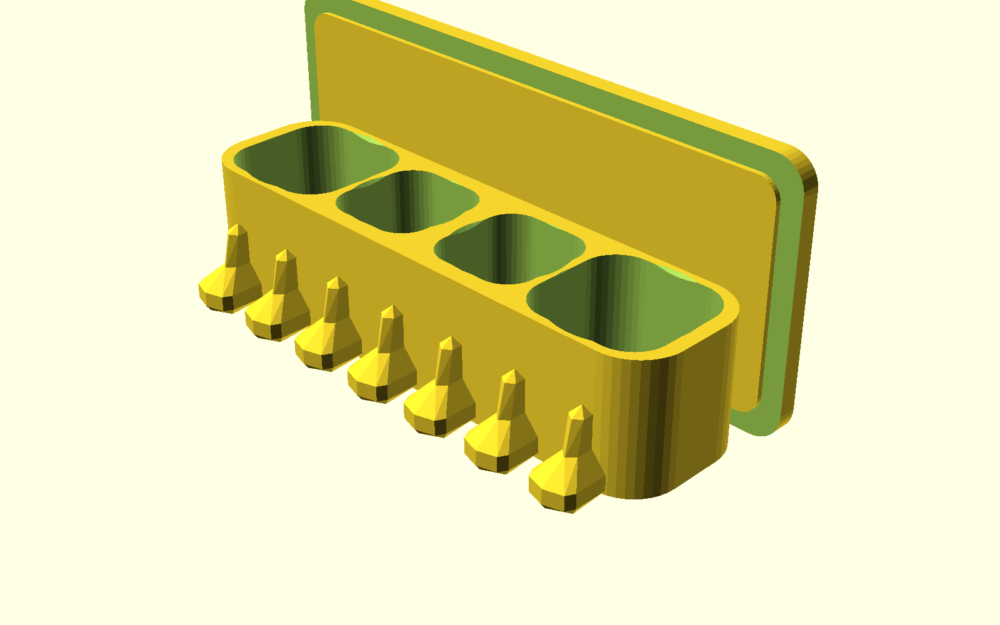
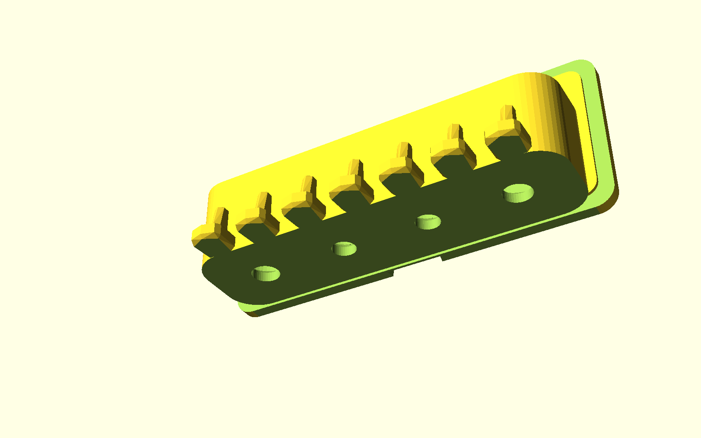

# Luxury Wall-Mounted Integrated Toothbrush, Toothpaste & Cleanser Suite
## (奢華壁掛前壁一體化 6 位牙刷 + 雙洗面乳 + 雙牙膏衛浴收納套裝)

專為 **玫瑰金絲綢金屬線材（Rose Gold / Copper Silk PLA）** 量身打造的五星級輕奢衛浴收納套裝。

依據使用者實測回饋與實際使用之精密牙刷架實例（`621-01.stp`），進行全新**前壁立面一體化（Front-Wall Integration）**重構：將 6 位前推自導向牙刷懸掛牙齒直接雕刻於牙膏/洗面乳收納艙的前垂立面上，徹底省去懸挑展台與夾層死角，總進深自原先的 $94\text{ mm}$ 大幅壓縮至僅 **$74.6\text{ mm}$**，結構力矩降低 25%，空間極致輕盈貼牆！

---

## 🏛️ 旗艦前壁一體化幾何規格 (Integrated Architecture)

```
       +-------------------------------------------------------------+
       |                  Wall Bracket (錐形燕尾滑軌)                 |
       +-------------------------------------------------------------+
       |   洗面乳艙 (Ø44)   | 牙膏艙 (Ø36) | 牙膏艙 (Ø36) |  洗面乳艙 (Ø44)  |
       |  (Ø14mm 貫穿排水)  |(Ø12mm貫穿排水)|(Ø12mm貫穿排水)| (Ø14mm 貫穿排水) |
       +=============================================================+
       |   [T0]    [T1]    [T2]    [T3]    [T4]    [T5]    [T6]      | <-- 7 顆鑽石晶簇切面牙 (Art Deco)
       |     |       |       |       |       |       |       |       |
       |  Slot 1  Slot 2  Slot 3  Slot 4  Slot 5  Slot 6  (間距 25mm)  |
       |   手動    手動    手動     緩衝   小米電動   緩衝                |
```

### 1. 前壁立面一體化 6 位自定位牙刷架（Front-Wall Integrated 6-Slot Berths）
- **實體人體工學完美繼承與三大人性化升級**：
  1. **精準卡在牙刷頭下方處（Saddle Catching under Brush Head）**：
     - 牙刷刷頭直立坐入槽位（刷毛朝前），刷頭下端弧形過渡面穩妥落於 **$45^\circ$ 自對中馬鞍位（$Z = 7 \sim 13\text{ mm}$）**。
     - 底部頸部開口精準保持 **$9.00\text{ mm}$**，牙刷細頸（$4 \sim 5.5\text{ mm}$）垂直下垂穿過，刷頭下緣（$> 11.5\text{ mm}$）被牢固承托。
  2. **前方兩側延伸防滑翼（Front Retaining Wings）**：
     - 每一顆懸掛牙在前端朝**左右兩側延伸展開**（前緣總寬達 $16.0\text{ mm}$），在槽位前側形成一道物理安全阻擋肩。
     - 牙刷頸部落入內部 $16.0\text{ mm}$ 寬的置物艙後，前方被兩側延伸翼緊密卡住，**即便前後晃動或碰觸，也絕對無法向前滑落脫出**！
  3. **柱身高度精減（Compact Column Height, $H = 24.0\text{ mm}$）**：
     - 告別原版高達 40~44mm 的長柱設計，立柱高度精簡至 **$24.0\text{ mm}$**（頂部冠頂 $26.5\text{ mm}$）。
     - 僅佔收納艙前立面下半部，上方預留出開闊通透空間，視覺比例極致輕巧洗鍊，拿取後排牙膏與洗面乳更加順手無阻！
- **標準 25mm 節距（Pitch 25.0mm）**：總跨度 $150\text{ mm}$，6 個牙刷槽完美容納 **1 支小米電動牙刷 + 3 支手動牙刷 + 2 處緩衝位**（1:1 還原浴室真實使用場景）。
- **立面一體化雕刻優勢**：
  - 牙齒背側直接融入前艙壁（$Y = 58.0\text{ mm}$），省去懸空平台，總進深僅 **$74.5\text{ mm}$**。
  - 零死角、零接縫、無接水底盤，水滴直接落入洗手台，不積水、不發霉！

### 2. 大厚度大圓蓋全相容·後排連貫迴廊艙（Palazzo Fluted / Faceted Gallery）
- **左右雙洗面乳大艙（$X = \pm 66\text{ mm}$）**：
  - 尺寸 **$46 \times 44\text{ mm}$**（導角 $R = 12\text{ mm}$），深度達 **$33.5\text{ mm}$**。
  - **相容市售直徑高達 $\varnothing 44\text{ mm}$、厚度達 $15 \sim 25\text{ mm}$ 的超大厚實圓形翻蓋洗面乳**（如資生堂專科 Senka、Biore 蜜妮、曼秀雷敦、Uno、Kiehl's 等）。
- **正中雙牙膏大艙（$X = \pm 22\text{ mm}$）**：
  - 尺寸 **$36 \times 38\text{ mm}$**（導角 $R = 10\text{ mm}$），深度達 **$33.5\text{ mm}$**。
  - **相容市售直徑高達 $\varnothing 36\text{ mm}$、厚度達 $15 \sim 22\text{ mm}$ 的立式大圓蓋牙膏**（如高露潔全效、Crest 3D White、好來 Darlie、Marvis 等）。
- **直通開放空氣層貫穿排水（Through-Drain）+ 十字通風風道**：
  - 洗面乳專屬超大排水孔：**$\varnothing 14.0\text{ mm}$**（配 $45^\circ$ 導水漏斗）。
  - 牙膏專屬大排水孔：**$\varnothing 12.0\text{ mm}$**（配 $45^\circ$ 導水漏斗）。
  - **底部十字立體防密閉風道（$4.0\text{mm} \times 2.0\text{mm}$）**：即便大圓蓋平壓艙底，水流依然排空，煙囪效應保持空氣常態對流！

### 3. 快拆錐形燕尾背板模組（Universal Dovetail Wall Bracket）
- $12^\circ$ 錐形燕尾滑軌，具備 $>1400\text{ mm}^2$ 超大免打孔無痕膠黏貼面與 2 個 M4 沉頭螺絲孔。
- 清潔時向上推移 2cm 即可秒拆下架直沖水龍頭！

---

## 💎 主推風格：裝飾藝術水晶切面 (Art Deco Diamond Faceted)

針對玫瑰金絲綢金屬線材的光學反光特性，主打 **裝飾藝術水晶切面款（Art Deco Diamond Faceted）**：
- 7 顆牙刷懸掛牙齒外緣精雕多層鑽石切角（$45^\circ$ Chamfered Facets），頂部收攏於典雅的四角錐形金字塔冠頂。
- 在浴室鏡前燈照射下，呈現璀璨俐落的高光折射，兼具結構剛度與奢華珠寶質感。
- 另提供經典羅馬長虹柱款（Fluted）與極簡柔和曲面款（Curved）供自選。

---

## 📸 視覺渲染畫廊 (Render Gallery)

### 1. 使用者真實牙刷配置安裝演示 (Bathroom Wall In-Situ Real Setup)

*(後排：2 支大圓蓋洗面乳 + 2 支大圓蓋牙膏；前排：3 支手動牙刷 + 1 支小米電動牙刷 + 2 緩衝位)*

### 2. 三大奢華風格對比 (3 Styles Side-by-Side Comparison)

*(左：裝飾藝術水晶切面款 Faceted ★主推；中：羅馬長虹柱款 Fluted；右：極簡柔和曲面款 Curved)*

### 3. 多視角全景透視 (Multi-Angle Architectural Views)
| 正面立面 (Front Elevation) | 正面等角透視 (Isometric Front) | 底面貫穿排水與防密閉風道 (Bottom Drains) |
| :---: | :---: | :---: |
|  |  |  |
| 7 齒立面一體化雕刻，鑽石金字塔冠頂 | 玫瑰金金屬切面光影，線條洗鍊大器 | Ø14/Ø12mm 貫穿開放大排水孔 + 十字立體風道 |

### 4. 獨立單體版與單盤同印切片佈局 (Standalone & 1-Plate Print Bed)
| 獨立 6 位牙刷架 (Standalone Rack) | 快拆燕尾背板 (Wall Bracket) | 單盤同印佈局 (1-Plate Combo Bed) |
| :---: | :---: | :---: |
|  |  |  |
| 完美相容 621-01 人體工學，自帶燕尾滑軌 | 100% 平整熱床貼合面 + 沉頭螺絲孔 + 錐形燕尾軌 | $204 \times 116\text{mm}$ 單盤排版，主體 + 快拆背板一盤印完 |

---

## 📐 尺寸與幾何規格表 (Specifications)

| 功能組件 | 前壁一體化旗艦套裝（Grand Faceted） | 獨立 6 位牙刷架（Standalone Faceted） | 設計原理與功能優勢 |
| :--- | :--- | :--- | :--- |
| **外觀總尺寸** | **寬 204mm × 深 74.6mm × 高 88mm** | 寬 167mm × 深 20.6mm × 高 46mm | 總進深壓縮至 74.6mm，小衛浴無壓迫感 |
| **牙刷懸掛位** | **6 位（節距 25mm，跨度 150mm）**<br>• 頸部卡槽：**$9.00\text{ mm}$**<br>• 入口喇叭：**$19.4\text{ mm}$**<br>• 自定位鞍座：$45^\circ$ 斜切倒角 | **6 位（節距 25mm，跨度 150mm）**<br>• 頸部卡槽：**$9.00\text{ mm}$**<br>• 入口喇叭：**$19.4\text{ mm}$**<br>• 自定位鞍座：$45^\circ$ 斜切倒角 | 100% 逆向工程 `621-01` 實測人體工學，普通牙刷與小米電動牙刷全相容 |
| **後排收納艙** | **4 倉一體（寬 188mm × 深 50mm）**<br>• 2 洗面乳倉（$46 \times 44\text{mm}$，**相容 Ø44mm 厚圓蓋**）<br>• 2 牙膏倉（$36 \times 38\text{mm}$，**相容 Ø36mm 厚圓蓋**） | 無（純牙刷專用款） | 倒錐底漏斗 + $\varnothing 14\text{mm}/\varnothing 12\text{mm}$ 全貫穿直通排水大孔 + 十字立體風道 |
| **熱床貼合面積** | **$> 3800\text{ mm}^2$**（$Z = 0$ 實心大基座） | $> 600\text{ mm}^2$ | 底部 100% 平整貼床，無懸空，徹底防止翹曲 |
| **快拆背板** | 寬 44mm × 高 34mm × 厚 6.8mm | 寬 44mm × 高 34mm × 厚 6.8mm | 共用通用規格，支援免打孔黏貼與 M4 沉頭螺絲孔 |

---

## 🖨️ 3D 列印建議參數 (Optimized for Rose Gold Silk PLA)

1. **切片設定 (Slicer Settings)**：
   - **支撐結構 (Supports)**：**完全關閉（Supports: None）**！全模型內部天花板均採用 $45^\circ$ 錐度與懸臂斜撐，100% 自支撐（0.00g 支撐廢料）。
   - **底邊 (Brim)**：**無須開啟 Brim**（主體底面接觸面積達 $>3800\text{ mm}^2$）。
   - **層高 (Layer Height)**：推薦 `0.16mm` ~ `0.20mm`（追求極致金屬光澤外壁層高可設 `0.12mm`）。
   - **列印方向**：直接使用 STL 預設放置方向（主體平貼底面正立印、背板平躺印）。
   - **熱床尺寸相容**：
     - Bambu Lab（X1 / P1 / A1，256×256）：直接單盤同印組合檔（$204 \times 116\text{mm}$）。
     - Prusa（MK3 / MK4，250×210）：直接單盤同印組合檔（$204 \times 116\text{mm}$，遠小於 $250 \times 210$）。
     - Creality（Ender-3 系列，220×220）：主體 204mm 舒適放入，單盤同印（$204 \times 116\text{mm}$）開箱即印！
2. **絲綢線材調校建議 (Silk PLA Optical Optimization)**：
   - **噴嘴溫度 (Nozzle Temp)**：建議比一般 PLA 提高 $5^\circ\text{C} \sim 10^\circ\text{C}$（約 $215^\circ\text{C} \sim 220^\circ\text{C}$），溫度稍高有助於金屬絲綢光澤充分析出。
   - **外壁速度 (Outer Wall Speed)**：建議降低至 `35 ~ 45 mm/s`，外壁走速平緩均勻能讓金屬高光折射最為璀璨。
   - **外壁圈數 (Wall Loops)**：建議設為 `3 ~ 4 圈`，增強結構剛度與耐用度。

---

## 📦 檔案清單 (STL Catalog)

### 裝飾藝術水晶切面款（Art Deco Faceted，★使用者指定主推款）
| 檔案名稱 | 說明 | 規格 |
| :--- | :--- | :--- |
| **[`luxury_holder_grand_faceted.stl`](luxury_holder_grand_faceted.stl)** | **前壁一體化水晶切面旗艦置物架 (★首選)** | 雙洗面乳（Ø44mm 蓋）+ 雙牙膏（Ø36mm 蓋）+ 6 位立體切面牙刷架，總深 74.6mm。 |
| **[`combo_plate_grand_faceted.stl`](combo_plate_grand_faceted.stl)** | **旗艦版整盤同印組合檔 (一鍵開印)** | 水晶切面主體 + 快拆背板同盤排列（佔用 $204 \times 116\text{mm}$）。 |
| **[`standalone_toothbrush_faceted.stl`](standalone_toothbrush_faceted.stl)** | **獨立 6 位水晶切面牙刷架** | 完美相容 621-01 人體工學，附快拆燕尾滑軌，小巧精緻（$167 \times 20.6 \times 46\text{mm}$）。 |

### 其他建築風格款 (Alternative Styles)
| 檔案名稱 | 說明 | 規格 |
| :--- | :--- | :--- |
| **[`luxury_holder_grand_fluted.stl`](luxury_holder_grand_fluted.stl)** | 羅馬長虹柱面旗艦置物架 | 雙洗面乳 + 雙牙膏 + 6 位牙刷架（長虹立柱造型）。 |
| **[`combo_plate_grand_fluted.stl`](combo_plate_grand_fluted.stl)** | 羅馬長虹柱旗艦版整盤同印組合檔 | 長虹柱主體 + 快拆背板同盤排列（佔用 $204 \times 116\text{mm}$）。 |
| **[`luxury_holder_grand_curved.stl`](luxury_holder_grand_curved.stl)** | 極簡柔和曲面旗艦置物架 | 溫潤大圓角與連續流體曲面，純粹現代優雅。 |

### 通用配件與原始碼
| 檔案名稱 | 說明 | 備註 |
| :--- | :--- | :--- |
| **[`wall_bracket.stl`](wall_bracket.stl)** | **快拆免打孔雙用背板 (共用件)** | 適用所有款式，平貼熱床印，背貼 3M 膠或打螺絲。 |
| **[`luxury_wall_toothbrush_holder.scad`](luxury_wall_toothbrush_holder.scad)** | OpenSCAD 參數化原始代碼 | 支援所有風格、牙刷槽距、孔徑與尺寸自定義。 |
| **`renders/`** | 高解析多視角渲染圖庫 | 包含實際牙刷配置圖、各角度特寫與單盤切片排版。 |
