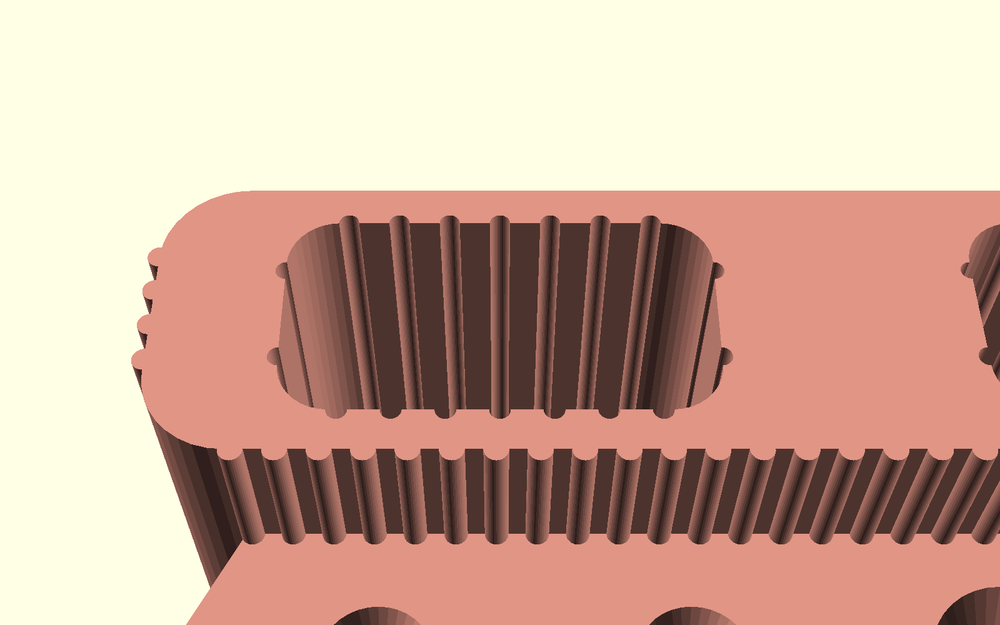
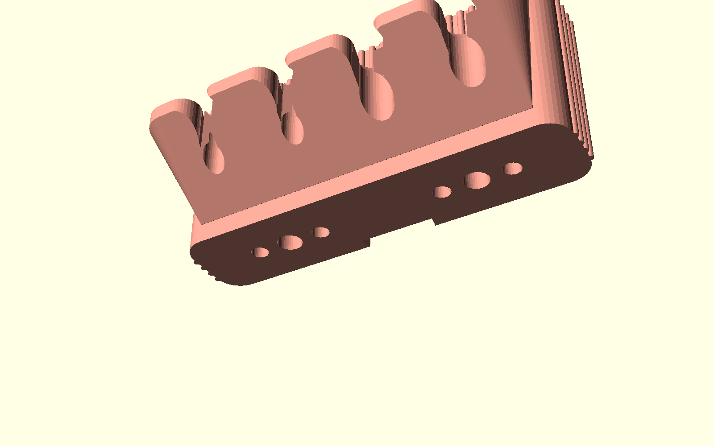

# Luxury Wall-Mounted Toothbrush & Toothpaste Organizer (奢華壁掛前推前取式牙刷牙膏置物架 - 玫瑰金輕奢版)

專為 **玫瑰金絲綢金屬線材（Rose Gold / Copper Silk PLA）** 量身打造的五星級輕奢衛浴收納套裝。

針對一般衛浴收納「需要向上提起 20cm 碰撞鏡櫃」、「孔徑過大導致普通牙刷容易滑落掉落」、「塑料感重缺乏高級質感」等關鍵痛點進行徹底幾何重構：
- **一體式古典雙重羅馬柱與建築托樑拱筋（Monolithic Dual-Fluted Architecture with Modillion Corbel Brackets）**：
  - 摒棄單薄分叉的夾爪，採用連續貫通的建築式平整展台，下方輔以一體成型 $45^\circ$ 自支撐優雅托樑。
  - **後排大羅馬柱（Pitch 4.8mm, Radius 1.4mm）**：立體縱向凸柱紋理，隨視線產生豎琴拉絲金屬光影，完美隱藏 FDM 層線。
  - **前唇與側翼微細凹凸柱飾（Pitch 3.2mm, Radius 0.8mm）**：正面直立邊緣與兩側外壁鋪陳細膩微條紋，手感溫潤且充滿層次。
  - **底部 5 組建築牛腿托樑拱筋（5 Modillion Corbel Console Ribs）**：分布於 $X = [-72, -36, 0, +36, +72\text{mm}]$，工整環繞 4 個牙刷開孔，將現代力學與歐洲古典拱橋美學完美融合。
  - **頂面緞面平整易潔展台（Smooth Satin Gallery Deck）**：頂面展台呈現極致平整光潔，杜絕任何水垢沉積死角，一抹即淨、持久光亮！
- **圓滑切線喇叭口與防掉落沉孔結構（Tangential Trumpet Horns with Anti-Drop Retention Cups）**：
  - **徹底消除前方直角，極致順滑盲插入座**：前方開口不再是生硬直角，採用高階建築曲面 $C^1$ 連續切線圓弧喇叭口（Trumpet Bell Curve）。展台正面與喇叭導槽以圓弧無稜角平滑過渡，入口開口大幅擴展至 **$20.0\text{ mm}$（手動）** 與 **$23.0\text{ mm}$（電動）**。洗漱時無須費力精確對準，牙刷輕靠即可順著流體曲面自然聚攏導中推入！
  - **左側 1 & 2 號位：專屬重型電動牙刷位（Electric Toothbrush Berths）**
    - 喇叭口開闊度 $23.0\text{ mm}$、內部喉寬 $10.5\text{ mm}$：供電動牙刷上頸部（約 $8.5 \sim 9.8\text{ mm}$）順暢滑入。
    - 通孔直徑 $\varnothing 12.8\text{ mm}$：承托手柄頂部金屬頸環，杜絕整支下墜。
    - 防掉沉孔 $\varnothing 18.5\text{ mm}$（深度 $4.5\text{ mm}$，帶平滑導引倒角）：手柄頂部金屬圓圈/圓錐肩部（$\varnothing 15 \sim 17.5\text{ mm}$）穩妥坐入沉孔凹窩內，由於肩部直徑遠大於 $10.5\text{ mm}$ 喉口，**水平自然咬鎖，碰撞絕不前傾翻落**！
  - **右側 3 & 4 號位：專屬手動牙刷精密防掉位（Precision Manual Toothbrush Berths）**
    - 喇叭口開闊度 $20.0\text{ mm}$、內部喉寬僅 $7.0\text{ mm}$：手動牙刷纖細刷頸（約 $5.0 \sim 6.2\text{ mm}$）輕鬆滑入。
    - 通孔直徑 $\varnothing 8.8\text{ mm}$：提供刷頸自垂對中空間。
    - 防掉沉孔 $\varnothing 13.5\text{ mm}$（深度 $4.5\text{ mm}$）：刷頭底部過渡區（寬度 $11.5 \sim 13\text{ mm}$）平穩落入沉孔窩內。
    - **100% 物理防掉保證**：普通手動牙刷刷頭（$11.5 \sim 13\text{ mm}$）與手柄（$11 \sim 14\text{ mm}$）寬度**遠大於 $7.0\text{ mm}$ 喉口**，無論如何碰觸、傾斜或晃動，**刷頭均被兩側實心擋肩阻擋，絕對不會向前掉落**！
- **極致直覺操作（Direct Front Insertion & Retrieval）**：
  - 水平前推進孔、輕微上抬 3mm 即可水平向前順暢取出！
  - **垂直空間零死角干涉**：無須向上拔起整支牙刷，完美適用鏡櫃下方、壁龕或低矮層架空間。
- **360° 懸垂通風速乾**：手柄懸垂於下方開闊空間，水滴經由垂直貫通孔直接滴落排空，徹底杜絕筒底積水黑斑與細菌發霉。
- **後排高階牙膏倉（隱藏式 360° 立體導氣槽 + 底層三重漏斗極速排空，零影響外觀美學）**：
  - **360° 內壁縱向導氣煙囪槽（Interior Aeration Flutes）**：牙膏倉內壁四面均勻雕琢立體通風導氣槽（半徑 $1.2\text{ mm}$）。當大家庭號牙膏管、洗面乳放入時，管身僅接觸槽棱，**管壁與倉壁之間保留連續垂直空氣通道，牙膏絕不貼壁吸附**，自然形成煙囪熱對流，蒸發水氣極速乾燥！
  - **底層三重 $45^\circ$ 漏斗急速排空孔（Triple Conical Drainage Ports）**：倉底設有 **1 個 $\varnothing 10\text{ mm}$ 核心孔 + 2 個 $\varnothing 7\text{ mm}$ 輔助孔**，上方均銜接 $45^\circ$ 自支撐錐形倒角漏斗。總排氣/排水斷面積高達 **$>155\text{ mm}^2$（舊版 3 倍以上）**，水滴順坡秒排，絕無死角積水、滑膩發黑！
  - **100% 隱形工程設計**：所有排空孔設於底面、導氣槽設於內壁，**正面、頂面、側面外觀 100% 保持奢華金屬一體感**，無任何突兀外露孔洞。
- **快拆背板模組**：錐形自鎖燕尾滑軌背板，具備 $>1800\text{ mm}^2$ 超大免打孔黏貼面與 2 個 M4 沉頭螺絲孔。
- **100% 免支撐（Support-Free）**：拱托嚴格控制在 $45^\circ$ 自支撐角，內部燕尾槽採用尖拱天花板，FDM 列印 0 支撐警報。
- **3 款專屬外觀美學風格**：古典雙重羅馬柱、瑞士名錶巴黎釘紋微金字塔鑽石切面、現代意式階梯瀑布折面。

---

## 💎 玫瑰金金屬美學與外觀設計 (Aesthetic Styles for Rose Gold Filament)

玫瑰金絲綢線材（Silk PLA）在光線照射下具有強烈的各向異性金屬光澤（Anisotropic Metallic Sheen）。若列印一般的平直塑膠盒，容易顯得廉價塑料感重；本設計專為金屬反射光學特性設計了 **3 大外觀美學風格**，讓金屬線材在每一處轉折都能折射出高級光影：

### 三大奢華風格對比 (Side-by-Side Comparison)

*(由左至右：輕奢雙重羅馬柱款 Fluted、現代意式階梯瀑布款 Curved、瑞士巴黎釘紋鑽石款 Faceted)*

---

### 風格 1：古典雙重羅馬柱 + 建築托樑拱筋 (Fluted & Modillion Brackets) —— ★ 旗艦推薦
- **設計語彙**：融合 **Art Deco 古典羅馬柱後壁**、**前唇細微條紋飾面** 與 **底部 5 組古典牛腿托樑拱筋**：
  - **後排牙膏高階壁**：環繞立體縱向古典羅馬柱凸槽紋理（Pitch 4.8mm, R 1.4mm），隨視線產生豎琴拉絲光影。
  - **前唇與側翼**：精緻微細凹凸柱飾（Pitch 3.2mm, R 0.8mm），與後排大柱相呼應，層次豐富。
  - **底部 $45^\circ$ 托樑拱筋**：5 組實體結構肋條，強化支撐力的同時勾勒出歐洲拱門建築秩序美感。
  - **頂部牙刷展台**：緞面平滑光潔，牙膏泡沫與水花一擦即淨，不藏汙納垢。
- **對應檔案**：[`luxury_holder_fluted.stl`](luxury_holder_fluted.stl) 與 [`combo_plate_fluted.stl`](combo_plate_fluted.stl)

### 風格 2：現代意式階梯瀑布折面 (Italian Waterfall Stepped Terraces)
- **設計語彙**：極簡連續光潔流線與頂部階梯柔和導角，後排腰部與前唇內嵌雙道 $45^\circ$ 自支撐內凹陰影飾線。
- **光影效果**：平滑溫潤的流體曲面展現玫瑰金深邃柔和的漸層反射，陰影槽線形成高對比立體視覺，極致純粹大器。
- **對應檔案**：[`luxury_holder_curved.stl`](luxury_holder_curved.stl)

### 風格 3：瑞士名錶巴黎釘紋微金字塔鑽石切面 (Swiss Clous de Paris Guilloché Diamond Studs)
- **設計語彙**：後排上壁與前緣採用嚴謹數學排列的幾何微金字塔釘紋（Pitch 5.0mm, H 1.2mm, 4-sided pyramid），底部搭配立體托樑。
- **光影效果**：在浴室鏡前燈照射下，每個金字塔四面晶瑩反射光點，呈現如百達翡麗、愛彼名錶錶盤般的璀璨鑽石折射工藝感。
- **對應檔案**：[`luxury_holder_faceted.stl`](luxury_holder_faceted.stl)

---

## 📸 視覺渲染畫廊 (Render Gallery)

### 1. 衛浴安裝與全能收納演示 (Bathroom Wall Installations)
| 風格 1：雙重羅馬柱托樑（★推薦） | 風格 2：意式階梯瀑布 | 風格 3：瑞士巴黎釘紋鑽石 |
| :---: | :---: | :---: |
|  |  |  |
| 典雅羅馬柱拉絲反光，2 支電動牙刷 + 2 支手動牙刷穩固前懸，2 支牙膏穩坐後階 | 柔和瀑布階梯導角，極簡大器 | 俐落金字塔微釘紋，名錶工藝感 |

### 2. 羅馬柱旗艦款多視角實拍 (Fluted & Modillion Architecture Details)
| 頂面平整展台 (Top Deck) | 底部托樑與排空孔 (Bottom Underside) | 側翼細微條紋 (Side Flank) |
| :---: | :---: | :---: |
|  |  |  |
| 光潔平整無水垢死角，喇叭口圓滑過渡 | 5 組建築拱筋 + 6 個錐形排空孔 | 前後條紋呼應，細節層次豐富 |

| 前方微條紋唇邊 (Front Lip) | 正面等角透視 (Isometric Front) | 仰角等角透視 (Isometric Underside) |
| :---: | :---: | :---: |
|  |  |  |
| 直立微條紋飾面，手感細膩溫潤 | 羅馬柱與托樑渾然一體，氣度優雅 | 45° 完美自支撐托樑，線條剛勁有力 |

### 3. 精密人體工學與隱藏式通風瀝水 (Ergonomics & Ventilation Details)
| 圓滑切線喇叭口與防掉沉孔 | 牙膏倉 360° 內壁導氣煙囪槽 | 底層三重漏斗極速排空孔 |
| :---: | :---: | :---: |
|  |  |  |
| 消除直角之切線圓滑喇叭口（20/23mm 入口），盲插極致順滑 | 內壁均布縱向微槽，牙膏管身不貼壁，水氣暢通對流 | 1 個 Ø10mm + 2 個 Ø7mm 錐形大通孔，排空斷面 $>155\text{mm}^2$ |

### 4. 模組化快拆背板與 3D 列印佈局 (Mounting & Print Bed)
| 快拆錐形燕尾背板 (Wall Slide Bracket) | 單盤同印佈局 (1-Plate Combo Layout) |
| :---: | :---: |
|  |  |
| 100% 平整熱床貼合面 + 沉頭螺絲孔 + 錐形自鎖燕尾軌 | $160 \times 116\text{mm}$ 極緊湊排版，主體 + 快拆背板一盤印完 |

---

## ⚡ 前推前取與防掉落幾何設計解密 (Ergonomics & Anti-Drop Physics)

針對一般牙刷放置時容易滑落以及無法適用電動牙刷的困境，本設計進行了精確的尺寸與力學分析：

| 懸掛位類型 | 規格參數 | 牙刷適用規格 | 防掉落與操作幾何原理 |
| :--- | :--- | :--- | :--- |
| **左側 1 & 2 號位： 重型電動牙刷位** | • 喇叭口寬：$23.0\text{ mm}$ • 內部喉寬：$10.5\text{ mm}$ • 通孔徑：$\varnothing 12.8\text{ mm}$ • 沉孔徑：$\varnothing 18.5\text{ mm}$ • 沉孔深：$4.5\text{ mm}$ | Oral-B（iO / Pro / Genius 全系列）、Philips Sonicare、小米、Panasonic 等粗手柄電動牙刷 | • **無直角圓滑喇叭口**：正面採用 $C^1$ 切線圓弧過渡，23mm 超寬導引口，無須精確瞄準即可輕鬆推入。 • **沉孔咬鎖**：手柄頂部金屬圓環/圓錐肩部（$\varnothing 15 \sim 17.5\text{ mm}$）坐入 $4.5\text{ mm}$ 深的沉孔內。 • **防傾防掉**：手柄肩部遠大於 $10.5\text{ mm}$ 喉口，沉孔前壁形成實心阻擋壁，晃動不脫出。 |
| **右側 3 & 4 號位： 手動牙刷精密防掉位** | • 喇叭口寬：$20.0\text{ mm}$ • 內部喉寬：$7.0\text{ mm}$ • 通孔徑：$\varnothing 8.8\text{ mm}$ • 沉孔徑：$\varnothing 13.5\text{ mm}$ • 沉孔深：$4.5\text{ mm}$ | 高露潔、黑人/好來、獅王 Lion、舒適達 Sensodyne、瑞士 Curaprox 等所有市售普通手動牙刷 | • **無直角圓滑喇叭口**：正面切線圓弧倒角，20mm 寬導引口，輕輕一碰即可自動聚攏導向中心。 • **物理零掉落**：刷頭寬度（$11.5 \sim 13\text{ mm}$）遠大於 $7.0\text{ mm}$ 喉口，整整保留 $4.5 \sim 6\text{ mm}$ 的實體阻擋台階！即便旋轉傾斜亦**絕對無法從前方脫出**！ • **刷頭定位**：刷頭底部過渡區安穩落入 $\varnothing 13.5\text{ mm}$ 沉孔，重心筆直下垂。 |

---

## 📐 尺寸與幾何規格表 (Specifications)

| 功能組件 | 規格參數 | 設計原理與功能優勢 |
| :--- | :--- | :--- |
| **外觀總尺寸** | 寬 160mm × 深 68.8mm × 高 66mm | 比例輕盈大器，展台懸挑有力，適配各類衛浴鏡櫃旁牆面。 |
| **前排四前推開孔** | 4 個對稱精密位（$X=-54, -18, +18, +54\text{mm}$） | • 間距達 36mm，電動牙刷頭之間保留充足間距，刷毛絕不互碰。 • 雙電動（10.5mm 喉口）+ 雙手動（7.0mm 喉口）。 • 下方自帶 $45^\circ$ 一體連貫斜撐拱托，100% 免支撐列印。 |
| **後排雙超大牙膏倉** | 2 個獨立大內腔（$X=\pm 40\text{mm}$，每槽 $50 \times 26\text{mm}$，深 56mm） | • 支援 2 支 200g 超大家庭號牙膏、洗面乳或電動刮鬍刀。 • 獨立分倉互不傾倒干擾。 • 360° 內壁導氣煙囪槽 + 底層三重漏斗排空孔（斷面 $>155\text{mm}^2$），通風極速乾燥。 |
| **快拆雙用安裝背板** | 寬 46mm × 高 44mm × 厚 6.8mm | • **免打孔黏貼**：背板底面 $Z=0$ 為 $>1800\text{ mm}^2$ 超大連續平面，3M VHB / 無痕膠條黏著力極強。 • **螺絲打孔固定**：設有 2 個 M4 沉頭螺絲孔（間距 20mm），自帶向上展開 $45^\circ$ 錐形導角，免支撐列印。 • **錐形燕尾滑軌**：$12^\circ$ 錐形滑軌，自帶重力楔緊止位；**清潔時向上推移 2cm 即可秒拆下架**，直接於水龍頭下沖洗！ |

---

## 🖨️ 3D 列印建議參數 (Optimized for Rose Gold Silk PLA)

使用金屬絲綢線材（Silk PLA）時，列印參數會直接影響表面的金屬光澤度與層線細緻度：

1. **切片設定 (Slicer Settings)**：
   - **支撐結構 (Supports)**：**完全關閉（Supports: None）**！全模型內部天花板均採用 $45^\circ$ 尖拱與懸臂斜撐設計，100% 自支撐（0.00g 支撐廢料）。
   - **底邊 (Brim)**：**無須開啟 Brim**（主體底面接觸面積達 $>2200\text{ mm}^2$）。
   - **層高 (Layer Height)**：推薦 `0.16mm` ~ `0.20mm`（展台外觀細膩平滑；追求極致金屬光澤外壁層高可設 `0.12mm`）。
   - **列印方向**：直接使用 STL 預設放置方向（主體平貼底面正立印、背板平躺印）。
2. **絲綢線材調校建議 (Silk PLA Optical Optimization)**：
   - **噴嘴溫度 (Nozzle Temp)**：建議比一般 PLA 提高 $5^\circ\text{C} \sim 10^\circ\text{C}$（約 $215^\circ\text{C} \sim 220^\circ\text{C}$），溫度稍高有助於金屬絲綢光澤充分析出。
   - **外壁速度 (Outer Wall Speed)**：建議降低至 `35 ~ 45 mm/s`，外壁走速平緩均勻能讓金屬高光折射最為璀璨。
   - **外壁圈數 (Wall Loops)**：建議設為 `3 ~ 4 圈`，增強結構剛度與耐用度。

---

## 📦 檔案清單 (STL Catalog)

| 檔案名稱 | 說明 | 推薦用途 |
| :--- | :--- | :--- |
| **[`luxury_holder_fluted.stl`](luxury_holder_fluted.stl)** | **古典雙重羅馬柱 + 托樑拱筋置物架主體 (★推薦)** | 經典輕奢立體凸柱紋後壁 + 前唇微細凹凸柱飾 + 5 組建築牛腿托樑，2 電動 + 2 手動防掉孔 + 2 隱藏通風牙膏倉。 |
| **[`combo_plate_fluted.stl`](combo_plate_fluted.stl)** | **整盤雙件同印組合檔 (一鍵開印)** | 羅馬柱旗艦主體 + 快拆背板同盤排列（佔用 $162.8 \times 118\text{mm}$），單次搞定整套，開箱即印！ |
| **[`luxury_holder_curved.stl`](luxury_holder_curved.stl)** | 現代意式階梯瀑布折面置物架主體 | 溫潤大圓角與階梯瀑布導角，中位雙道內凹高光陰影飾線，純粹現代優雅。 |
| **[`luxury_holder_faceted.stl`](luxury_holder_faceted.stl)** | 瑞士名錶巴黎釘紋鑽石切面置物架主體 | 嚴謹微金字塔釘紋裝飾，多角度折射璀璨鑽石光芒，名錶工藝感。 |
| **[`wall_bracket.stl`](wall_bracket.stl)** | **快拆免打孔雙用背板 (共用件)** | 適用所有款式，平貼熱床印，背貼 3M 膠或打螺絲。 |
| **[`luxury_wall_toothbrush_holder.scad`](luxury_wall_toothbrush_holder.scad)** | OpenSCAD 參數化原始代碼 | 支援自定義喉徑、間距、牙膏倉尺寸與風格切換。 |
| **`renders/`** | 高解析多視角渲染圖庫 | 包含全套對比圖、各風格單獨視角、前推取放特寫與單盤切片排版。 |
