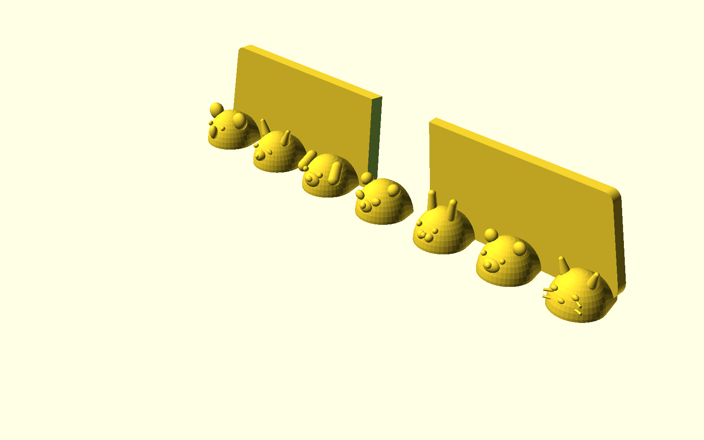

# Luxury Wall-Mounted Integrated Toothbrush, Toothpaste & Cleanser Suite
## 奢華壁掛前壁一體化 6 位牙刷 + 雙洗面乳 + 雙牙膏衛浴收納套裝
### 🌟 旗艦典藏版：羅馬長虹藝術鑽石晶簇牆 × 7 大萌寵立體浮雕水滴托爪 (Grand Fluted Edition)

專為 **玫瑰金絲綢金屬線材（Rose Gold / Copper Silk PLA）** 量身打造的五星級輕奢衛浴收納套裝。

依據使用者明確指示，專注打造唯一頂級旗艦版本 **`luxury_holder_grand_fluted`**，集結前壁立面一體化、零死角直通大排水、藝術鑽石切面紋理牆面與 7 大精雕動物水滴托爪於一身！

---

## 🏛️ 旗艦升級核心設計亮點 (Key Highlights)

```
       +-------------------------------------------------------------+
       |                  Wall Bracket (錐形燕尾滑軌)                 |
       +-------------------------------------------------------------+
       |   洗面乳艙 (Ø44)   | 牙膏艙 (Ø36) | 牙膏艙 (Ø36) |  洗面乳艙 (Ø44)  |
       |  (Ø14mm 貫穿排水)  |(Ø12mm貫穿排水)|(Ø12mm貫穿排水)| (Ø14mm 貫穿排水) |
       +=============================================================+
       |  [ 不規則藝術鑽石晶簇浮雕外牆 (Organic Diamond Crystalline) ]  |
       |  [ 兩側羅馬長虹曲面包邊 (Architectural Fluting Wraparound) ]   |
       +-------------------------------------------------------------+
       |   🐱貓咪   🐻小熊   🐰兔子   🐼熊貓   🐶狗狗   🦊小狐狸  🐨無尾熊 | <-- 7 大萌寵立體浮雕水滴頭
       |     |       |       |       |       |       |       |       |
       |  Slot 1  Slot 2  Slot 3  Slot 4  Slot 5  Slot 6  (間距 25mm)  |
       |   手動    手動    手動     緩衝   小米電動   緩衝                |
```

### 1. 後方洗面乳與牙膏外牆：不規則藝術鑽石晶簇切面 (Diamond Crystalline Facade)
- **立體光影浮雕面**：在收納艙外立面（$Z = 13 \sim 38\text{ mm}$）雕琢高低錯落、傾角各異的不規則多邊形鑽石金字塔晶簇（Diamond Crystalline Facets）。
- **玫瑰金絲綢高光折射**：每顆切面在浴室鏡前燈下反射出不同角度的金屬絲綢高光，呈現如奢華珠寶與現代建築般的藝術質感。
- **古典長虹柱面包角與水平腰線**：兩側圓弧導角（$R = 16\text{ mm}$）飾以垂直古典長虹柱凹槽（Fluted Wraparound），並在 $Z = 28\text{ mm}$ 處設計黃金分割水平光影腰線（Architectural Shadow Beltline）。

### 2. 前方牙刷托爪：有機水滴造型 × 7 大萌寵立體浮雕 (7 Cute Animal Waterdrops)
- **純 3D 有機雙圓心水滴造型**：
  - 100% 滿足用戶要求：「**前端改為圓弧、整體為水滴狀、越往外越厚**」。
  - 後方根部厚度 $5.5\text{ mm}$（寬 $14.5\text{ mm}$），向前平順隆起至前端圓弧水滴頭厚度 **$11.0\text{ mm}$**（寬 $17.5\text{ mm}$，厚度翻倍 $+5.5\text{ mm}$）。
  - 水滴托爪兩側收窄（間隔由內部的 $10.5\text{ mm}$ 縮至前端出槽口 $7.5\text{ mm}$），搭配前端半橢球穹頂向上昂起，形成雙重物理自鎖防滑機制，牙刷永不向前滑脫！
- **7 大萌寵趣味辨識雕刻（由左至右）**：
  - **T0（$X = -75\text{ mm}$）**：🐱 **小貓咪 (Cat)** —— 靈動尖立雙耳、圓潤鼻尖與兩側鬍鬚細節。
  - **T1（$X = -50\text{ mm}$）**：🐻 **小泰迪熊 (Bear)** —— 渾圓立耳、立體飽滿吻部與呆萌圓鼻。
  - **T2（$X = -25\text{ mm}$）**：🐰 **小兔子 (Bunny)** —— 優雅長萌耳、小巧圓鼻與三瓣嘟嘟嘴。
  - **T3（$X = 0\text{ mm}$ 正中）**：🐼 **大熊貓 (Panda)** —— 招牌圓黑耳、標誌性微傾眼圈與飽滿臉頰。
  - **T4（$X = +25\text{ mm}$）**：🐶 **小狗狗 (Puppy)** —— 俏皮下垂大折耳、立體大鼻頭與忠厚微笑面龐。
  - **T5（$X = +50\text{ mm}$）**：🦊 **小赤狐 (Fox)** —— 機靈錐形大耳、修長微翹鼻吻部與靈動眼型。
  - **T6（$X = +75\text{ mm}$）**：🐨 **無尾熊 (Koala)** —— 超萌毛茸蓬鬆大圓耳與標誌性大橢圓鼻頭。
- **免支撐 FDM 列印工藝保證**：
  - 所有動物五官微浮雕起伏（$0.8 \sim 2.5\text{ mm}$）均經過拔模角最佳化，耳部與鼻部最大外伸角度 $< 45^\circ$，**100% 免支撐（Zero Supports）**，底面平整貼床（$Z = 0$）列印附著穩固！

### 3. 大厚度大圓蓋全相容·後排連貫迴廊艙 (Palazzo Gallery)
- **左右雙洗面乳大艙（$X = \pm 66\text{ mm}$）**：
  - 尺寸 **$46 \times 44\text{ mm}$**（導角 $R = 12\text{ mm}$），深度達 **$33.5\text{ mm}$**。
  - **相容市售直徑高達 $\varnothing 44\text{ mm}$、厚度達 $15 \sim 25\text{ mm}$ 的超大厚實圓形翻蓋洗面乳**（如資生堂專科 Senka、Biore 蜜妮、曼秀雷敦、Uno、Kiehl's 等）。
- **正中雙牙膏大艙（$X = \pm 22\text{ mm}$）**：
  - 尺寸 **$36 \times 38\text{ mm}$**（導角 $R = 10\text{ mm}$），深度達 **$33.5\text{ mm}$**。
  - **相容市售直徑高達 $\varnothing 36\text{ mm}$、厚度達 $15 \sim 22\text{ mm}$ 的立式大圓蓋牙膏**（如高露潔全效、Crest 3D White、好來 Darlie、Marvis 等）。
- **直通開放空氣層貫穿排水（Through-Drain）+ 十字防密閉立體風道**：
  - 洗面乳專屬超大排水孔：**$\varnothing 14.0\text{ mm}$**（配 $45^\circ$ 導水漏斗）。
  - 牙膏專屬大排水孔：**$\varnothing 12.0\text{ mm}$**（配 $45^\circ$ 導水漏斗）。
  - **底部十字立體防密閉風道（$4.0\text{mm} \times 2.0\text{mm}$）**：即便大圓蓋平壓艙底，水流依然排空，煙囪效應保持空氣常態對流！

### 4. 快拆錐形燕尾背板模組 (Universal Dovetail Wall Bracket)
- $12^\circ$ 錐形燕尾滑軌，具備 $>1400\text{ mm}^2$ 超大免打孔無痕膠黏貼面與 2 個 M4 沉頭螺絲孔。
- 清潔時向上推移 2cm 即可秒拆下架直沖水龍頭！

---

## 📸 視覺渲染畫廊 (Render Gallery)

### 1. 使用者真實牙刷配置安裝演示 (Bathroom Wall In-Situ Real Setup)

*(後排：2 支大圓蓋洗面乳 + 2 支大圓蓋牙膏；前排：3 支手動牙刷 + 1 支小米電動牙刷 + 2 緩衝位)*

### 2. 正視圖·7 大萌寵水滴爪與鑽石晶簇外牆 (Front Elevation & Animals Detail)

*(從左至右依次為：🐱貓咪、🐻小熊、🐰兔子、🐼熊貓、🐶狗狗、🦊狐狸、🐨無尾熊)*

### 3. 多視角全景透視 (Multi-Angle Architectural Views)
| 正面等角透視 (Isometric Front) | 側面水滴厚度變化 (Side Profile) | 底面貫穿排水與立體風道 (Bottom Drains) |
| :---: | :---: | :---: |
|  |  |  |
| 鑽石金字塔晶簇牆面 + 羅馬長虹包角 | 越往外越厚 (5.5mm 升至 11.0mm) | Ø14/Ø12mm 貫穿開放大排水孔 + 十字立體風道 |

### 4. 獨立單體版與單盤同印切片佈局 (Standalone & 1-Plate Print Bed)
| 獨立 6 位萌寵牙刷架 (Standalone Rack) | 快拆燕尾背板 (Wall Bracket) | 單盤同印佈局 (1-Plate Combo Bed) |
| :---: | :---: | :---: |
|  |  |  |
| 包含 7 大萌寵水滴爪，自帶燕尾滑軌 | 100% 平整熱床貼合面 + 沉頭螺絲孔 + 錐形燕尾軌 | $204 \times 116\text{mm}$ 單盤排版，主體 + 快拆背板一盤印完 |

---

## 📐 尺寸與幾何規格表 (Specifications)

| 功能組件 | 前壁一體化旗艦套裝（Grand Fluted） | 獨立 6 位牙刷架（Standalone Fluted） | 設計原理與功能優勢 |
| :--- | :--- | :--- | :--- |
| **外觀總尺寸** | **寬 204mm × 深 74.5mm × 高 88mm** | 寬 167mm × 深 20.5mm × 高 46mm | 總進深壓縮至 74.5mm，小衛浴無壓迫感 |
| **牙刷懸掛位** | **6 位（節距 25mm，跨度 150mm）**<br>• 7 顆萌寵水滴爪（🐱🐻🐰🐼🐶🦊🐨）<br>• 越往外越厚（$5.5\text{mm} \to 11.0\text{mm}$）<br>• 前端出槽口收窄至 $7.5\text{mm}$ 防脫 | **6 位（節距 25mm，跨度 150mm）**<br>• 7 顆萌寵水滴爪（🐱🐻🐰🐼🐶🦊🐨）<br>• 越往外越厚（$5.5\text{mm} \to 11.0\text{mm}$）<br>• 前端出槽口收窄至 $7.5\text{mm}$ 防脫 | 雙圓心 3D 水滴流體穹頂，卡定牙刷頭下緣，普通牙刷與小米電動牙刷全相容 |
| **後排收納艙** | **4 倉一體（寬 188mm × 深 50mm）**<br>• 2 洗面乳倉（$46 \times 44\text{mm}$，**相容 Ø44mm 厚圓蓋**）<br>• 2 牙膏倉（$36 \times 38\text{mm}$，**相容 Ø36mm 厚圓蓋**） | 無（純牙刷專用款） | 倒錐底漏斗 + $\varnothing 14\text{mm}/\varnothing 12\text{mm}$ 全貫穿直通排水大孔 + 十字立體風道 |
| **外牆藝術質感** | **不規則鑽石晶簇切面浮雕 + 古典長虹柱包邊** | 典雅簡約背板飾面 | 絲綢玫瑰金光澤折射極致發揮 |
| **熱床貼合面積** | **$> 3800\text{ mm}^2$**（$Z = 0$ 實心大基座） | $> 600\text{ mm}^2$ | 底部 100% 平整貼床，無懸空，徹底防止翹曲 |
| **快拆背板** | 寬 44mm × 高 34mm × 厚 6.8mm | 寬 44mm × 高 34mm × 厚 6.8mm | 共用通用規格，支援免打孔黏貼與 M4 沉頭螺絲孔 |

---

## 🖨️ 3D 列印建議參數 (Optimized for Rose Gold Silk PLA)

1. **切片設定 (Slicer Settings)**：
   - **支撐結構 (Supports)**：**完全關閉（Supports: None）**！全模型內部天花板均採用 $45^\circ$ 錐度與懸臂斜撐，動物雕刻均在拔模安全角內，100% 自支撐（0.00g 支撐廢料）。
   - **底邊 (Brim)**：**無須開啟 Brim**（主體底面接觸面積達 $>3800\text{ mm}^2$）。
   - **層高 (Layer Height)**：推薦 `0.16mm` ~ `0.20mm`（追求動物面部微雕細節與極致金屬光澤外壁層高可設 `0.12mm`）。
   - **列印方向**：直接使用 STL 預設放置方向（主體平貼底面正立印、背板平躺印）。
   - **熱床尺寸相容**：
     - Bambu Lab（X1 / P1 / A1，256×256）：直接單盤同印組合檔（$204 \times 116\text{mm}$）。
     - Prusa（MK3 / MK4，250×210）：直接單盤同印組合檔（$204 \times 116\text{mm}$，遠小於 $250 \times 210$）。
     - Creality（Ender-3 系列，220×220）：主體 204mm 舒適放入，單盤同印（$204 \times 116\text{mm}$）開箱即印！
2. **絲綢線材調校建議 (Silk PLA Optical Optimization)**：
   - **噴嘴溫度 (Nozzle Temp)**：建議比一般 PLA 提高 $5^\circ\text{C} \sim 10^\circ\text{C}$（約 $215^\circ\text{C} \sim 220^\circ\text{C}$），溫度稍高有助於金屬絲綢光澤充分析出。
   - **外壁速度 (Outer Wall Speed)**：建議降低至 `35 ~ 45 mm/s`，外壁走速平緩均勻能讓金屬高光折射最為璀璨。
   - **外壁圈數 (Wall Loops)**：建議設為 `3 ~ 4 圈`，增強結構剛度與耐用度。

---

## 📦 檔案清單 (STL Catalog)

### 唯一主打旗艦款（Grand Fluted Edition）
| 檔案名稱 | 說明 | 規格 |
| :--- | :--- | :--- |
| **[`luxury_holder_grand_fluted.stl`](luxury_holder_grand_fluted.stl)** | **旗艦羅馬長虹鑽石晶簇外牆 × 7 大萌寵水滴托爪衛浴收納架 (★唯一主推)** | 雙洗面乳（Ø44mm 蓋）+ 雙牙膏（Ø36mm 蓋）+ 6 位牙刷架（7 大萌寵 🐱🐻🐰🐼🐶🦊🐨 水滴托爪），鑽石晶簇外牆，總深 74.5mm。 |
| **[`combo_plate_grand_fluted.stl`](combo_plate_grand_fluted.stl)** | **旗艦版整盤同印組合檔 (一鍵開印)** | 旗艦主體 + 快拆背板同盤排列（佔用 $204 \times 116\text{mm}$）。 |
| **[`standalone_toothbrush_fluted.stl`](standalone_toothbrush_fluted.stl)** | **獨立 6 位萌寵水滴牙刷架** | 附 7 大萌寵水滴托爪與快拆燕尾滑軌，小巧精緻（$167 \times 20.5 \times 46\text{mm}$）。 |

### 通用配件與原始碼
| 檔案名稱 | 說明 | 備註 |
| :--- | :--- | :--- |
| **[`wall_bracket.stl`](wall_bracket.stl)** | **快拆免打孔雙用背板 (共用件)** | 平貼熱床印，背貼 3M 膠或打螺絲。 |
| **[`luxury_wall_toothbrush_holder.scad`](luxury_wall_toothbrush_holder.scad)** | OpenSCAD 參數化原始代碼 | 支援萌寵開關（`tooth_style`）、外牆樣式（`wall_style`）、牙刷槽距、孔徑與尺寸自定義。 |
| **`renders/`** | 高解析多視角渲染圖庫 | 包含實際牙刷配置圖、各角度特寫與單盤切片排版。 |
