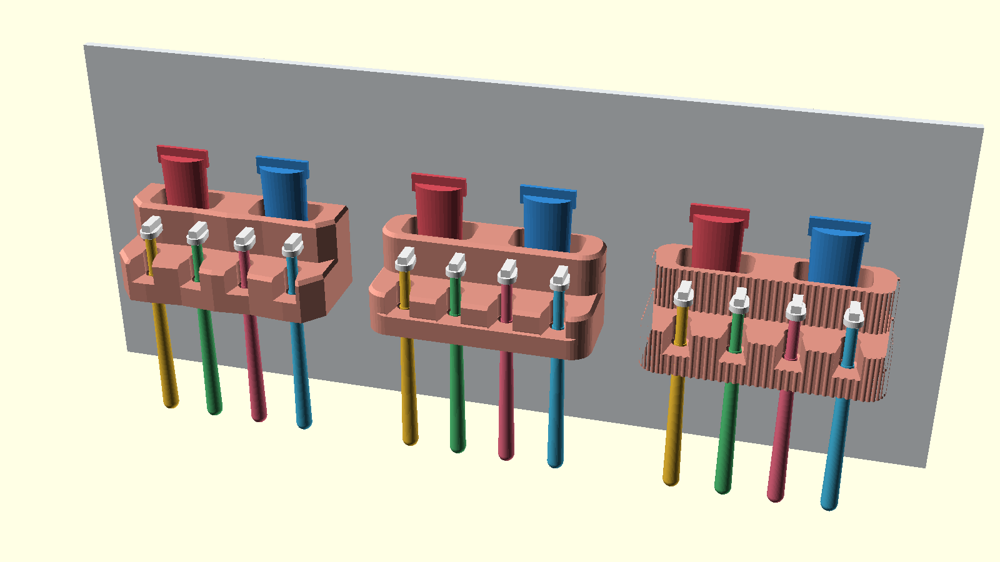
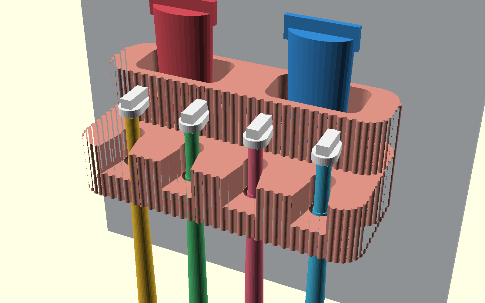
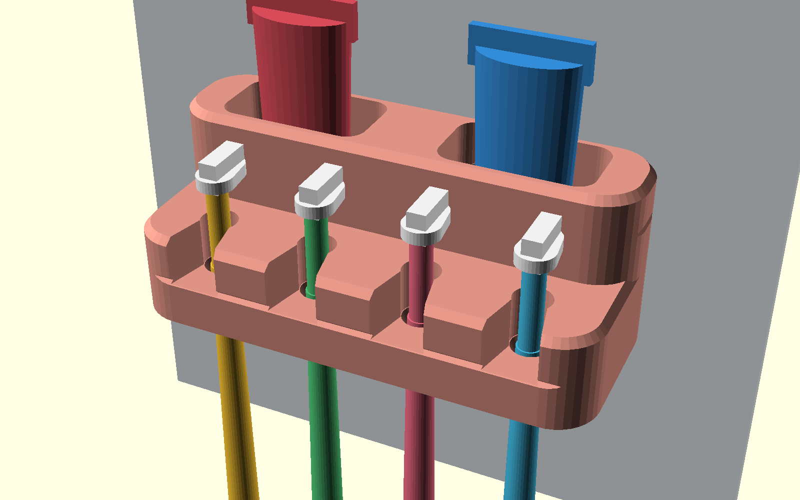
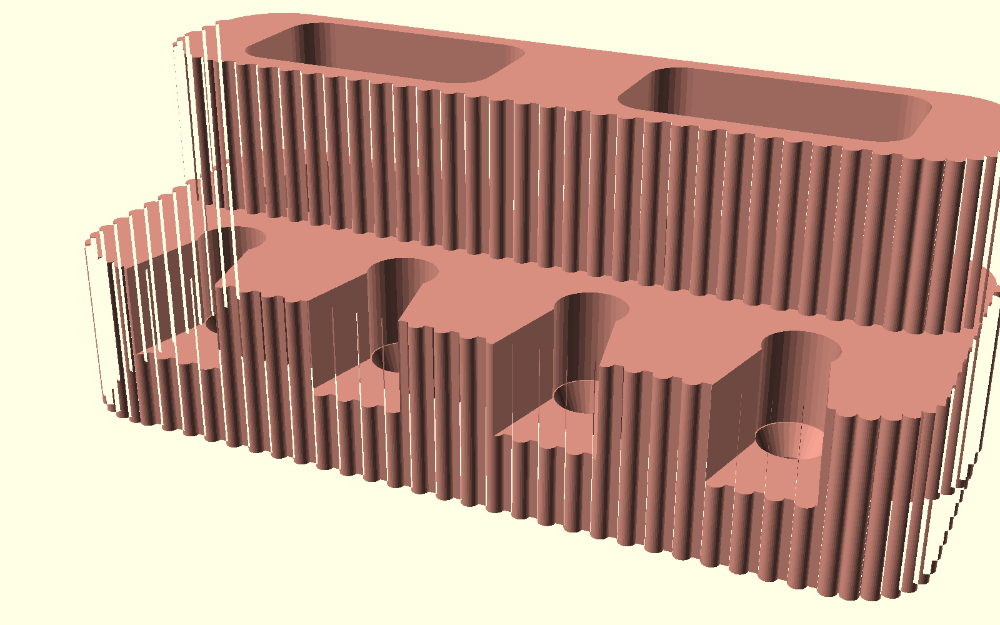
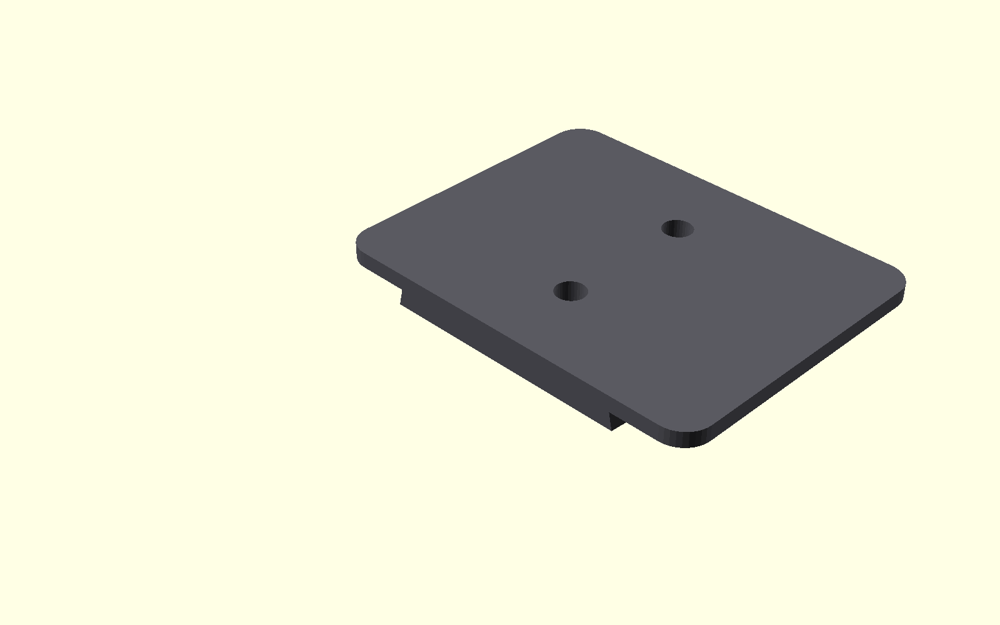
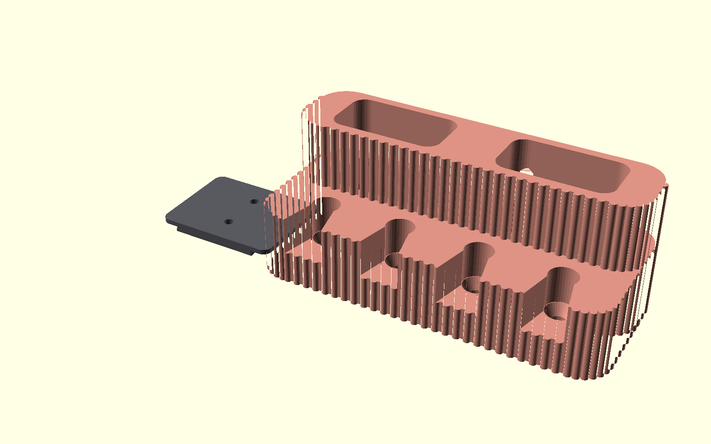

# Luxury Wall-Mounted Toothbrush & Toothpaste Organizer (奢華壁掛階梯式牙刷牙膏置物架 - 玫瑰金人體工學版)

專為 **玫瑰金絲綢金屬線材（Rose Gold / Copper Silk PLA）** 量身打造的五星級輕奢衛浴收納套裝。

依據最新人體工學體驗全新升級，**移除傳統下掛漱口杯**，全面聚焦於最純粹直覺的牙刷與牙膏取放體驗。採用獨家「**前後階梯式展階架構（Front-Back Tiered Architectural Gallery）**」，完美整合：
- **後排高階（Z=58mm）**：雙獨立大容量牙膏/電動牙刷倉（至少容納 2 支大牙膏或電動牙刷手柄），底部自帶 $12^\circ$ 傾斜自流排水與 $\varnothing 8\text{mm}$ 導水孔。
- **前排低階（Z=30mm，前唇僅 14mm）**：4 支牙刷人體工學微傾入座鞍座。擁有超寬 **34mm 防碰撞間距**、**16mm 喇叭口盲放入手槽**、**12mm 球面重力定位凹窩**與 $45^\circ$ 自流瀝水孔，單手盲插盲取極致順手！
- **背部快拆模組**：錐形自鎖燕尾滑軌背板，具備 $>2400\text{ mm}^2$ 超大免打孔黏貼面與 M4 沉頭螺絲孔。
- **100% 免支撐（Support-Free）**：全模型內外角度 $\ge 45^\circ$，零支撐列印，不浪費絲綢線材。
- **3 款專屬外觀美學風格**：提供羅馬柱豎條紋、現代意式極簡微弧、建築多角鑽石切面。

---

## 💎 玫瑰金金屬美學與外觀設計 (Aesthetic Styles for Rose Gold Filament)

玫瑰金絲綢線材（Silk PLA）在光線照射下具有強烈的各向異性金屬光澤（Anisotropic Metallic Sheen）。若列印一般的平直塑膠盒，容易顯得廉價塑料感重；本設計專為金屬反射光學特性設計了 **3 大外觀美學風格**，讓金屬線材在每一處轉折都能折射出高級光影：

### 三大奢華風格對比 (Side-by-Side Comparison)

*(由左至右：幾何鑽石切面款 Faceted、現代意式極簡流線款 Curved、輕奢羅馬柱豎條紋款 Fluted)*

---

### 風格 1：輕奢羅馬柱豎條紋 (Fluted / Reeded Luxury) —— ★ 編輯推薦
- **設計語彙**：前排低階與後排高階立面皆環繞立體縱向凸柱凸條紋理（Pitch 4.5mm, R 1.5mm），搭配頂部階梯式建築飛簷導角線。
- **光影效果**：金屬絲綢光澤隨視線移動產生如豎琴琴弦般的拉絲金屬反光，**100% 完美隱藏 FDM 列印層線**，呈現媲美頂級衛浴五金陽極氧化拉絲質感的奢華工藝。
- **對應檔案**：[`luxury_holder_fluted.stl`](luxury_holder_fluted.stl)

### 風格 2：現代意式極簡流線 (Curved Streamline Luxury)
- **設計語彙**：大圓角有機微弧（R 14mm）與前後階梯 $45^\circ$ 瀑布柔和導角，腰部點綴貫穿式 $45^\circ$ 自支撐內凹金屬飾線。
- **光影效果**：平滑溫潤的流體曲面展現玫瑰金深邃柔和的漸層反射，飾線形成高對比立體陰影，純粹大器。
- **對應檔案**：[`luxury_holder_curved.stl`](luxury_holder_curved.stl)

### 風格 3：幾何菱格鑽石切面 (Architectural Faceted / Diamond Luxury)
- **設計語彙**：前低後高雙階皆採用 12 面建築幾何多邊形切面，邊界交接稜線分明。
- **光影效果**：在浴室鏡前燈照射下，各個精確切面如同高級珠寶盒與香水瓶般產生璀璨多角度折射。
- **對應檔案**：[`luxury_holder_faceted.stl`](luxury_holder_faceted.stl)

---

## 📸 視覺渲染畫廊 (Render Gallery)

### 1. 衛浴安裝與全能收納演示 (Bathroom Wall Installations)
| 風格 1：羅馬柱豎條紋 (Fluted) | 風格 2：意式極簡流線 (Curved) | 風格 3：幾何鑽石切面 (Faceted) |
| :---: | :---: | :---: |
|  |  |  |
| 典雅羅馬柱拉絲反光，4 支牙刷 + 2 支牙膏展階排列 | 柔和微弧瀑布導角，極簡大器 | 俐落多角鑽石刻面，珠寶工藝感 |

### 2. 極致人體工學與 3D 列印佈局 (Ergonomic Details & Print Bed)
| 人體工學取放特寫 (Ergonomics Detail) | 快拆錐形燕尾背板 (Wall Slide Bracket) | 單盤同印佈局 (1-Plate Combo Layout) |
| :---: | :---: | :---: |
|  |  |  |
| 14mm 超低前唇 + 16mm 喇叭入口 + 34mm 超寬間距 | 100% 平整熱床貼合面 + 沉頭螺絲孔 + 錐形自鎖燕尾軌 | 主體 + 快拆背板同盤並列，100% 免支撐直接印 |

---

## 🛠️ 人體工學與工程規格突破 (Ergonomic Engineering Highlights)

為徹底解決傳統牙刷架「孔洞太深容易卡住、間距太窄相鄰牙刷碰撞、前高後低擋住視線」三大操作痛點，本設計針對**取放便利性（Ease of Retrieval & Placement）**進行全面重構：

| 人體工學痛點 | 傳統設計缺陷 | 本款全新階梯人體工學設計優勢 |
| :--- | :--- | :--- |
| **拿取受阻** | 高筒壁垂直包裹牙刷頸部，手指不易抓握刷柄。 | **前階低矮化（唇高僅 14mm）**：前唇高度降低至只有 14mm，手指可直接捏取牙刷中下段粗柄，斜拉、前推或垂直提起皆無阻礙。 |
| **入位費神** | 入口孔徑狹窄（常見 $<10\text{mm}$），每次放回都需要眼睛緊盯小心對準。 | **16mm 喇叭導引入手口**：頂部喇叭口自帶導向滑面，刷柄接觸到入口邊緣便順勢滑入槽內，實現隨手一丟即到位的「盲放體驗」。 |
| **相鄰碰頭** | 牙刷孔位間距緊湊（一般僅 15~18mm），刷毛容易交叉碰觸，有交叉污染與卡阻疑慮。 | **34mm 寬距展階佈局**：4 支牙刷中心間距達 34mm，刷頭之間保留超過 20mm 的充裕空隙，絕不碰頭，取用單支牙刷絕不牽動鄰座。 |
| **牙膏遮擋** | 牙膏與牙刷平排混放，拿取牙刷常被前方或後方胖牙膏管卡手。 | **前後階梯分層（後階 $Z=58\text{mm}$，前階 $Z=30\text{mm}$）**：牙膏穩固坐鎮後方高台，牙刷在前排平鋪展列，視覺一目了然，空間層次井然有序。 |
| **底部積水發霉** | 平底死角殘留水滴發黑生菌。 | **雙層立體自流瀝水**：後排牙膏倉底設 $12^\circ$ 傾角導水斜坡與 $\varnothing 8\text{mm}$ 通孔；前排牙刷底設 $\varnothing 12\text{mm}$ 球面鞍座與 $\varnothing 7\text{mm}$ 錐底排滴孔，秒乾防霉。 |

---

## 📐 尺寸與幾何規格表 (Specifications)

| 功能組件 | 規格參數 | 設計原理與功能優勢 |
| :--- | :--- | :--- |
| **外觀總尺寸** | 寬 140mm × 深 64mm × 高 58mm | 符合人體工學黃金視覺比例，厚實穩重，氣派奢華。 |
| **前排四牙刷鞍座** | 4 個對稱展階位點（$X=-51, -17, +17, +51\text{mm}$） | • 間距達 34mm，徹底防止刷毛互碰。 • 16mm 喇叭型盲投入口，內縮至 9.6mm 防脫頸位。 • 底部 $\varnothing 12\text{mm}$ 球面自定心落座鞍座，穩固不晃動。 • 底部 $45^\circ$ 錐形過渡接 $\varnothing 7\text{mm}$ 垂直排滴通孔。 |
| **後排雙牙膏倉** | 2 個獨立大內腔（$X=\pm 36\text{mm}$，每槽 $48 \times 26\text{mm}$，深 48mm） | • 輕鬆容納 2 支 200g 超大家庭號牙膏、電動牙刷手柄或洗面乳。 • 獨立分倉互不傾倒干擾。 • 底面 $12^\circ$ 導水斜坡，直接由 $\varnothing 8\text{mm}$ 通孔排走水滴。 |
| **快拆雙用安裝背板** | 寬 40mm × 高 46mm × 厚 6.8mm | • **免打孔黏貼**：背板底面 $Z=0$ 為 $>2400\text{ mm}^2$ 超大連續平面，3M VHB / 無痕膠條黏著力極強。 • **螺絲打孔固定**：設有 2 個 M4 沉頭螺絲孔（間距 20mm），自帶向上展開 $45^\circ$ 錐形導角，免支撐列印。 • **錐形燕尾滑軌**：$12^\circ$ 錐形滑軌，自帶重力楔緊止位；**清潔時向上推移 2cm 即可秒拆下架**，直接於水龍頭下沖洗！ |

---

## 🖨️ 3D 列印建議參數 (Optimized for Rose Gold Silk PLA)

使用金屬絲綢線材（Silk PLA）時，列印參數會直接影響表面的金屬光澤度與層線細緻度：

1. **切片設定 (Slicer Settings)**：
   - **支撐結構 (Supports)**：**完全關閉（Supports: None）**！全模型內部天花板均採用 $45^\circ$ 尖拱與倒錐漏斗設計，100% 自支撐。
   - **底邊 (Brim)**：**無須開啟 Brim**（主體與背板底面均為超大平整熱床接觸面）。
   - **層高 (Layer Height)**：推薦 `0.16mm` ~ `0.20mm`（曲面極為細膩平滑；若想追求最極致的金屬拉絲質感，外壁層高可設 `0.12mm`）。
   - **列印方向**：直接使用 STL 預設放置方向（主體平貼底面正立印、背板平躺印）。
2. **絲綢線材調校建議 (Silk PLA Optical Optimization)**：
   - **噴嘴溫度 (Nozzle Temp)**：建議比一般 PLA 提高 $5^\circ\text{C} \sim 10^\circ\text{C}$（約 $215^\circ\text{C} \sim 220^\circ\text{C}$），溫度稍高有助於金屬絲綢光澤充分析出。
   - **外壁速度 (Outer Wall Speed)**：建議降低至 `35 ~ 45 mm/s`，外壁走速平緩均勻能讓金屬高光折射最為璀璨。
   - **外壁圈數 (Wall Loops)**：建議設為 `3 ~ 4 圈`，增強實體厚度感與金屬份量。

---

## 📦 檔案清單 (STL Catalog)

| 檔案名稱 | 說明 | 推薦用途 |
| :--- | :--- | :--- |
| **[`luxury_holder_fluted.stl`](luxury_holder_fluted.stl)** | **羅馬柱豎條紋階梯置物架主體 (★推薦)** | 經典輕奢立體凸柱紋，最能完美展現玫瑰金絲綢拉絲光澤，4 牙刷 + 2 牙膏階梯式佈局。 |
| **[`combo_plate_fluted.stl`](combo_plate_fluted.stl)** | **整盤雙件同印組合檔 (一鍵開印)** | 羅馬柱主體 + 快拆背板同盤排列，單次搞定整套，開箱即印！ |
| **[`luxury_holder_curved.stl`](luxury_holder_curved.stl)** | 意式極簡流線階梯置物架主體 | 溫潤大圓角與瀑布導角，中位金屬內凹飾線，純粹現代優雅。 |
| **[`luxury_holder_faceted.stl`](luxury_holder_faceted.stl)** | 幾何鑽石切面階梯置物架主體 | 12 面建築多邊形切面，多角度反射玫瑰金光澤，如高級珠寶盒。 |
| **[`wall_bracket.stl`](wall_bracket.stl)** | **快拆免打孔雙用背板 (共用件)** | 適用所有款式，平貼熱床印，背貼 3M 膠或打螺絲。 |
| **[`luxury_wall_toothbrush_holder.scad`](luxury_wall_toothbrush_holder.scad)** | OpenSCAD 參數化原始代碼 | 支援自定義孔距、牙膏倉尺寸、角度與風格切換。 |
| **`renders/`** | 高解析多視角渲染圖庫 | 包含全套對比圖、各風格單獨視角、人體工學特寫與切片盤排版。 |
