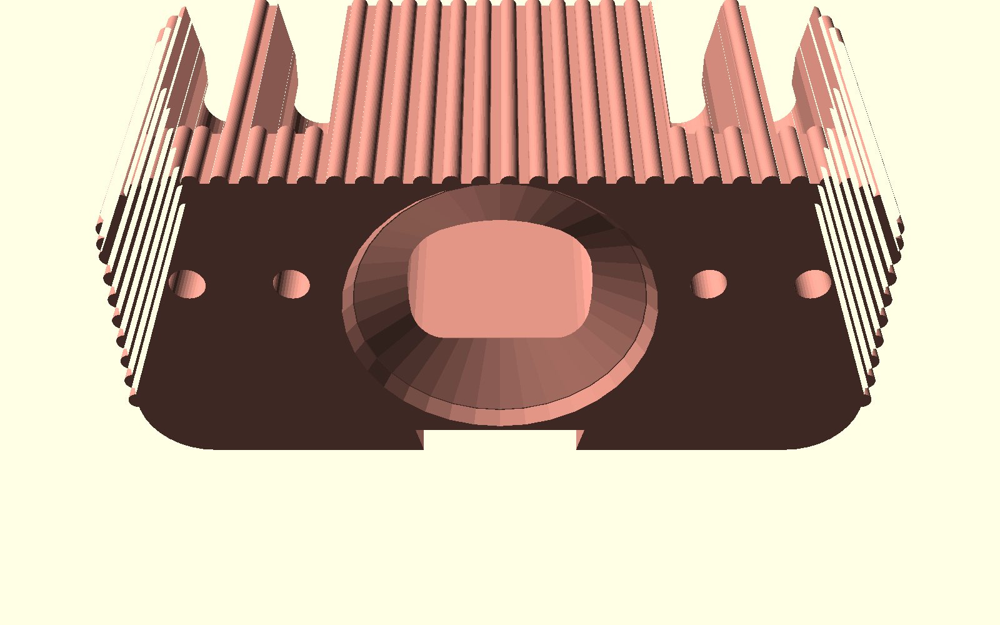

# Luxury Wall-Mounted Toothbrush & Toothpaste Organizer with Inverted Cup Dock (奢華壁掛式全能牙刷置物架 - 玫瑰金輕奢版)

專為 **玫瑰金絲綢金屬線材（Rose Gold / Copper Silk PLA）** 量身打造的五星級輕奢壁掛式全功能衛浴收納套裝。

整合「**4 支牙刷/刮鬍刀懸掛槽 + 中央大容量牙膏/電動牙刷槽 + 底部倒扣磁吸瀝水防塵漱口杯 + 免打孔/螺絲雙用快拆背板**」，具備 100% 免支撐（Support-Free）幾何設計，提供 3 款專屬外觀美學風格！

---

## 💎 玫瑰金金屬美學與外觀設計 (Aesthetic Styles for Rose Gold Filament)

玫瑰金絲綢線材（Silk PLA）在光線照射下具有強烈的方向性光澤（Anisotropic Metallic Sheen）。若列印普通的平直塑膠盒，容易顯得廉價塑料感重；本設計專為金屬反射光學特性設計了 **3 大外觀美學風格**，讓金屬線材在每一處轉折都能折射出高級光影：

### 三大奢華風格對比 (Side-by-Side Comparison)

*(由左至右：幾何鑽石切面款 Faceted、現代意式極簡流線款 Curved、輕奢羅馬柱豎條紋款 Fluted)*

---

### 風格 1：輕奢羅馬柱豎條紋 (Fluted / Reeded Luxury) —— ★ 編輯推薦
- **設計語彙**：全曲面環繞 32 道細緻立體縱向凸柱紋理（Pitch 4.5mm, R 1.5mm），搭配專用豎紋奢華漱口杯。
- **光影效果**：金屬絲綢光澤隨視線移動產生如豎琴琴弦般的拉絲金屬反光，**100% 完美隱藏 FDM 層線**，呈現媲美 CNC 陽極氧化玫瑰金五金件的奢華感。
- **對應檔案**：[`luxury_holder_fluted.stl`](luxury_holder_fluted.stl) + [`luxury_cup_fluted.stl`](luxury_cup_fluted.stl)

### 風格 2：現代意式極簡流線 (Curved Streamline Luxury)
- **設計語彙**：大圓角有機微弧（R 14mm）與頂部 $45^\circ$ 瀑布柔和倒角，腰部點綴貫穿式 $45^\circ$ 自支撐內凹金屬飾線，杯身具備人體工學收腰金屬環。
- **光影效果**：平滑溫潤的流體曲面展現玫瑰金深邃柔和的漸層反射，飾線形成高對比陰影，極致純粹典雅。
- **對應檔案**：[`luxury_holder_curved.stl`](luxury_holder_curved.stl) + [`luxury_cup_curved.stl`](luxury_cup_curved.stl)

### 風格 3：幾何菱格鑽石切面 (Architectural Faceted / Diamond Luxury)
- **設計語彙**：12 面幾何多邊形建築切面，搭配頂部菱格幾何導角與杯身鑽石切面基座。
- **光影效果**：在浴室鏡前燈照射下，各個精確切面如同高級珠寶盒與香水瓶般產生璀璨多角度折射。
- **對應檔案**：[`luxury_holder_faceted.stl`](luxury_holder_faceted.stl) + [`luxury_cup_faceted.stl`](luxury_cup_faceted.stl)

---

## 📸 視覺渲染畫廊 (Render Gallery)

### 1. 衛浴安裝與全能收納演示 (Bathroom Wall Installations)
| 風格 1：羅馬柱豎條紋 (Fluted) | 風格 2：意式極簡流線 (Curved) | 風格 3：幾何鑽石切面 (Faceted) |
| :---: | :---: | :---: |
|  |  |  |
| 典雅羅馬柱拉絲反光，四牙刷 + 牙膏 + 倒扣杯 | 柔和微弧水滴腰線，極簡大器 | 俐落多角鑽石刻面，珠寶工藝感 |

### 2. 核心機械機構與 3D 列印佈局 (Mechanical Details & Print Bed)
| 底部倒扣磁吸座與排水系統 (Bottom Dock & Drainage) | 快拆錐形燕尾背板 (Wall Slide Bracket) | 單盤同印佈局 (1-Plate Combo Layout) |
| :---: | :---: | :---: |
|  |  |  |
| $\varnothing 52.4\text{mm}$ 導引槽 + 10x2mm 磁吸孔 + $45^\circ$ 自流排水煙囪 | 100% 平整熱床貼合面 + 沉頭螺絲孔 + 錐形自鎖燕尾軌 | 主體 + 漱口杯 + 背板三件一盤印，100% 免支撐 |

---

## 🛠️ 關鍵工程規格與人體工學 (Engineering & Ergonomics)

| 功能組件 | 規格參數 | 設計原理與功能優勢 |
| :--- | :--- | :--- |
| **外觀總尺寸** | 寬 126mm × 深 58mm × 高 56mm | 輕巧不突兀，兩側牙刷與中央漱口杯空間比例符合黃金分割。 |
| **四牙刷懸掛槽** | 4 個對稱掛槽（左翼 $X=\pm 34, \pm 51\text{mm}$） | • 前開口 14mm 喇叭形導引入手槽，盲插也能順利放入。 • 內縮至 8.2mm 頸位，擴展至 $\varnothing 10.8\text{mm}$ 圓形落座凹窩。 • 前方設有 2.5mm 安全防脫突起，防止碰撞脫落。 • 底部自帶 $45^\circ$ 錐形排水孔，快速乾燥不發霉。 |
| **中央牙膏/電動牙刷槽** | 內腔寬 44mm × 深 32mm × 深 46mm | • 輕鬆容納 200g 大容量牙膏管或飛利浦/歐樂B電動牙刷手柄。 • 內底面具備 $12^\circ$ 漏斗狀傾斜，直接連通中央導水煙囪。 |
| **底部倒扣磁吸杯座** | 外導引口 $\varnothing 52.4\text{mm}$，深度 2.5mm | • 內嵌標準 $\varnothing 10.2\text{mm} \times 2.4\text{mm}$ 釹鐵硼強力磁鐵孔。 • 倒扣瀝水：水滴沿杯壁自然下滴，內部絕不積水，徹底杜絕發霉。 • 防塵衛生：杯口朝下，避免衛生間空氣落塵。 |
| **專用奢華漱口杯** | 高 88mm，口徑 $\varnothing 68\text{mm}$，底徑 $\varnothing 51\text{mm}$ | • 容量約 220ml，杯口人體工學圓滑導角，觸唇舒適。 • 杯底 100% 純平（$Z=0$ 附著力極佳），底心內建 10x2mm 磁鐵孔。 • 既可正立平放於洗手台，亦可磁吸倒扣於置物架下方。 |
| **快拆雙用安裝背板** | 寬 46mm × 高 44mm × 厚 6.8mm | • **免打孔黏貼**：背板底面 $Z=0$ 為 $>1800\text{ mm}^2$ 超大連續平面，3M VHB / 無痕膠條黏著力極強。 • **螺絲打孔固定**：設有 2 個 M4 沉頭螺絲孔（間距 20mm），自帶向上展開錐形導角，免支撐列印。 • **錐形燕尾滑軌**：$12^\circ$ 錐形滑軌，自帶重力楔緊止位；**清潔時向上推移 2cm 即可秒拆下架**，直接於水龍頭下沖洗！ |

---

## 🖨️ 3D 列印建議參數 (Optimized for Rose Gold Silk PLA)

使用金屬絲綢線材（Silk PLA）時，列印參數會直接影響表面的金屬光澤度與層線細緻度：

1. **切片設定 (Slicer Settings)**：
   - **支撐結構 (Supports)**：**完全關閉（Supports: None）**！全模型內部天花板均採用 $45^\circ$ 尖拱與倒錐漏斗設計，100% 自支撐。
   - **底邊 (Brim)**：**無須開啟 Brim**（主體與漱口杯底面均為平整大接觸面）。
   - **層高 (Layer Height)**：推薦 `0.16mm` ~ `0.20mm`（面部弧度極平滑；若想追求極致金屬光澤，外壁層高可設 `0.12mm`）。
   - **列印方向**：直接使用 STL 預設放置方向（主體平貼底面正立印、漱口杯杯口朝上正立印、背板平躺印）。
2. **絲綢線材調校建議 (Silk PLA Optical Optimization)**：
   - **噴嘴溫度 (Nozzle Temp)**：建議比一般 PLA 提高 $5^\circ\text{C} \sim 10^\circ\text{C}$（約 $215^\circ\text{C} \sim 220^\circ\text{C}$），溫度稍高有助於金屬絲綢光澤充分析出。
   - **外壁速度 (Outer Wall Speed)**：建議降低至 `35 ~ 45 mm/s`，外壁走速平緩均勻能讓金屬高光折射最為璀璨。
   - **外壁圈數 (Wall Loops)**：漱口杯建議設為 `3 ~ 4 圈`，可確保杯體 100% 水密不滲水。
3. **磁吸倒扣安裝說明**：
   - 置物架底部中心與漱口杯底部中心分別預留了 $\varnothing 10.2\text{mm} \times 2.4\text{mm}$ 的磁鐵凹槽。
   - 購買 2 顆常見的 $10\text{mm} \times 2\text{mm}$ 釹鐵硼強力磁鐵，點一滴瞬間膠按入凹槽（注意確認兩者磁極互吸）即可實現懸空磁吸倒扣！

---

## 📦 檔案清單 (STL Catalog)

| 檔案名稱 | 說明 | 推薦用途 |
| :--- | :--- | :--- |
| **[`luxury_holder_fluted.stl`](luxury_holder_fluted.stl)** | **羅馬柱豎條紋置物架主體 (推薦)** | 經典輕奢立體凸柱紋，最能完美展現玫瑰金絲綢拉絲光澤。 |
| **[`luxury_cup_fluted.stl`](luxury_cup_fluted.stl)** | **羅馬柱豎條紋專用漱口杯 (推薦)** | 與豎條紋主體成套搭配，杯身立體豎柱，底心磁吸。 |
| **[`combo_plate_fluted.stl`](combo_plate_fluted.stl)** | **整盤三合一同印組合檔 (一鍵開印)** | 羅馬柱主體 + 專用漱口杯 + 快拆背板同盤排列，單次搞定整套！ |
| **[`luxury_holder_curved.stl`](luxury_holder_curved.stl)** | 意式極簡流線置物架主體 | 溫潤大圓角與瀑布倒角，中位金屬內凹飾線，純粹優雅。 |
| **[`luxury_cup_curved.stl`](luxury_cup_curved.stl)** | 意式極簡流線專用漱口杯 | 人體工學收腰金屬環，手感絕佳。 |
| **[`luxury_holder_faceted.stl`](luxury_holder_faceted.stl)** | 幾何鑽石切面置物架主體 | 12 面建築多邊形切面，多角度反射玫瑰金光澤，如珠寶盒。 |
| **[`luxury_cup_faceted.stl`](luxury_cup_faceted.stl)** | 幾何鑽石切面專用漱口杯 | 杯底環繞幾何斜切面，風格一致。 |
| **[`wall_bracket.stl`](wall_bracket.stl)** | **快拆免打孔雙用背板 (共用件)** | 適用所有款式，平貼熱床印，背貼 3M 膠或打螺絲。 |
| **[`luxury_wall_toothbrush_holder.scad`](luxury_wall_toothbrush_holder.scad)** | OpenSCAD 參數化原始代碼 | 支援自定義尺寸、磁鐵規格、杯子直徑與風格切換。 |
| **`renders/`** | 高解析多視角渲染圖庫 | 包含全套對比圖、各風格單獨視角、排水座特寫與切片盤排版。 |
