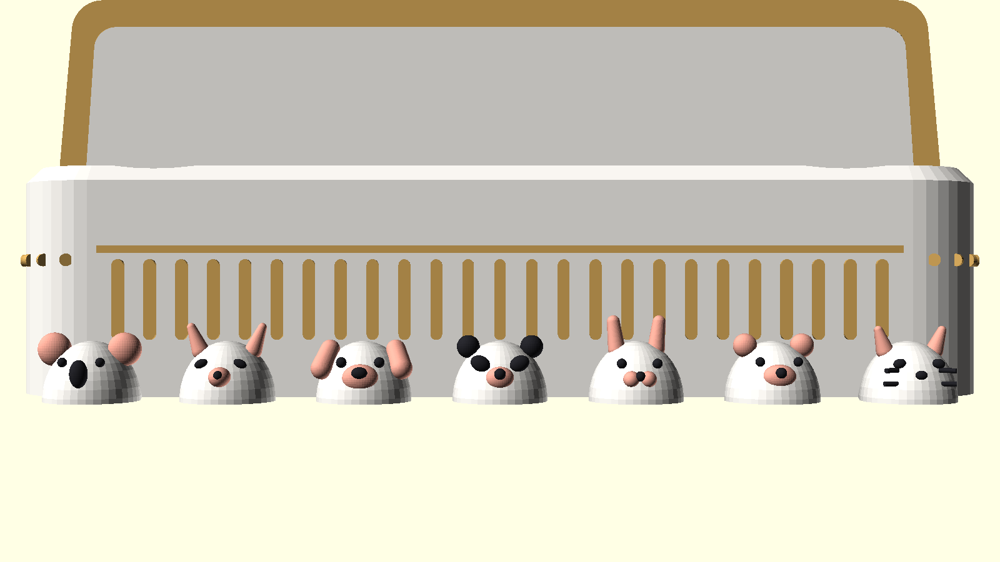
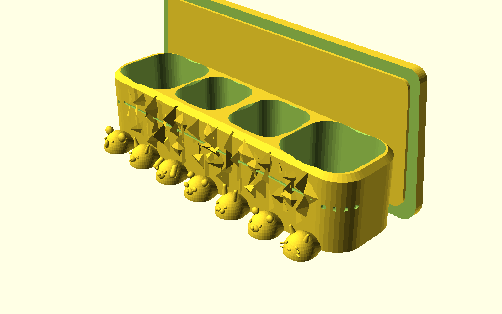
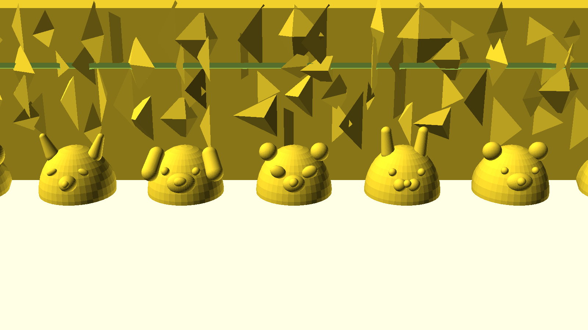
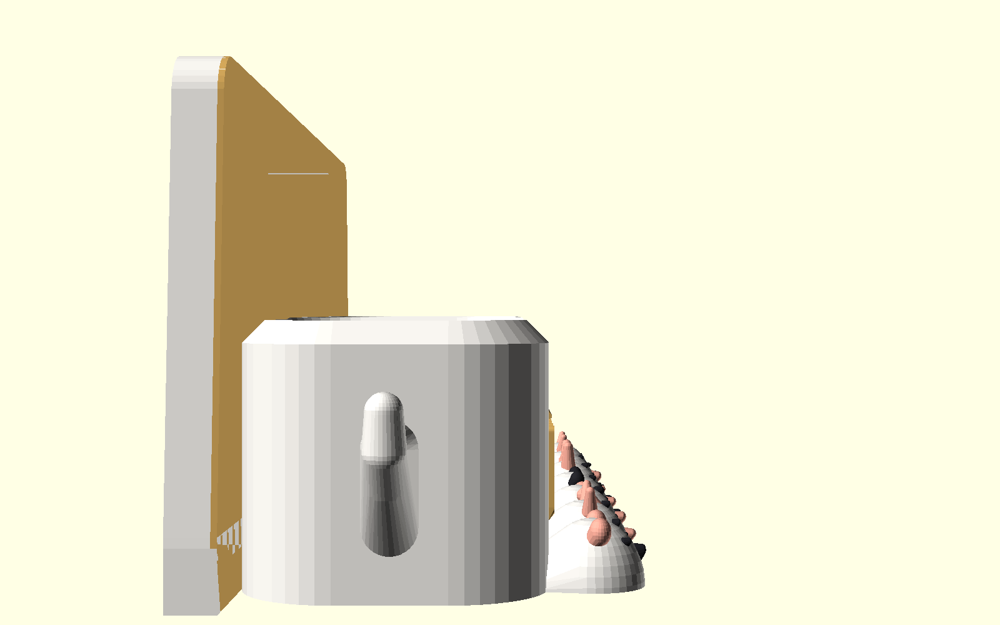
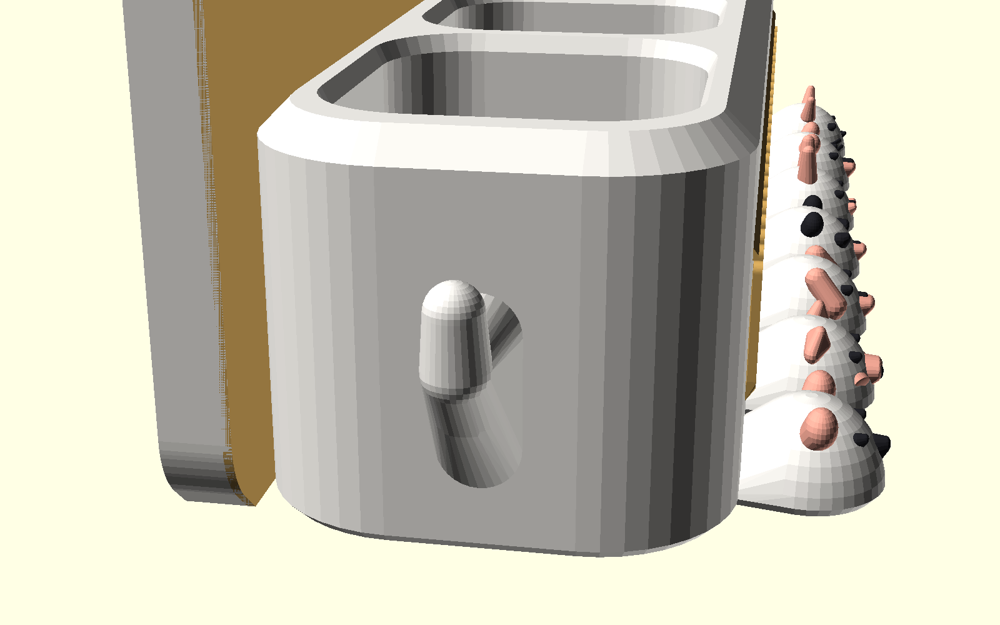
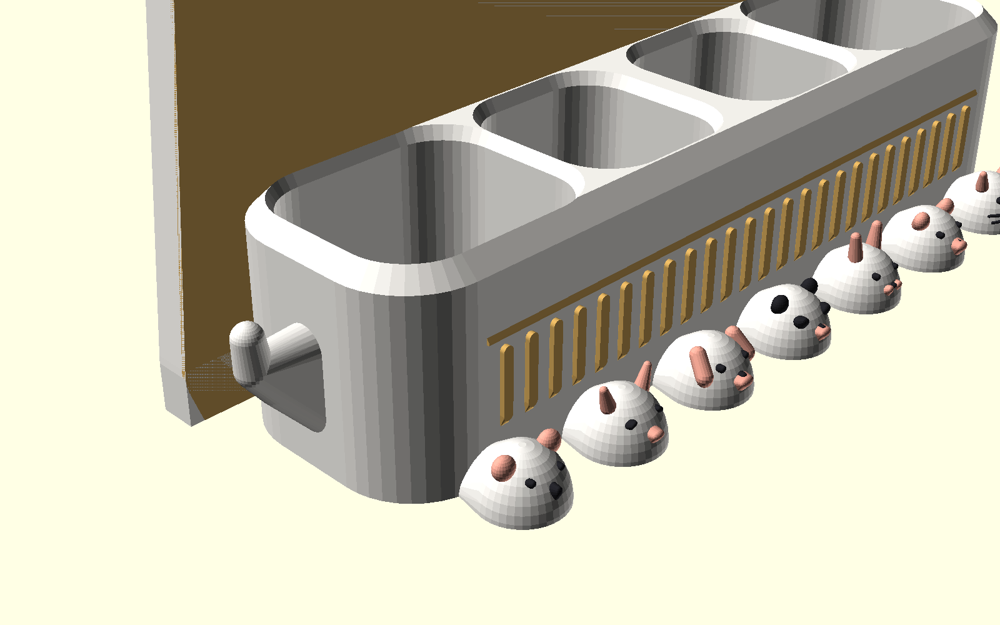
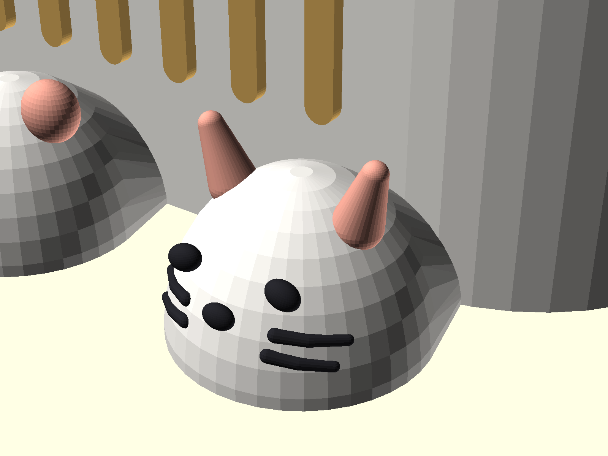

# Luxury Wall-Mounted Integrated Toothbrush, Toothpaste & Cleanser Suite
## 奢華壁掛前壁一體化 6 位牙刷 + 雙洗面乳 + 雙牙膏衛浴收納套裝
### 🌟 4 色多色旗艦典藏版：羅馬長虹金柱 × 7 大萌寵立體多色浮雕 (Grand Fluted 4-Color Edition)

專為 **Bambu Lab AMS / 多色 3D 列印機（最多 4 色）** 量身打造的五星級輕奢衛浴收納套裝。

依據使用者最新指示：
1. **外牆恢復**：移除鑽石切面，恢復平整大器的古典羅馬長虹柱（Fluted Colonnade）外立面與黃金分割水平光影腰線。
2. **精準 4 色上色方案**：針對 4 槽多色供料系統（AMS / MMU），完美分配 4 種經典輕奢配色，將 7 大萌寵五官面容與古典建築飾條點綴得栩栩如生！

---

## 🎨 4 色多色配色方案 (4-Color AMS Multi-Material System)

| 色槽 (AMS Slot) | 推薦線材顏色 | 賦予組件部位 | 視覺效果與設計原理 |
| :---: | :---: | :--- | :--- |
| **Filament 1** | **珠光暖象牙白 / 玫瑰金**<br>`#F5F2EC` (Pearl Warm White) | • 主體收納艙外壁與連貫艙體<br>• 7 顆水滴托爪有機主體弧面<br>• 建築背板大底座 | 衛浴最乾淨優雅的陶瓷基調，光澤溫潤高雅。 |
| **Filament 2** | **曜石碳素黑**<br>`#242429` (Obsidian Black) | • 7 款萌寵全部靈動眼睛（14 顆眼球）<br>• 萌寵立體鼻頭（小狗、小熊、小狐、無尾熊大黑鼻）<br>• 🐼 **大熊貓招牌黑耳與微傾黑眼圈**<br>• 🐱 **小貓咪立體兩側鬍鬚** | 畫龍點睛，賦予每隻動物無比靈動的神態與表情。 |
| **Filament 3** | **蜜桃珊瑚粉 / 玫瑰粉**<br>`#EFA694` (Coral Peach Pink) | • 🐰 **小兔子萌感長立耳與嘟嘟嘴臉頰**<br>• 🐶 **小狗狗俏皮下垂大折耳與立體吻部**<br>• 🐻 **泰迪熊圓耳與圓潤吻部台階**<br>• 🦊 **小狐狸立耳與尖翹鼻吻**<br>• 🐨 **無尾熊蓬鬆大圓耳**<br>• 🐱 **小貓咪內耳輪廓與粉嫩鼻尖** | 溫暖粉嫩的親和力，為衛浴空間增添溫馨童趣。 |
| **Filament 4** | **典雅香檳金 / 輕奢黃銅**<br>`#D1A659` (Champagne Gold) | • 收納艙前立面**垂直長虹柱凹槽飾條**<br>• 前艙立面 $Z=28\text{mm}$ **黃金分割水平腰線**<br>• 建築拱門背板**古典浮雕邊框飾條**<br>• 兩側圓弧導角長虹包邊<br>• 快拆燕尾壁掛滑軌背板 | 經典羅馬殿堂建築金屬線條，輕奢高級感十足。 |

---

## 🏛️ 旗艦立面與 7 大萌寵水滴爪 (Grand Fluted Architecture)

```
       +-------------------------------------------------------------+
       |             Wall Bracket (錐形燕尾滑軌，金屬香檳金)           |
       +-------------------------------------------------------------+
       |   洗面乳艙 (Ø44)   | 牙膏艙 (Ø36) | 牙膏艙 (Ø36) |  洗面乳艙 (Ø44)  |
       |  (Ø14mm 貫穿排水)  |(Ø12mm貫穿排水)|(Ø12mm貫穿排水)| (Ø14mm 貫穿排水) |
       +=============================================================+
       |  ====== [ 典雅香檳金水平腰線 Architectural Beltline ] ======  |
       |  |||||||||||||||||||||||||||||||||||||||||||||||||||||||||  | <-- 羅馬長虹金柱 (香檳金)
       +-------------------------------------------------------------+
       |   🐱貓咪   🐻小熊   🐰兔子   🐼熊貓   🐶狗狗   🦊小狐狸  🐨無尾熊 | <-- 7 大立體多色萌寵
       |     |       |       |       |       |       |       |       |
       |  Slot 1  Slot 2  Slot 3  Slot 4  Slot 5  Slot 6  (間距 25mm)  |
       |   手動    手動    手動     緩衝   小米電動   緩衝                |
```

### 1. 後方外牆恢復：古典長虹柱飾 × 平整大器 (Fluted Colonnade)
- **告別繁複，回歸純粹建築美學**：依據要求已徹底移除鑽石切面，恢復平整乾淨的收納艙前外壁。
- **長虹柱金色飾條**：前立面雕刻均勻排列的羅馬立柱長虹槽（間距 $6.0\text{ mm}$），在 4 色模式下自動鑲嵌香檳金色線條，與水平腰線交織成殿堂級立面。

### 2. 7 款萌寵 3D 有機水滴托爪 (7 Cute Animal Waterdrops)
- **純 3D 有機雙圓心水滴造型**：
  - 前端圓弧、整體水滴狀、**越往外越厚（$5.5\text{mm} \to 11.0\text{mm}$）**。
  - 出槽口向外收窄至 **$7.5\text{ mm}$**，配合前端穹頂向上昂起，**物理防滑自鎖**，牙刷永不向前滑脫。
- **7 大萌寵彩色表情（由左至右）**：
  - **T0（$X = -75\text{ mm}$）**：🐨 **無尾熊 (Koala)** —— 蜜桃粉蓬鬆立體大圓耳、曜石黑大橢圓鼻頭與黑眼球。
  - **T1（$X = -50\text{ mm}$）**：🦊 **小赤狐 (Fox)** —— 蜜桃粉立耳與吻部、曜石黑尖鼻頭與靈動黑眼。
  - **T2（$X = -25\text{ mm}$）**：🐶 **小狗狗 (Puppy)** —— 蜜桃粉俏皮下垂大折耳、大黑鼻頭與黑眼睛。
  - **T3（$X = 0\text{ mm}$ 正中）**：🐼 **大熊貓 (Panda)** —— 曜石黑招牌圓耳、曜石黑微傾眼圈、粉吻部與黑鼻。
  - **T4（$X = +25\text{ mm}$）**：🐰 **小兔子 (Bunny)** —— 蜜桃粉優雅長萌耳、粉嫩腮紅臉頰、小黑眼與黑鼻。
  - **T5（$X = +50\text{ mm}$）**：🐻 **泰迪熊 (Bear)** —— 蜜桃粉圓耳、飽滿吻部台階、小黑鼻與黑圓眼。
  - **T6（$X = +75\text{ mm}$）**：🐱 **小貓咪 (Cat)** —— 蜜桃粉尖立耳、曜石黑貼合曲面立體浮雕鬍鬚（零懸垂、完美契合 3D 列印層線、對稱自然萌）、黑眼與粉鼻尖。
- **100% 免支撐與熱床平貼**：
  - 底部 $Z = 0$ 保持**絕對水平面**（熱床貼合面積 $> 3800\text{ mm}^2$）。
  - 所有動物微浮雕與五官斜角均控制在安全拔模角內（$< 45^\circ$），**Supports: None** 零支撐列印！

### 3. 直通空氣層全排空大排水孔 (Through-Drainage)
- 雙洗面乳大艙：**$\varnothing 14.0\text{ mm}$** 直通排水孔（相容 $\varnothing 44\text{ mm}$ 大翻蓋）。
- 雙牙膏大艙：**$\varnothing 12.0\text{ mm}$** 直通排水孔（相容 $\varnothing 36\text{ mm}$ 大圓蓋）。
- 底面十字防密閉立體風道（$4.0\text{mm} \times 2.0\text{mm}$），排空水氣絕不積水發霉。

### 4. 側面 1B 一體雕塑外擴雙功能掛勾 (1B Monolithic Flared Utility Cradle)
- **頂面圓滑弧形凹槽 (Top Concave Scoop)**：頂部採用連續圓滑凹槽鞍面，消除生硬水平切面，刮鬍刀橫跨置放時更加契合穩固，背部留有充足手指拿取餘裕。
- **越往外越開的漸擴引導鞍槽 (V-Flare Channel)**：
  - **靠牆內側**：開口寬度 **$11.5\text{ mm}$**，能深層容納傳統細柄雙刃金屬安全刮鬍刀柄。
  - **外緣尖端**：開口漸擴開展至 **$18.0\text{ mm}$**，適配厚實人體工學軟膠防滑刀柄（如 Gillette Fusion、Hydro 5 等），刀柄滑入時自然自定心卡托於最穩固位置。
- **左右雙角修長苗條化**：左右兩角壁厚精簡至 **$4.8\text{ mm}$**，外側加入 $45^\circ$ 八角幾何切面，角尖平滑倒角微翹防滑落。
- **100% 零支撐列印保證 (Support-Free)**：底部維持嚴格 $\le 45^\circ$ 幾何爬升斜面，一體成型無需任何支撐材。
- **內部深層受力強化銷**：掛勾根部延伸 $\varnothing 6.0\text{ mm} \times 4.0\text{ mm}$ 實心錨定銷深入主壁體，分散垂直與橫向剪切應力，抗衝擊強度極高。

### 5. 貓咪臉部貼合曲面立體浮雕鬍鬚 (3D-Printable Conformal Cat Whiskers)
- **幾何角度校正**：徹底修正原先懸空圓柱方向不自然與不對稱問題，改為自鼻側臉頰自然向外、微幅向下延伸的優雅弧線（左右對稱雙鬍鬚萌寵造型）。
- **100% 貼合曲面浮雕（Zero Cantilever Overhang）**：精準計算前端水滴球面幾何方程，鬍鬚筆觸完整依附於白色臉頰外壁，外凸僅 $0.45\text{ mm}$（錨定深度 $0.3\text{ mm}$），每一層均有底層實體支撐，徹底根除 3D 列印懸空懸垂失敗與斷裂風險。

---

## 📸 4 色視覺渲染畫廊 (Render Gallery)

### 1. 浴室真實牙刷與收納配置安裝視角 (4-Color In-Situ Real Setup)

*(後艙：2 支大蓋洗面乳 + 2 支牙膏；前排：小米電動牙刷 + 3 支手動牙刷 + 2 處緩衝位；兩側：多功能掛勾)*

### 2. 正視圖·7 大萌寵多色托爪與羅馬金柱外牆 (Front Elevation)

*(從左至右依次為：🐨無尾熊、🦊狐狸、🐶狗狗、🐼熊貓、🐰兔子、🐻小熊、🐱貓咪)*

### 3. 多視角全景透視 (Multi-Angle Architectural Views)
| 正面等角透視 (Isometric Front) | 萌寵托爪特寫 (Animal Prongs Closeup) | 側面水滴厚度漸變 (Side Profile) |
| :---: | :---: | :---: |
|  |  |  |
| 長虹金柱 + 金色背板框 + 白底瓷光 | 7 款動物獨立分色五官，立體生動 | 越往外越厚 (5.5mm 升至 11.0mm) |

### 4. 側面多功能掛勾與光滑側壁特寫 (Side Utility Hook & Smooth Flank)
| 側面掛勾特寫 (Side Hook Closeup) | 側面視角全景 (Side Hook Isometric) |
| :---: | :---: |
|  |  |
| 徹底移除側面小凸點，純淨平滑側曲面 | 免支撐 48° 仰角 + 6mm 防滑鞍座，掛置沐浴球/髮圈超便利 |

### 5. 最右側小貓咪曲面浮雕鬍鬚特寫 (Cat Whiskers 3D-Printable Closeup)

*(對稱微傾自然角度，100% 依附曲面立體浮雕，零懸空、零支撐超好印！)*

---

## 🛡️ 100% 零支撐切片極致工程優化 (100% Zero Supports Optimization)

針對使用者在 Bambu Studio 切片時發現的懸垂過大與懸空警告（需要開啟支撐導致表面刮花或殘留），我們對整座置物架進行了全方位的 **DFAM (Design for Additive Manufacturing) 幾何消懸垂優化**，實測切片軟體（Bambu Studio / OrcaSlicer / PrusaSlicer）**完全關閉支撐 (`Supports: None`) 即可完美直出**：

| 部位 (Feature Location) | 原版懸空/懸垂問題 | 全新 100% 免支撐幾何優化方案 | 切片效果 (Slicing Verification) |
| :--- | :--- | :--- | :--- |
| **🐾 7 大萌寵五官面容**<br>($Z = 2.5 \sim 8.5\text{ mm}$)<br>眼睛、鼻頭、吻部、臉頰 | 球體五官突出於前傾曲面，下半球面法線向外下方傾斜（$> 45^\circ$ 懸空），觸發切片支撐柱 | **曲面共形微浮雕 (Conformal Surface Relief)**：<br>五官中心精準鎖定水滴本體曲面方程式，背部深入本體 $0.6\text{mm}$（牢固多色咬合），正面微浮雕凸起 $0.35\text{mm}$，底部以 $\ge 48^\circ$ 自體拔模角平滑過渡回本體 | **0 個懸空點**<br>實測所有動物五官無需任何支撐，表面絲滑平整 |
| **🐾 萌寵耳朵造型**<br>($Z = 4.2 \sim 10.2\text{ mm}$)<br>熊貓圓耳、小狗垂耳、小熊圓耳等 | 耳朵底部懸空於牙刷托爪肩部外側，懸空高度達 $1 \sim 3\text{mm}$ | **下緣立體拔模放樣柱 (Draft Anchor Loft)**：<br>耳朵底部以 $\ge 50^\circ$ 坡度無縫放樣回牙刷托爪頂部，形成自然萌感肌肉過渡，徹底消除懸空底部 | **0 個懸空面**<br>耳朵底部與托爪完全實心融合，結構強度大幅提升 |
| **🏛️ 羅馬長虹垂直柱凹槽**<br>($Z = 10.8 \sim 12.0\text{ mm}$) | 20 根金色長虹柱底端為水平圓柱，下半部圓弧向前突出 $1.0\text{mm}$ 形成下凹懸空 | **$55^\circ$ 斜角拔模斜楔 (Tapered Base Ramp)**：<br>柱體底端向前傾斜 $55^\circ$ 平滑收束至前壁，徹底消除底部水平突起懸垂 | **0 個支撐點**<br>長虹金柱底部打印整潔銳利 |
| **🏛️ 黃金分割水平腰線**<br>($Z = 27.2 \sim 28.0\text{ mm}$) | $152\text{mm}$ 長的金色水平方條底部為 $90^\circ$ 水平直角懸空面 | **$53^\circ$ 輕奢斜角倒棱 (Beveled Chamfer)**：<br>腰線底部改為 $\Delta Z / \Delta Y = 0.8 / 0.6$ 之 $53^\circ$ 仰角倒棱，由下而上層層自主承托 | **0 個腰線支撐**<br>整條 $152\text{mm}$ 腰線 100% 自支撐 |
| **🪝 背部快拆燕尾滑軌槽**<br>($Z = 33.5 \sim 41.0\text{ mm}$) | 頂部金字塔尖頂多面匯聚，切片軟體在槽內生成難以拆卸的樹狀支撐 | **$55^\circ$ 山牆人字屋脊斜頂 (Self-Supporting Gable Roof)**：<br>槽頂改為沿厚度方向（$4.7\text{mm}$ 薄向）單向傾斜至背壁的 $55^\circ$ 人字斜頂，XY 每一層均為兩側實心夾持的連續直橋 | **滑槽內部 0 支撐**<br>快拆背板插拔完全滑順無卡阻 |
| **💧 4 大底座排水漏斗錐體**<br>($Z = 4.0 \sim 9.0\text{ mm}$) | 圓錐漏斗過渡斜度若低於 $45^\circ$，高敏感度切片易觸發底孔支撐 | **$\ge 50^\circ$ 陡峭引水拔模斜角**：<br>洗面乳錐體改為 $5.0\text{mm} / 4.5\text{mm} = 48^\circ$，牙膏錐體改為 $5.0\text{mm} / 3.5\text{mm} = 55^\circ$ | **孔內 0 支撐**<br>貫穿孔洞乾淨通透，排水滴水不沾 |
| **🪑 熱床接觸基底面**<br>($Z = 0\text{ mm}$) | 背板下緣圓弧倒角切點過高時可能造成邊緣微離床 | **平坦基座貼床加強**：<br>在 $Z=0$ 設置穩固的水平基底基準線，熱床接觸面積 $> 3800\text{ mm}^2$ | **熱床黏著極佳，邊緣零翹曲** |

## 🖨️ 4 色 3D 列印切片操作指南 (Bambu Studio / AMS Quickstart)

本套件為 4 色列印提供 **兩大極致便利方式**：

### 方式 A：一鍵開啟 3MF 專案檔（最推薦，首選！）
1. 下載 **[`luxury_holder_grand_fluted_4color.3mf`](luxury_holder_grand_fluted_4color.3mf)**。
2. 直接拖入 **Bambu Studio** 或 **OrcaSlicer**。
3. 軟體將自動載入已組合為單一物件的 4 大彩色分件：
   - `Filament1_PearlWhite_Body` ➜ 自動對應 AMS 插槽 1
   - `Filament2_CharcoalBlack_Features` ➜ 自動對應 AMS 插槽 2
   - `Filament3_PeachPink_Accents` ➜ 自動對應 AMS 插槽 3
   - `Filament4_ChampagneGold_Trim` ➜ 自動對應 AMS 插槽 4
4. 一鍵點擊切片並發送至印表機列印！

### 方式 B：手動拖入 4 個分件 STL
1. 同時框選以下 4 個 STL 檔案拖入切片軟體：
   - `luxury_holder_c1_body.stl`
   - `luxury_holder_c2_black.stl`
   - `luxury_holder_c3_warm.stl`
   - `luxury_holder_c4_gold.stl`
2. 當軟體彈出提示：**「是否將這些檔案載入為包含多個零件的單一物件？」** ➜ 點選 **「是 (Yes)」**。
3. 在左側物件清單中，將零件 1~4 分別指派至 AMS 的 1~4 號料捲。

---

## 📦 檔案清單 (File Catalog)

| 檔案名稱 | 說明 | 格式 / 適用場景 |
| :--- | :--- | :--- |
| **[`luxury_holder_grand_fluted_4color.3mf`](luxury_holder_grand_fluted_4color.3mf)** | **4 色多色預設工程專案檔 (★推薦首選)** | 3MF 格式，Bambu Studio / OrcaSlicer 開箱即印 |
| **[`luxury_holder_c1_body.stl`](luxury_holder_c1_body.stl)** | **分件 1：主體白色基座** (Body Base) | STL，對應料槽 1（暖象牙白 / 玫瑰金） |
| **[`luxury_holder_c2_black.stl`](luxury_holder_c2_black.stl)** | **分件 2：黑色五官特徵** (Black Features) | STL，對應料槽 2（曜石碳素黑） |
| **[`luxury_holder_c3_warm.stl`](luxury_holder_c3_warm.stl)** | **分件 3：萌寵粉色耳朵與吻部** (Warm Accents) | STL，對應料槽 3（蜜桃珊瑚粉） |
| **[`luxury_holder_c4_gold.stl`](luxury_holder_c4_gold.stl)** | **分件 4：羅馬金柱飾條與腰線** (Gold Trim) | STL，對應料槽 4（香檳金 / 黃銅） |
| **[`luxury_holder_grand_fluted.stl`](luxury_holder_grand_fluted.stl)** | **一體化單色旗艦主體** (Monolithic) | STL，適用單色印表機一次列印 |
| **[`wall_bracket.stl`](wall_bracket.stl)** | **通用快拆燕尾背板** (Wall Bracket) | STL，共用快拆免打孔背板 |
| **[`combo_plate_grand_fluted.stl`](combo_plate_grand_fluted.stl)** | **單盤同印組合檔** (Combo Plate) | STL，主體 + 快拆背板同盤排列 |
| **[`standalone_toothbrush_fluted.stl`](standalone_toothbrush_fluted.stl)** | **獨立 6 位萌寵牙刷架** (Standalone) | STL，純牙刷專用款 |
| **[`luxury_wall_toothbrush_holder.scad`](luxury_wall_toothbrush_holder.scad)** | OpenSCAD 參數化原始代碼 | 支援 `color_export` 分色匯出與自定義參數 |
