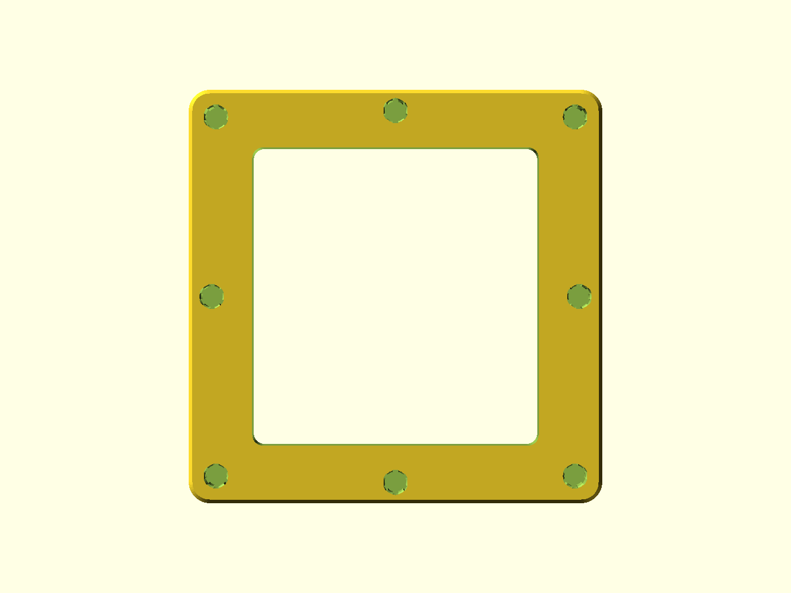
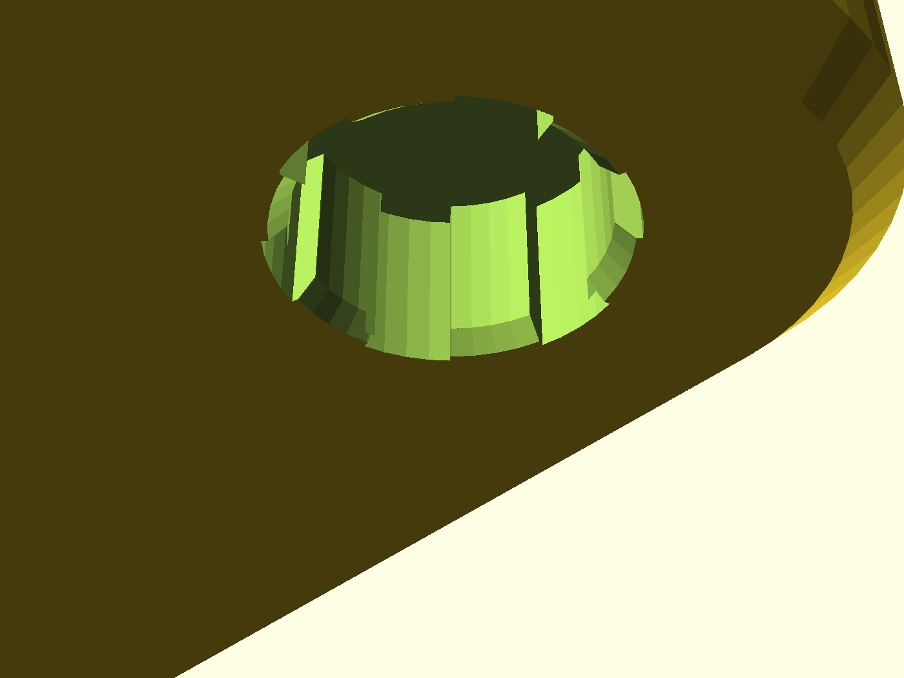

# 牆面排風網罩 - 磁吸式轉接底座 (Magnetic Exhaust Base Mount)

本模型為專為六角蜂巢孔排風網罩設計的磁吸法蘭基座。上方配備精準對位的六角定位柱，底面則配置 8 顆帶有 **6 齒彈性避讓槽（Crush Ribs）** 的圓形磁鐵盲孔，方便未來快速吸附各類排風管、過濾罩或轉接配件，並確保高度氣密。

---

## 視覺渲染圖 (Renders)

| 等角透視圖 (Isometric) | 底面磁鐵佈局 (Bottom Magnets) |
| :---: | :---: |
|  |  |
| **6 齒彈性避讓槽特寫** | **頂面 56 根六角柱陣列** |
|  |  |

---

## 設計特點與工程細節

1. **頂面六角柱定位陣列 (56 根柱)**：
   - **上下側（橫向）**：11 根柱，相鄰柱為「頂角對頂角（Vertex-to-Vertex）」。
   - **左右側（縱向）**：19 根柱，相鄰柱為「邊對邊（Flat-to-Flat）」。
   - **累積誤差校正**：實測修正縱向螺距為 `post_pitch_y = 4.314 mm`，徹底消除 18 格間隙累積的 0.9mm 誤差。
   - **列印容差**：柱寬套用 `hex_print_tolerance = 0.03 mm`（實際柱寬 2.50mm），搭配頂部 0.4mm 導入倒角，好插且定位牢固。
2. **底面 6 齒彈性避讓磁鐵槽 (8 顆 5x3 磁鐵)**：
   - **6 瓣內凸圓弧齒**：內徑 5.06mm 緊密夾持 5.0mm 磁鐵。
   - **外圈深凹槽 (外徑 5.9mm)**：提供充足空間避讓 3D 列印 **Z 縫（Z-seam）** 突起，並允許微彈性變形，手壓即可輕鬆入座，不再卡死。
   - **盲孔完全密封**：孔深 3.2mm，頂部保有 0.8mm 實體封閉層，氣流不穿透。
   - **8 點均勻壓緊**：4 角落 + 4 邊緣中點，跨距縮短至約 40mm，避免風管受風壓邊緣起翹。
   - **7~8mm 連續氣密密封帶**：磁鐵避開中央開口，外圍保留完整平整區域供貼合氣密矽膠條/墊片。
3. **3D 列印防翹板與防象腳**：
   - 底座外框四角為 **R5.0 mm 圓弧**，消除直角冷卻收縮的向上剝離力，防止熱床翹板。
   - 底座中央鏤空內部四角為 **R2.5 mm 圓角**，消除應力集中防開裂。
   - 最底層外緣帶有 **1.0 mm 微縮倒角**，消除首層象腳。

---

## 尺寸規格 (Specifications)

- **外框尺寸**：$97.0 \times 97.0 \times 4.0 \text{ mm}$ (外角 R5.0mm)
- **中央排風鏤空**：$67.0 \times 69.75 \text{ mm}$ (內角 R2.5mm)
- **六角柱規格**：對邊 2.50 mm (原孔 2.53 mm)，高度 2.5 mm，頂部帶 0.4mm 導向斜面
- **磁鐵規格**：圓形釹鐵硼磁鐵 $\varnothing 5 \times 3 \text{ mm}$，共需 8 顆

---

## 3D 列印建議 (Print Settings)

- **擺盤方向**：底面（帶有磁鐵孔那一面）直接貼緊熱床列印，六角柱朝上。
- **支撐設定**：**全件 100% 免支撐（Support-Free）**。磁鐵盲孔頂部為水平橋接，5.2mm 直徑可無懸垂完美成型。
- **建議材質**：PETG / ABS / ASA（排風常有溫差與濕氣，建議耐溫耐候材質）。
- **層高**：0.20 mm
- **壁厚 / 外圈**：4 圈以上（確保六角柱與磁鐵孔周圍皆為實心結構）
- **填充率**：25% ~ 40% (推薦 Gyroid 陀螺狀填充)

---

## 檔案清單

- [`magnetic_exhaust_base.scad`](magnetic_exhaust_base.scad)：OpenSCAD 原始可參數化代碼
- [`magnetic_exhaust_base.stl`](magnetic_exhaust_base.stl)：已編譯可直接切片列印之 STL 檔案
- `renders/`：高解析度視覺渲染展示圖檔
