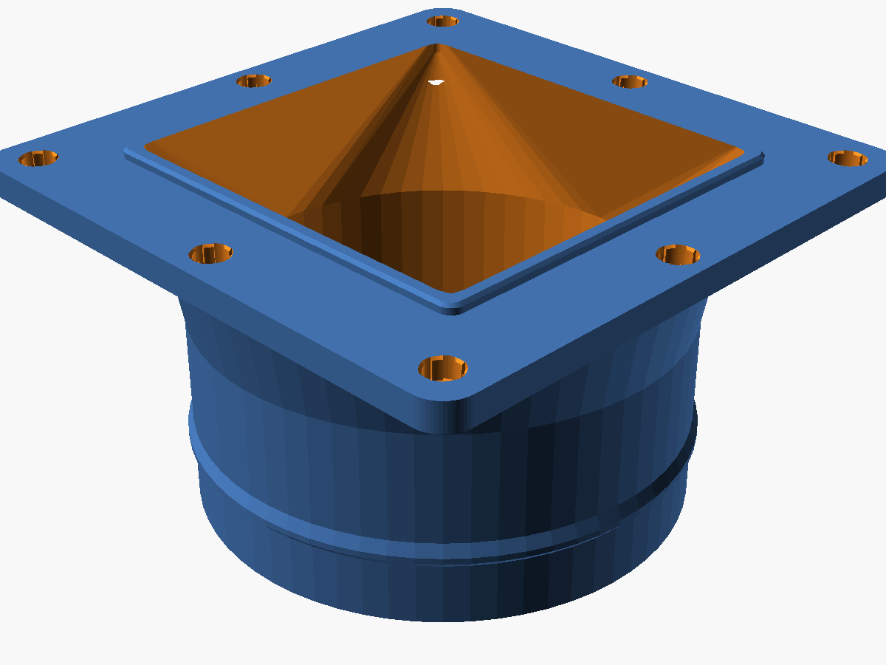
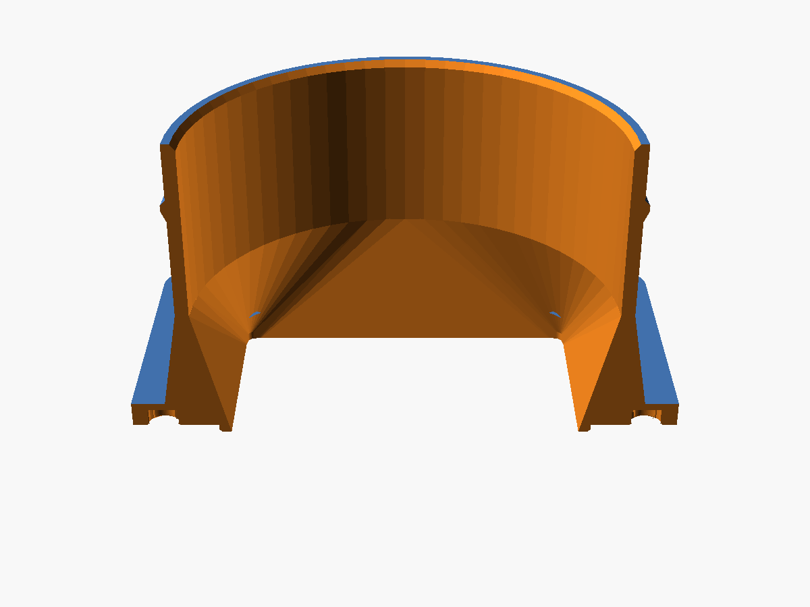
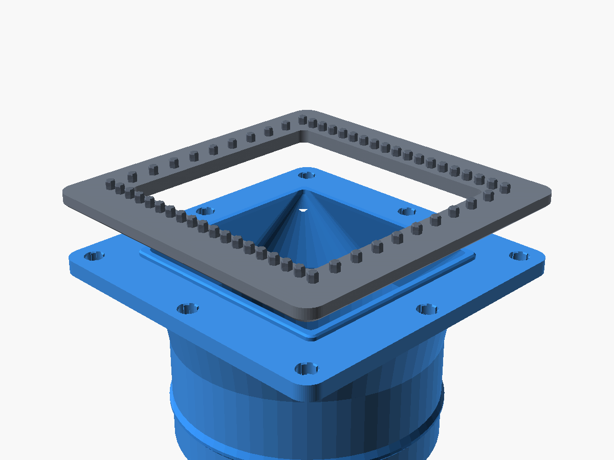
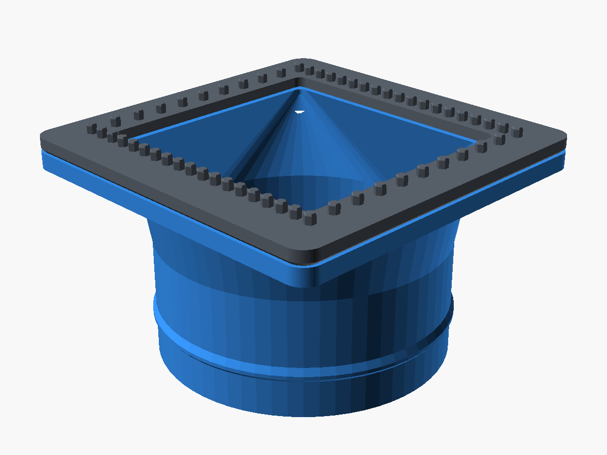

# 80mm 磁吸式排風管轉接頭 (80mm Magnetic Exhaust Duct Adapter)

專為搭配 **[牆面排風網罩磁吸轉接底座 (magnetic-exhaust-base)](../magnetic-exhaust-base/)** 設計的快速磁吸排風管配件。能將底座的方形排風開口平滑轉接至標準 **80mm 排風軟管**（鋁箔風管、PVC 複合風管、波紋管），實現免工具秒拆裝、高氣密與強固抗拉脫。

---

## 視覺渲染展示 (Renders)

| 等角立體視角 (Functional View) | 貼合面與 1.5mm 對位止口 (Mating Face) |
| :---: | :---: |
|  |  |
| **內部氣流平滑過渡剖面** | **磁吸組裝爆炸對齊圖** |
|  |  |
| **完全吸附貼合組裝效果** | |
|  | |

---

## 設計特點與工程細節

1. **8 點強力磁吸 + 6 齒彈性避讓槽 (Crush Ribs)**：
   - 配置 8 顆 $\varnothing 5 \times 3 \text{ mm}$ 圓形釹鐵硼磁鐵（4 角落 + 4 邊緣中點），磁鐵座標與底座 100% 鏡像完全重合。
   - 孔壁沿用 **6 齒內凸彈性夾持輪廓**（夾緊內徑 5.06mm、齒谷深槽外徑 5.90mm），徹底消除 3D 列印 **Z 縫（Z-seam）** 突起導致磁鐵卡死的通病，手壓即可順暢入座。
   - 盲孔深 3.2mm（微沉 0.2mm），磁鐵吸附時不凸出碰撞，提供約 **4.0 kgf** 的強勁垂向磁吸夾持力。

2. **1.5mm 內嵌防滑對位止口 (Alignment Lip)**：
   - 貼合面中央帶有一圈向上凸出 1.5mm 的圓角方形凸緣（$66.3 \times 69.05 \text{ mm}$），單邊保留 0.35mm 精密裝配間隙。
   - 凸緣直接嵌入底座中央開口內部，**徹底鎖死 X/Y 軸剪切自由度**，即使風管受到劇烈拉扯、震動或外力碰撞，磁鐵亦絕不橫向錯位滑脫。
   - 止口前端設計有 0.5mm 導向倒角，盲操作吸附時自動滑順入位。

3. **外套式管接頭 + 防脫倒鉤凸緣 (Retention Barb)**：
   - **直管段外徑 78.8mm**：標準 80mm 軟管可輕鬆順暢套入，避免管徑過緊刮破薄鋁箔。
   - **管口 1.2mm 導入斜角**：軟管套入零阻礙。
   - **80.6mm 防脫倒鉤環**：位於接頭中段，微幅撐開軟管，並於後方形成專用卡槽，搭配不銹鋼喉箍（管束）或紮線帶旋緊後，即便用力拉扯風管也絕不鬆脫。

4. **氣動優化過渡錐段 (Lofted Funnel Transition)**：
   - 由底面 $61.5 \times 64.25\text{ mm}$ 方形通風開口，以三維流線連續平滑過渡（Loft）至 $\varnothing 74.0\text{ mm}$ 圓管內徑。
   - 內部無任何垂直台階或銳角，氣流截面積平緩過渡，排風阻力極低、靜音無風切聲。

5. **★★★ 100% 免支撐列印設計 (Support-Free) ★★★**：
   - 默認模式以 **「管口朝下貼熱床、法蘭朝上」** 方向切片輸出。
   - 錐體外壁斜度為 $65^\circ$（遠高於 3D 列印 45 度臨界角），全件 **零懸垂、零支撐**。
   - 磁鐵孔與對位止口皆朝上成型，邊緣銳利清晰，無底層支撐殘留問題。

---

## 尺寸規格 (Specifications)

- **法蘭外框尺寸**：$97.0 \times 97.0 \text{ mm}$ (四外角 $R=5.0 \text{ mm}$，厚度 $4.5 \text{ mm}$)
- **對位止口尺寸**：$66.3 \times 69.05 \times 1.5 \text{ mm}$ (外角 $R=2.2 \text{ mm}$)
- **風管接頭外徑**：$78.8 \text{ mm}$ (防脫環最大徑 $80.6 \text{ mm}$)
- **風管接頭內徑**：$74.0 \text{ mm}$ (管壁厚度 $2.4 \text{ mm}$)
- **接頭直管長度**：$32.0 \text{ mm}$ (喉箍固定區寬度約 $14 \text{ mm}$)
- **總裝配高度**：$54.5 \text{ mm}$ (不含止口) / $56.0 \text{ mm}$ (含止口)
- **磁鐵規格**：圓形釹鐵硼磁鐵 $\varnothing 5 \times 3 \text{ mm}$，共需 8 顆

---

## 3D 列印與切片建議 (Print Settings)

- **擺盤方向**：**接頭管口貼緊熱床**（STL 檔案已默認設為此最佳方向）。
- **熱床附著 (Adhesion)**：建議開啟 **外裙邊 / 寬度 5mm 外 Brim**，確保 78.8mm 圓環牢固貼合熱床。
- **支撐設定**：**全件 100% 免支撐 (No Supports Needed)**。
- **建議材質**：PETG / ABS / ASA（排風常有溫濕度變化，建議耐溫耐候材質）。
- **層高**：0.20 mm
- **外牆圈數**：4 圈（確保 2.4mm 管壁與法蘭皆為 100% 實心，提升結構剛性）。
- **頂層 / 底層數**：頂層 5 層、底層 4 層。
- **填充率**：25% ~ 35% (推薦 Gyroid 陀螺狀填充)。

> [!TIP]
> **磁鐵安裝極性提示**：
> 安裝轉接頭磁鐵時，可先將磁鐵吸附在已裝好磁鐵的「牆面底座」上，用油性筆在朝外那一面點上標記，再依標記方向壓入轉接頭的 6 齒槽中，即可 100% 保證兩側極性相吸（N 極對 S 極）！

---

## 檔案清單

- [`magnetic_exhaust_duct_80mm.scad`](magnetic_exhaust_duct_80mm.scad)：完整 OpenSCAD 參數化原始代碼（可自定義管徑、止口開關、列印方向）
- [`magnetic_exhaust_duct_80mm.stl`](magnetic_exhaust_duct_80mm.stl)：已編譯完成之 STL 模型（管口朝下最佳方向，直接拖入切片軟體即可列印）
- `renders/`：各角度高清渲染圖與組裝展示圖
