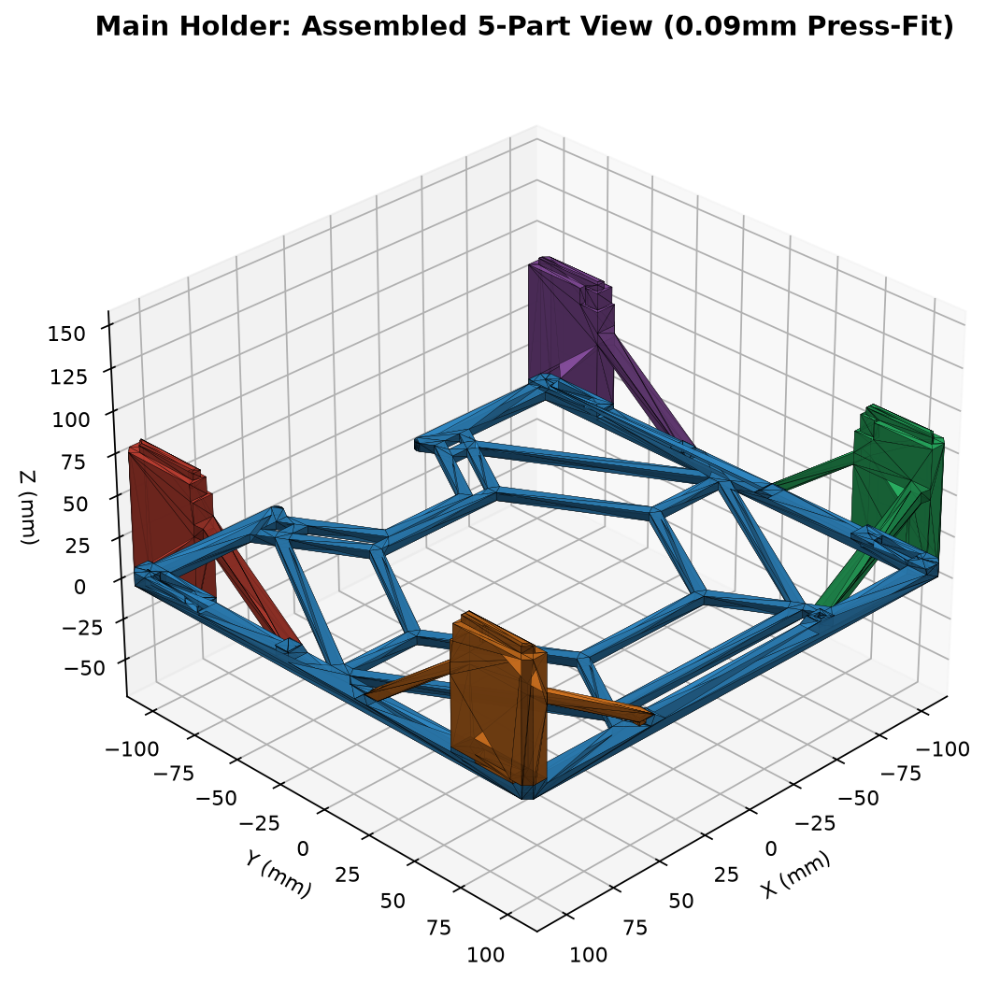
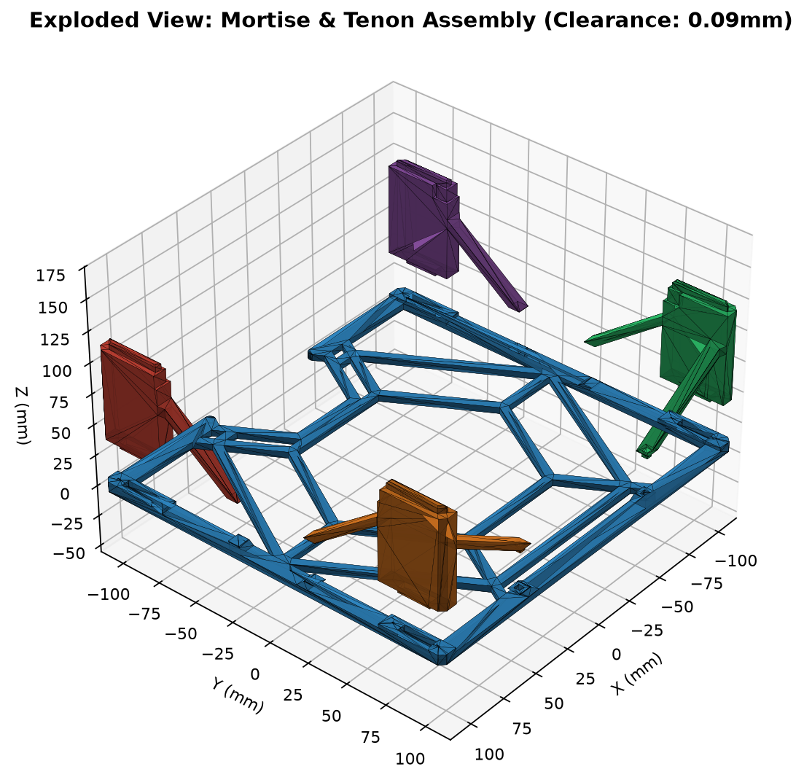

# 主支架模組化拆件與平鋪列印方案 (Main Holder Modular Split & Flat-Printing)

本模型為針對大型結構件 `Main_Holder.stl`（外觀尺寸 `231.0 × 221.0 × 85.0 mm`）進行 **DFM（可製造性設計，Design for Additive Manufacturing）** 的模組化拆件優化版本。

透過在底部交界處（$Z = 8.0\text{ mm}$）精準拆件，將原本高達 85mm（425 層）、中空跨距超過 220mm 的高空跑模型，拆解為 **1 件平躺底盤** 與 **4 件平鋪立柱**。在**完全不改變原模型外觀、安裝孔位與整體尺寸規格**的前提下，大幅縮短列印時間，消除長途空跑與層冷卻降速，並讓立柱抗拉扯剪切強度提升數倍。

---

## 視覺渲染與裝配示意 (Renders)

| 組合總成視圖 (Assembled View) | 榫卯卡榫爆炸圖 (Exploded Tenon View) |
| :---: | :---: |
|  |  |
| **第一盤：底盤平躺 (Plate 1)** | **第二盤：4 根立柱平鋪 (Plate 2)** |
|  |  |

---

## 關鍵優勢與切片實測數據

使用 **Bambu Lab P1 / Bambu PLA Basic / 0.4mm 噴嘴 / 0.20mm 層高 / 7% 網格填充 (Grid)** 原廠標準配置實測：

| 方案 | 排版形式 | 最大高度 (層數) | 單盤列印時間 | 總耗時 | 耗材用量 | 膠水需求 |
| :--- | :--- | :---: | :---: | :---: | :---: | :---: |
| **原模型一體列印** | 單件直立打印 | 85 mm (425 層) | 4 小時 54 分 | **4 小時 54 分** | 107.3 g | 無 |
| **本拆件優化方案** | **分兩盤平鋪列印** | 底盤 8mm (40層) 立柱平鋪 69mm | 盤 1: **1h 56m** 盤 2: **1h 55m** | **3 小時 52 分** *(省下約 1 小時)* | 100.5 g | **完全免膠水** *(0.09mm 緊配合)* |

### 為什麼拆件平鋪能省下超過 1 小時？
1. **消除 385 層的超長距離空跑**：原模型在 $Z = 8 \sim 85\text{ mm}$ 區間中間 90% 均為空氣，噴嘴每層需在四角跨距 220mm 間大幅度加減速回抽（超過 1,500 次長途空跑）；平鋪後各零件緊湊排列，噴嘴全程連續高效擠出。
2. **解除細小截面層冷卻降速**：原模型頂部立柱極細，切片機強制降速以防過熱塌陷；平鋪後每層接觸面積充裕，全程維持 200~300 mm/s 全速列印。
3. **單次列印風險減半**：單盤列印時間控制在 **2 小時以內**，大幅降低因斷電、翹曲等意外導致 5 小時大件整件報廢的風險。
4. **結構強度倍增**：立柱由「脆弱的 Z 軸層間受力」轉變為「沿長度方向的縱向纖維拉通受力」，側向抗撞擊抗斷裂強度提升 300% 以上。

---

## 榫卯卡榫工程設計規範

1. **精準 0.09 mm 實測黃金配合公差（Press-fit）**：
   - 逆向工程原模型頂部與底部堆疊卡槽，其實測清隙恰為 **單邊 0.090 mm（雙邊 0.180 mm）**。
   - 底座盲孔規格：`5.00 mm (寬) × 20.00 mm (長) × 5.00 mm (深)`。
   - 立柱凸榫規格：`4.82 mm (寬) × 19.82 mm (長) × 4.80 mm (高)`。
   - 斜撐定位柱規格：`3.42 mm × 3.42 mm`（對應底座 3.6mm 槽）。
   - **裝配手感**：手壓或小膠槌輕敲即可緊密咬合，牢固不鬆脫，**完全不需要點任何膠水**。
2. **0.5mm 導入倒角（Chamfer）**：
   - 所有凸榫端部均配備 $0.5\text{ mm} \times 45^\circ$ 導向角，防止起手碰撞與首層象腳干涉。
3. **0.2mm 槽底容膠避讓**：
   - 凸榫長度 4.8mm，孔深 5.0mm，底部留有 0.2mm 餘量，保證組裝時接縫完全貼平，不頂死。
4. **外觀 100% 無痕復原**：
   - 切割線完美收斂於原本 $Z=8.0\text{ mm}$ 的結構轉折陰角處，組裝後外觀無縫、無多餘螺絲孔或外露卡扣。

---

## 檔案清單說明

### 1. 打印排版就緒檔案 (Print-Ready Plates)
* `Plate1_Base_Plate.stl`：**第一盤（底盤平躺）**。高度僅 8mm，已置中微調避開拓竹左前方 18×28mm 擦嘴區，耗時約 1h 56m。
* `Plate2_Four_Pillars_Flat.stl`：**第二盤（4 根立柱平鋪）**。四根立柱以最佳平躺受力面緊湊排版於 256×256mm 床面，耗時約 1h 55m。

### 2. 獨立零組件檔案 (Individual Parts)
* `Part1_Base_Plate.stl`：底盤主體（含 6 處內嵌定位榫槽）。
* `Part2_Pillar_Rear_Right.stl`：後右立柱（含定向長方形凸榫）。
* `Part3_Pillar_Rear_Left.stl`：後左立柱（含定向長方形凸榫）。
* `Part4_Pillar_Front_Right.stl`：前右立柱與斜撐（含角柱凸榫 + 斜撐定位銷）。
* `Part5_Pillar_Front_Left.stl`：前左立柱與斜撐（含角柱凸榫 + 斜撐定位銷）。

### 3. 組合驗證總成與原始檔案
* `Assembled_Full_Model.stl`：組裝驗證總成（外圍尺寸 `231.0 × 221.0 × 85.0 mm` 與原件完全一致）。
* `Main_Holder.stl`：原版未拆分一體模型（供對比驗證）。

---

## 3D 列印建議設定 (Bambu Studio / OrcaSlicer)

* **材料**：Bambu PLA Basic（或 PETG / ABS）
* **噴嘴孔徑**：0.4 mm
* **層高**：0.20 mm Standard
* **外壁圈數**：2 圈（或 3 圈增強）
* **填充率**：7% ~ 15%（網格 Grid 或 迴旋 Gyroid）
* **支撐**：**無須開啟支撐（100% 免支撐列印）**
* **熱床附著**：底盤面積大，建議熱床保持乾淨，可開啟 Brim 5mm 確保四角平貼防翹曲。
