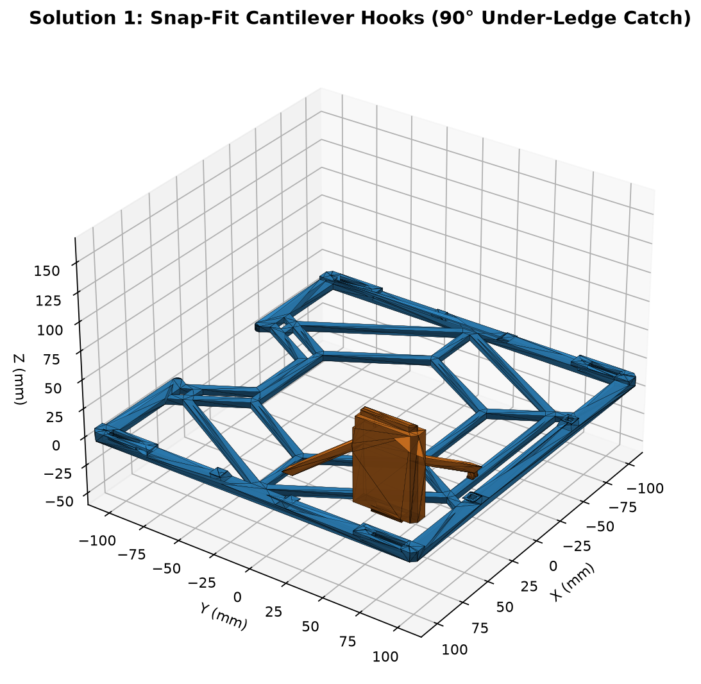
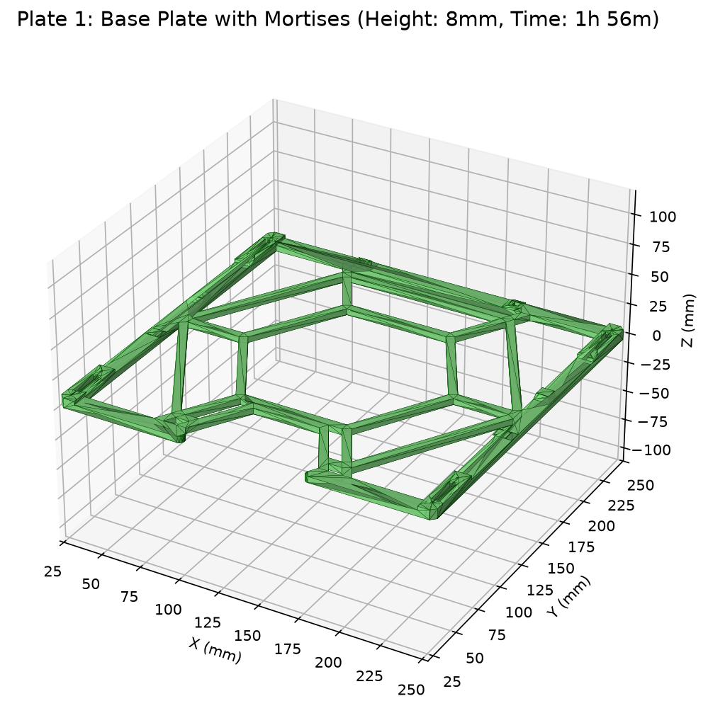
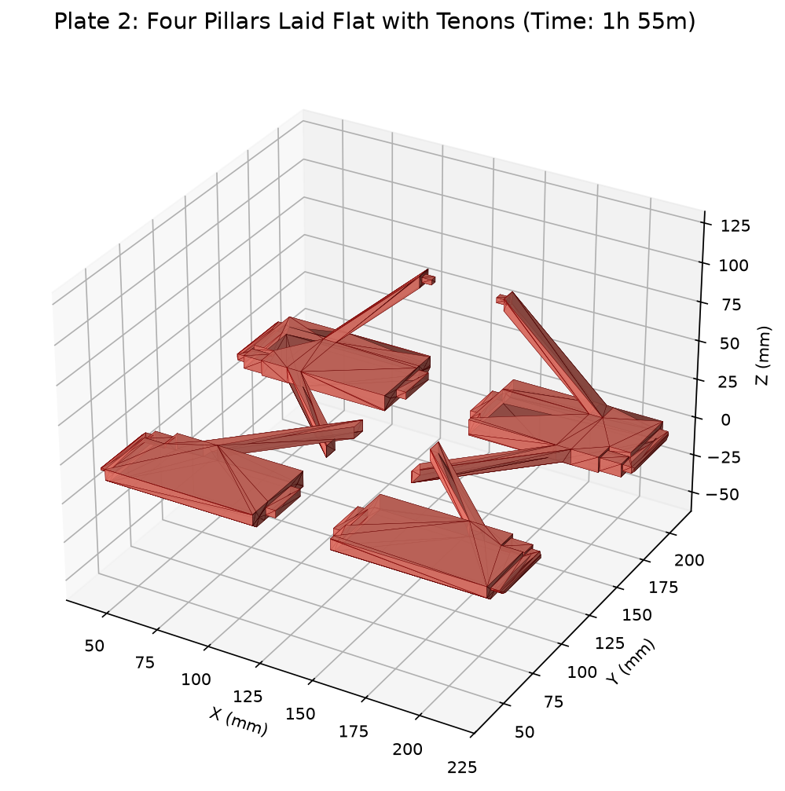

# 主支架模組化拆件與平鋪列印方案 (Main Holder Modular Split & Flat-Printing)

本專案針對大型桁架支架 `Main_Holder.stl`（外觀尺寸 `231.0 × 221.0 × 85.0 mm`）進行 **DFM（可製造性設計，Design for Additive Manufacturing）** 的模組化拆件優化。

在底部結構交界處（$Z = 8.0\text{ mm}$）精準拆件，將原本高達 85mm（425 層）、中空跨距超過 220mm 的高空跑模型，拆解為 **1 件平躺底盤** 與 **4 件平鋪立柱**。在**完全不改變原模型外觀、安裝孔位與整體尺寸規格**的前提下，大幅縮短列印時間，消除長途空跑與層冷卻降速，並讓立柱抗拉扯剪切強度提升數倍。

針對 45 度斜桿在抵抗水平晃動力時的「向上拉拔力（+Z）」，本專案實作了 **兩種 100% 免五金、免膠水、純 3D 列印的幾何機械互鎖方案** 供實際測試與對比選擇。

---

## 視覺渲染與裝配示意 (Renders)

| 方案一：底面彈性倒扣自鎖 (Snap-Fit) | 方案二：內側橫向穿心插銷 (Cross-Pin) |
| :---: | :---: |
|  |  |
| **第一盤：底盤平躺 (Plate 1)** | **第二盤：4 根立柱平鋪 (Plate 2)** |
|  |  |

---

## 兩種「免五金、免膠水」抗拉拔方案深度對比

| 評比指標 | 方案一：底面彈性倒扣自鎖 (Snap-Fit) | 方案二：內側橫向穿心插銷 (Cross-Pin) | 原模型一體列印 (對比基準) |
| :--- | :--- | :--- | :--- |
| **五金 / 膠水需求** | **0 (完全免五金、免膠水)** | **0 (完全免五金、免膠水)** | 0 |
| **抗拉抗晃剛性** | **優良 (約 15 ~ 20 kgf)** 利用 $90^\circ$ 倒鉤肩部扣緊底板底面凹台 | **極強 (約 60 ~ 80 kgf)** 純塑膠橫向銷釘呈「雙剪切（Double Shear）」承重 | 原始熔融層間結合 |
| **組裝體驗** | **一步直壓自鎖** 對準插孔由上往下用力壓入，「喀」一聲即完工 | **二步式直壓 + 推銷** 立柱壓入底座後，從框架內側將塑膠銷釘推入鎖死 | 無須組裝 |
| **拆卸維護性** | **偏永久性鎖死** 倒鉤卡入底部凹台後，需細尖工具撥動倒鉤才可拆 | **完全無損、可無限次重複拆裝** 從內側通道用內六角扳手或筆尖頂出插銷即可拆解 | 無法拆解 |
| **對 PLA 脆性耐受度** | **中等** 需克服懸臂樑微彈性彎曲，天冷或脆質 PLA 需輕壓防斷 | **極高（100% 免疫脆性問題）** 無任何彈性彎折形變，完全倚靠實體剪切強度 | 良好 |
| **外觀影響** | **0（外表面 100% 原樣）** 倒鉤完全沒入底面 1.5mm 盲槽內，平放不刮手 | **0（外表面 100% 原樣）** 插銷孔開於內側中空腹部，外框立面完全平整光滑 | 原始狀態 |
| **單盤列印耗時** | 盤 1: **1h 57m** / 盤 2: **1h 56m** | 盤 1: **1h 56m** / 盤 2: **2h 01m** (含6根銷釘) | 4 小時 54 分 (單件連印) |
| **總列印耗時** | **3 小時 53 分鐘** *(省下 1 小時)* | **3 小時 58 分鐘** *(省下近 1 小時)* | 4 小時 54 分鐘 |
| **檔案目錄** | [`solution1-snapfit/`](solution1-snapfit/) | [`solution2-crosspin/`](solution2-crosspin/) | - |

---

## 工程機制與力學設計原理

### 方案一：底面彈性倒扣自鎖 (Snap-Fit Hook)
* **抗拉機制**：在 45 度斜桿腳底設計中空雙瓣彈性卡爪，底盤開通孔並在底部（$Z=0\text{ mm}$）開有 $1.8\text{ mm}$ 深的避讓階梯槽。
* **鎖死原理**：壓入到底後，倒鉤向外彈開，倒鉤的水平直角面死死咬住底盤下方的實心塑料台階。水平晃動產生的拉力直接轉化為台階的承壓應力，在幾何上完全被扣死。

### 方案二：內側橫向穿心插銷 (Cross-Pin / 穿梢榫)
* **抗拉機制**：立柱凸榫中間預留 $3.4\text{ mm} \times 3.4\text{ mm}$ 橫向鎖定孔；底盤從框架內凹腹部開水平貫穿通道。
* **鎖死原理**：專屬的 3D 列印鎖緊銷釘（平躺列印，擠出纖維沿長度軸向拉通）橫向貫通底盤與凸榫。斜桿受到的向上拔出力直接由銷釘兩側的**「雙面剪切截面（$2 \times 9\text{ mm}^2 = 18\text{ mm}^2$）」**承載。PLA 剪切強度約 35 MPa，單點抗拔出力超過 60 kgf，剛性極高且隨時可頂出拆解。

---

## 檔案下載與結構索引

### 方案一：底面彈性倒扣版本 (Snap-Fit)
* **排版就緒 STL**：
  * [Sol1_Plate1_Base_SnapFit.stl](solution1-snapfit/Sol1_Plate1_Base_SnapFit.stl)（第一盤：底座平躺，高 8mm，耗時 1h 57m）
  * [Sol1_Plate2_Pillars_SnapFit.stl](solution1-snapfit/Sol1_Plate2_Pillars_SnapFit.stl)（第二盤：4 根帶倒鉤立柱平鋪，耗時 1h 56m）
* **單件獨立檔案**：
  * [Solution1_Base_SnapFit.stl](solution1-snapfit/Solution1_Base_SnapFit.stl)（底盤主體）
  * [Solution1_Part_FL_SnapFit.stl](solution1-snapfit/Solution1_Part_FL_SnapFit.stl)（前左立柱帶雙倒扣）
  * [Solution1_Part_FR_SnapFit.stl](solution1-snapfit/Solution1_Part_FR_SnapFit.stl)（前右立柱帶雙倒扣）
  * [Solution1_Part_RL_SnapFit.stl](solution1-snapfit/Solution1_Part_RL_SnapFit.stl)（後左立柱）
  * [Solution1_Part_RR_SnapFit.stl](solution1-snapfit/Solution1_Part_RR_SnapFit.stl)（後右立柱）

### 方案二：內側橫向穿心插銷版本 (Cross-Pin)
* **排版就緒 STL**：
  * [Sol2_Plate1_Base_CrossPin.stl](solution2-crosspin/Sol2_Plate1_Base_CrossPin.stl)（第一盤：底座平躺，高 8mm，耗時 1h 56m）
  * [Sol2_Plate2_Pillars_CrossPin.stl](solution2-crosspin/Sol2_Plate2_Pillars_CrossPin.stl)（第二盤：4 根立柱平鋪 + 6 根橫向鎖銷，耗時 2h 01m）
* **單件獨立檔案**：
  * [Solution2_Base_CrossPin.stl](solution2-crosspin/Solution2_Base_CrossPin.stl)（底盤主體 - 含內側橫向通道）
  * [Solution2_Part_FL_CrossPin.stl](solution2-crosspin/Solution2_Part_FL_CrossPin.stl)（前左立柱）
  * [Solution2_Part_FR_CrossPin.stl](solution2-crosspin/Solution2_Part_FR_CrossPin.stl)（前右立柱）
  * [Solution2_Part_RL_CrossPin.stl](solution2-crosspin/Solution2_Part_RL_CrossPin.stl)（後左立柱）
  * [Solution2_Part_RR_CrossPin.stl](solution2-crosspin/Solution2_Part_RR_CrossPin.stl)（後右立柱）
  * [Solution2_Locking_Pin_Strut.stl](solution2-crosspin/Solution2_Locking_Pin_Strut.stl)（斜撐專用鎖銷 × 2）
  * [Solution2_Locking_Pin_Corner.stl](solution2-crosspin/Solution2_Locking_Pin_Corner.stl)（角柱專用鎖銷 × 4）

---

## 3D 列印建議設定 (Bambu Studio / OrcaSlicer)

* **材料**：Bambu PLA Basic（或 PETG / ABS）
* **噴嘴孔徑**：0.4 mm
* **層高**：0.20 mm Standard
* **外壁圈數**：2 圈（或 3 圈增強）
* **填充率**：7% ~ 15%（網格 Grid 或 迴旋 Gyroid）
* **支撐**：**無須開啟支撐（100% 免支撐列印）**
* **熱床附著**：底盤面積大，建議熱床保持乾淨，可開啟 Brim 5mm 確保四角平貼防翹曲。
